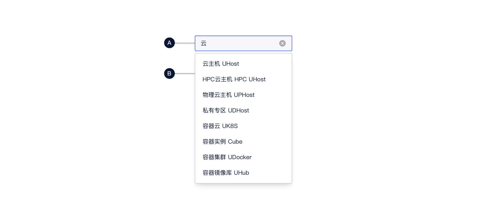
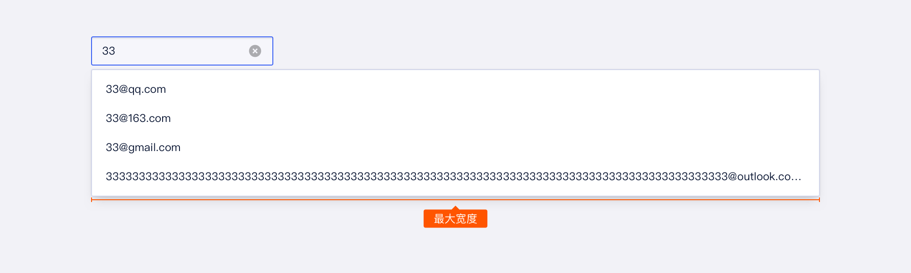
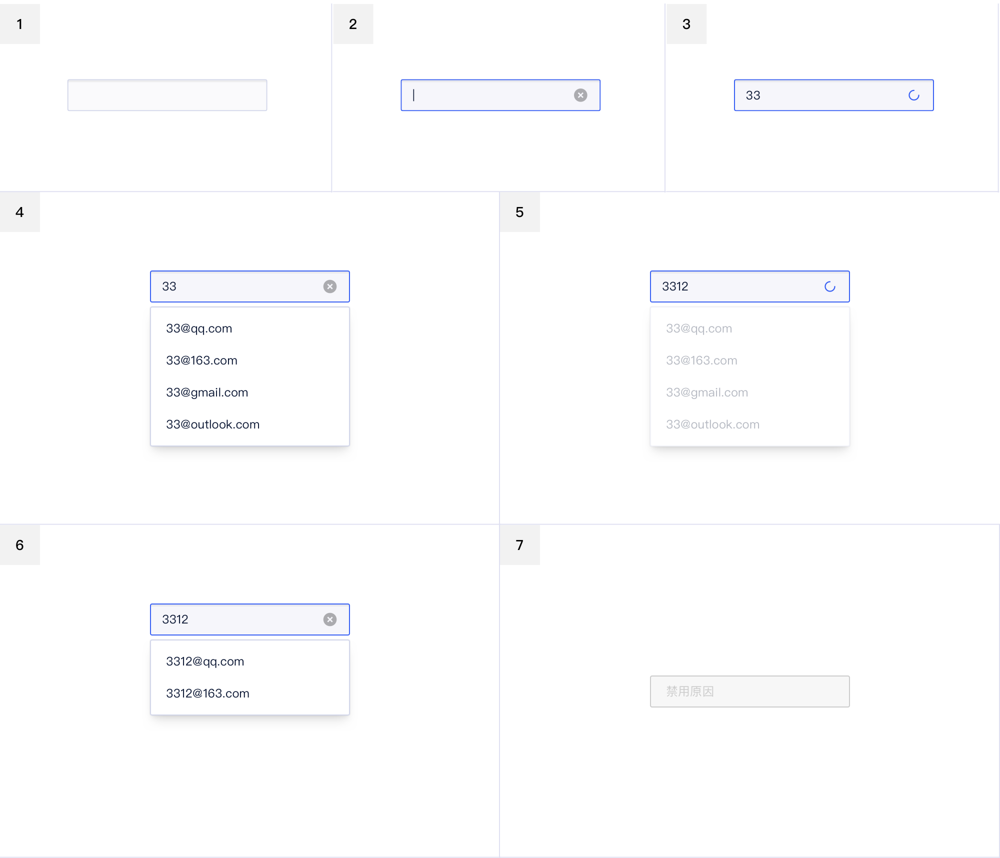

<!--副标题具体写法见源代码模式-->

## 简介

输入框自动完成功能，能够尝试猜测⽤户输⼊的⽂字，并且动态的搜索出适配的结果并推荐给⽤户，辅助完成输⼊。

## 基本构成

|      | 构成       | 备注                            |
| :--: | :--------- | :------------------------------ |
|  1   | 联想输入框 | 逻辑同 [输入框]() `Input` 一致  |
|  2   | 联想选择框 | 逻辑同 [下拉菜单]() `Menu` 一致 |

## 基本样式

### 尺寸

#### 最小尺寸

联想选择框最小尺寸与联想输入框宽度一致

#### 最大尺寸

联想选择框最大尺寸为 800px ，超出部分文本内容自动隐藏。

## 基本状态

|   | &nbsp;&nbsp;&nbsp;&nbsp;&nbsp;&nbsp;&nbsp;&nbsp;&nbsp;&nbsp;&nbsp;&nbsp;&nbsp;&nbsp;&nbsp;&nbsp;&nbsp;&nbsp;&nbsp;&nbsp;&nbsp;&nbsp;             | 说明                                                         |
| ---- | :------- | :----------------------------------------------------------- |
| 1    | 默认     | 组件初始状态                                                 |
| 2    | 激活     | 鼠标点击输入框，切换至该状态；若部分场景需要给用户默认提示内容（如高频搜索词、推荐搜索词等），则可在激活状态时给出下拉选择框 |
| 3    | 首次加载 | 第一次加载，不触发联想选择框                                 |
| 4    | 加载完成 | 加载完成后，下方出现包含搜索关键词的联想选择框，联想内容若超出选择框高度范围，支持纵向滚动条。 |
| 5    | 二次加载 | 在修改原有的关键词，触发二次搜索，联想选择框变灰，输入框变成加载状态。 |
| 6    | 加载完成 | 根据新的联想数量，改变选择框大小。                           |
| 7    | 禁用     | 当前行动点不可用，建议配合提示说明。                         |

## 设计说明

在界面中如何使用该组件？

#### 1.使用目的

⽬的是避免⽤户出错，起到提示作⽤，智能预测⽤户⼼理期望，从⽽确保他们的输⼊更有效率。

#### 2.使用场景

输入框需要建议或辅助提示时使用。

需要注意区分和Select的区别：

- AutoComplete是一个带提示的文本输入框，用户可以自由输入，关键词是辅助输入。
- Select是在限定的可选项中进行选择，关键词是选择。

## 相关文档
1. [Input 输入框](/component/Input/)
2. [Select 选择器](/component/Select/)

