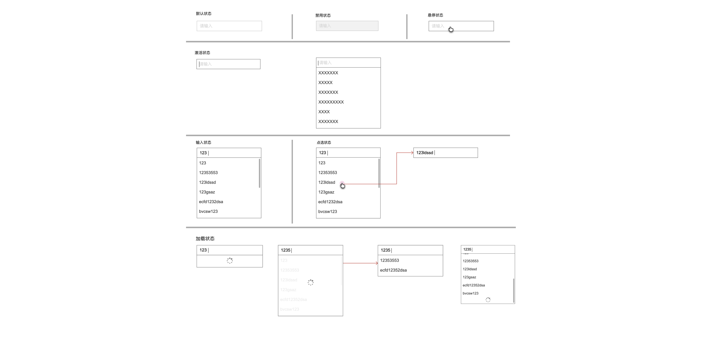

<!--副标题具体写法见源代码模式-->

## 简介

输入框自动完成功能，能够尝试猜测⽤户输⼊的⽂字，并且动态的搜索出适配的结果并推荐给⽤户，辅助完成输⼊。

⽬的是避免⽤户出错，起到提示作⽤，智能预测⽤户⼼理期望，从⽽确保他们的输⼊更有效率。

输入框需要建议或辅助提示时使用，注意：此处的基础组件是输入框，而不是选择器。

## 基本构成

A.输入框

B.联想选择框

## 

## 基本状态

| 状态     | 说明 | 作用 |
| :------- | :--- | ---- |
| 默认状态 | 描述 | 描述 |
| 禁用状态 |      |      |
