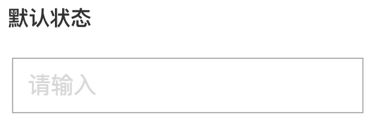
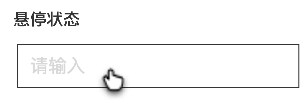
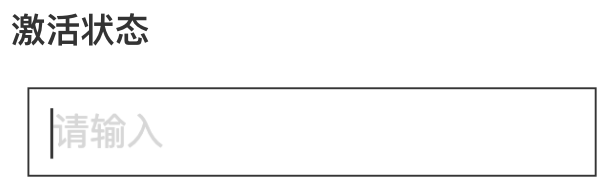
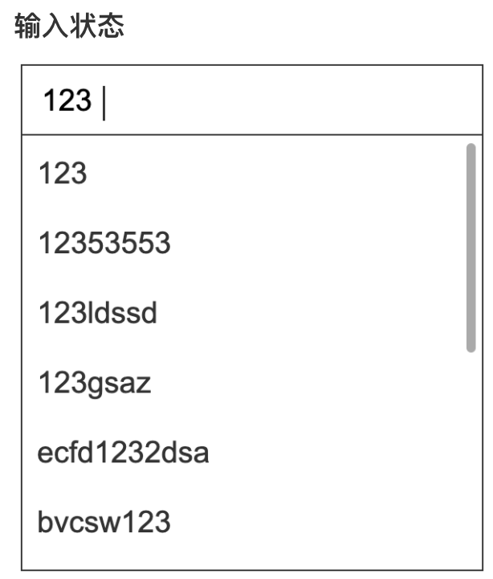
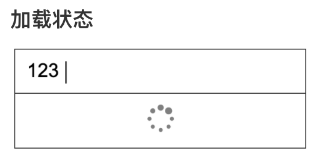
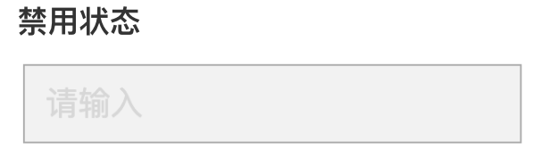

<!--副标题具体写法见源代码模式-->

## 简介

输入框自动完成功能，能够尝试猜测⽤户输⼊的⽂字，并且动态的搜索出适配的结果并推荐给⽤户，辅助完成输⼊。

⽬的是避免⽤户出错，起到提示作⽤，智能预测⽤户⼼理期望，从⽽确保他们的输⼊更有效率。

输入框需要建议或辅助提示时使用，注意：此处的基础组件是输入框，而不是选择器。

## 基本构成

A.输入框

B.联想选择框

## 

## 基本状态

默认提示内容（如高频搜索词、推荐搜索词等），可参考下图：

<!--图片存储路径为images下新建元素名文件夹，例/images/Name/pic.png-->

<!--图片存储路径为images下新建元素名文件夹，例/images/Name/pic.png-->

输入框输入内容后，下方出现包含搜索关键词的联想选择框，联想内容若超出选择框高度范围，支持纵向滚动条。

<!--图片存储路径为images下新建元素名文件夹，例/images/Name/pic.png-->

点选选项，输入框中写入选中项，同时收起下拉框，光标仍在输入框内，支持用户继续编辑，此时若修改内容则再次出现下拉框。

<!--图片存储路径为images下新建元素名文件夹，例/images/Name/pic.png-->

输入建议下拉框加载较慢时需给出loading提示：默认状态输入内容后，展示如上图： 

当已输入内容后再做修改，则保持原选择框高度，loading符号居中出现，加载完毕后刷新下拉框，见下图：

当输入建议较多时，一次加载一部分内容，滚动到底部再继续加载更多，见下图：

<!--图片存储路径为images下新建元素名文件夹，例/images/Name/pic.png-->

