<!--副标题具体写法见源代码模式-->

## 简介

Badge是指通常出现在图标或⽂字右上⻆的红⾊圆点、数字或者⽂字，表示有新内容或者待处理的信息。一般用于：

- 通知图标或头像的右上角，用于显示需要处理的信息条数，通过醒目视觉形式吸引用户关注和处理
- 代表事件的状态，让用户提前知道事情的进展状况



## 基本构成

设计实例地址  https://lanhuapp.com/url/krLv6-RvZm7

| 类型 | 内容（A） | 背景（B） |
| :--: | :-------: | :-------: |
| 常规 |     √     |     √     |

## 基本样式

### 类型

#### 数字徽标

需要准确计数的场景。

一般出现在通知图标或头像的右上角，用于显示需要处理的消息条数； 由于界面显示空间有限，因此注意视场景和信息类型决定封顶数字显示。

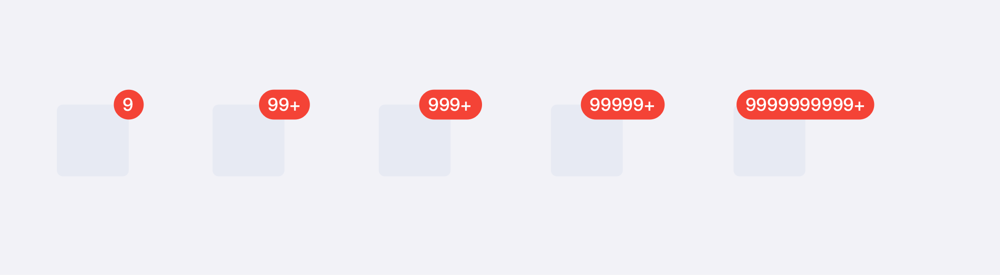

#### 点徽标

无需准确计数，仅做提醒的场景。

徽标中无具体数字显示，只出现红色小点，为了吸引用户注意，了解到有未读信息/未处理任务。

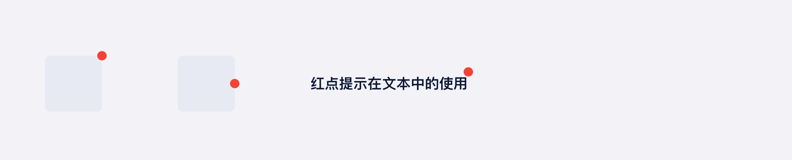

#### 自定义文本徽标

满足多场景定制诉求。

可以根据场景展示数字以外的文本内容。

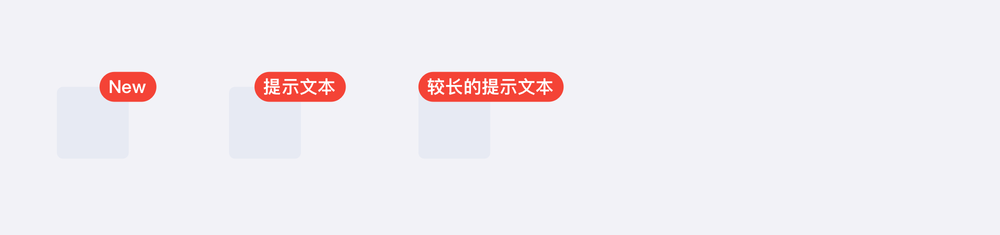

### 尺寸

结合容器使用的徽标向内缩进6**px**的偏移量；

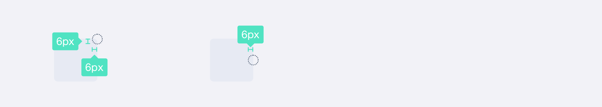

作为标签单独使用的徽标与文本内容保持8**px**的距离；

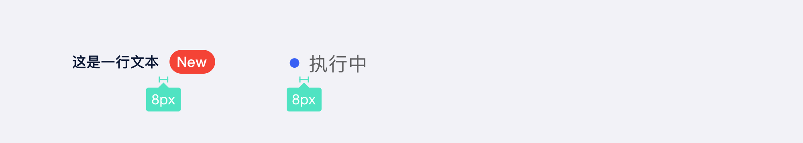

文本标签固定高度20**px**。

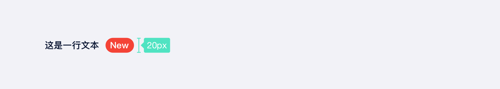

### 颜色

#### 预设颜色

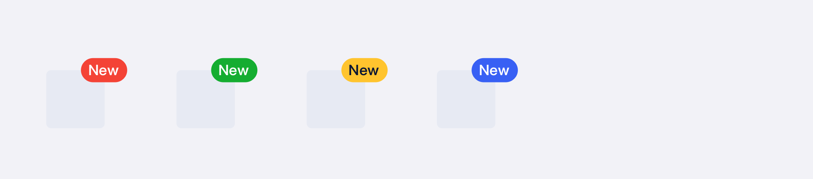

| 描述                                 | 背景色                    | 文本色                      |
| :----------------------------------- | :------------------------ | :-------------------------- |
| 新功能点、消息通知的提示、默认⾊色值 | `T_COLOR_LEGEND_RED_6`    | `T_COLOR_TEXT_SYSTEM_WHITE` |
| 成功性质的提示                       | `T-COLOR-BRAND-GREEN-6`   | `T_COLOR_TEXT_SYSTEM_WHITE` |
| 折扣信息、警告性质的提示             | `T_COLOR_LEGEND_YELLOW_6` | `T_COLOR_TEXT_SYSTEM_BLACK` |
| 进程中、主题⾊                       | `T_COLOR_BG_PRIMARY_1`    | `T_COLOR_TEXT_SYSTEM_WHITE` |

#### 自定义颜色

| 描述                     | 背景色                      | 文本色                      |
| :----------------------- | :-------------------------- | :-------------------------- |
| 用在区别于预设颜色的徽标 | `T_COLOR_BRAND_PURPLE_6`    | `T_COLOR_TEXT_SYSTEM_WHITE` |
| 用在区别于预设颜色的徽标 | `T_COLOR_BRAND_LIGHTBLUE_6` | `T_COLOR_TEXT_SYSTEM_WHITE` |
| 其他自定义颜色           | `T_COLOR_BRAND_xxxxxx_6`    | `T_COLOR_TEXT_SYSTEM_WHITE` |

- 点徽标使用背景色。

- 现有颜色无法满足需求时可使用其他自定义色值`T_COLOR_BRAND_xxxxx_6`，“xxxxx”代表颜色名。

  

## 设计说明

### 原则

在界面中如何使用该组件？

#### 1.排列

**基础排列**

以框架右边为中心点, 水平居中对齐。建议徽标内容不要过长。

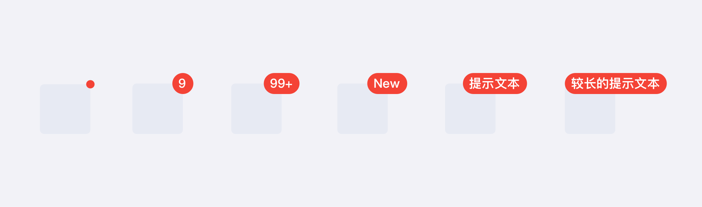

在文本中使用点徽标时，以文本框右边为中心点, 水平居中对齐。

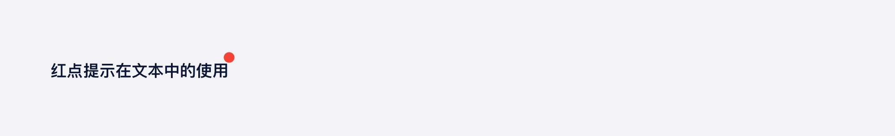

**自定义位置偏移**

默认为右上⻆，⽀持上、下 、左、右的偏移量。

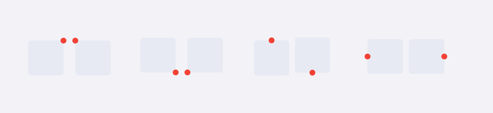

**独立使用**

不包裹任何元素即独立使用，可自定样式展示。 

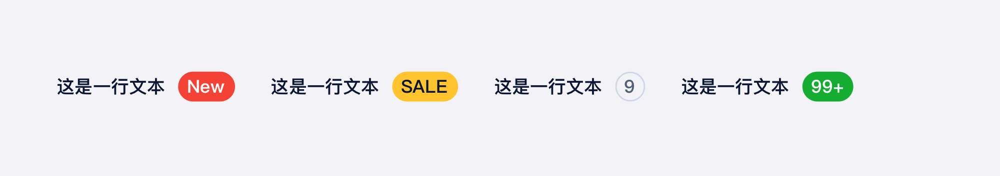

表示状态属性的标识用小圆点表示，用于表格或详情页中展示资源的状态。  

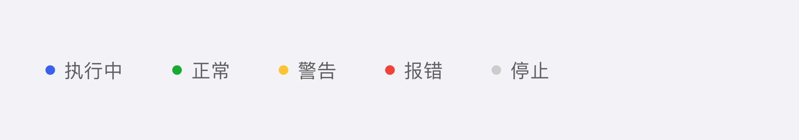

#### 2.行为

徽标通过视觉形式吸引用户注意，从而引导用户去关注或处理事件。

**徽标出现**

当有消息推送时，徽标自动出现。

**徽标消失**

通常用户点击按钮后，徽标消失；具体规则由业务决定。

### 操作

当用户使用不同设备端访问平台或页面时，如何与界面中的按钮交互？

#### 桌面端设备

- 鼠标：点击、悬停

#### 移动端设备

- 鼠标：平板可外接鼠标，行为与桌面端设备一致

- 手指：点击

  

##  常见问题

   

      
<i class="u-md-suggested"></i>文本内容简洁、长度适中

      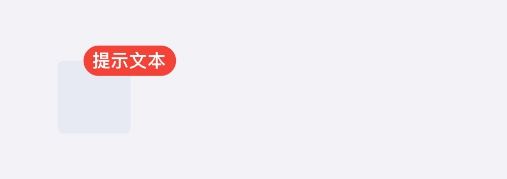
   

   

      
<i class="u-md-not-suggested"></i>文本内容过于啰嗦冗长

      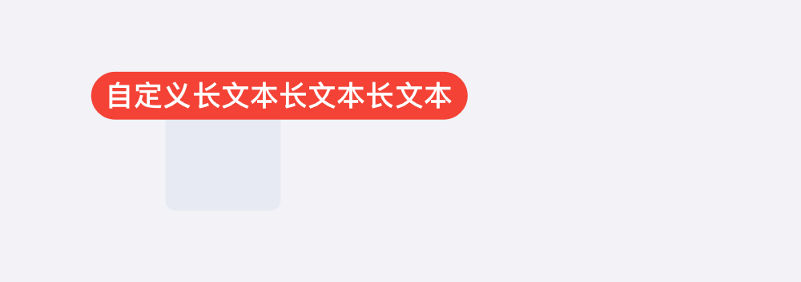
   

<!--

## 主题

| 内容 | 值           | 默认值  |
| :--- | :----------- | :------ |
| icon | icon/nothing | nothing |
| icon | icon/nothing | nothing |

-->

## 相关文档

1. [Tag 标签](/component/Tag/)
2. [Notice 提示]/component/Notice/)

