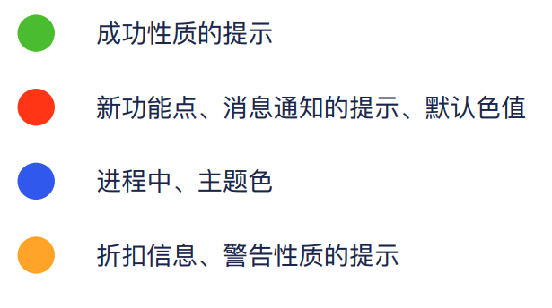
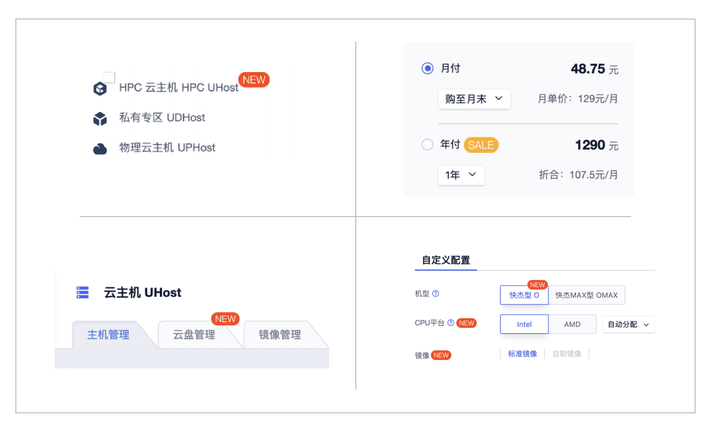
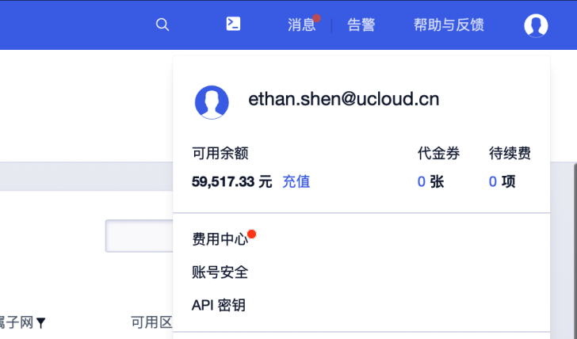

## 组件定义

Badge是指通常出现在图标或⽂字右上⻆的红⾊圆点、数字或者⽂字，表示有新内容或者待处理的信息。

## 使用场景

### 适用场景

- 一般出现在通知图标或头像的右上角，用于显示需要处理的信息条数，通过醒目视觉形式吸引用户关注和处理

- 代表事件的状态，让用户提前知道事情的进展状况

### 不适用场景

无需通过视觉形式吸引用户注意去关注或处理的内容

## 基本样式

### 数字徽标

需要准确计数的场景

- 一般出现在通知图标或头像的右上角，用于显示需要处理的消息条数
- 由于界面显示空间有限，因此注意视场景和信息类型决定封顶数字显示

### 点徽标

无需准确计数，仅做提醒的场景

徽标中无具体数字显示，只出现红色小点，为了吸引用户注意，了解到有未读信息/未处理任务

### 自定义文本徽标

满足多场景定制诉求

可以根据场景展示数字以外的文本内容

## 组成元素

> 设计实例地址https://lanhuapp.com/url/krLv6-RvZm7

A为文本内容，B为背景。

## 交互说明

### 状态

预设多个颜色值，用作不同场景使用

### 徽标出现

当有消息推送时，徽标自动出现

### 徽标消失

通常用户点击按钮后，徽标消失；具体规则由业务决定

# 设计说明

## 颜色

#### 预设颜色

| 描述                                 | 背景色                  | 文本色                    |
| :----------------------------------- | :---------------------- | :------------------------ |
| 新功能点、消息通知的提示、默认⾊色值 | T_COLOR_LEGEND_RED_6    | T_COLOR_TEXT_SYSTEM_WHITE |
| 成功性质的提示                       | T-COLOR-BRAND-GREEN-6   | T_COLOR_TEXT_SYSTEM_WHITE |
| 折扣信息、警告性质的提示             | T_COLOR_LEGEND_YELLOW_6 | T_COLOR_TEXT_SYSTEM_BLACK |
| 进程中、主题⾊                       | T_COLOR_BG_PRIMARY_1    | T_COLOR_TEXT_SYSTEM_WHITE |

#### 自定义颜色

| 描述                     | 背景色                    | 文本色                    |
| :----------------------- | :------------------------ | :------------------------ |
| 用在区别于预设颜色的徽标 | T_COLOR_BRAND_PURPLE_6    | T_COLOR_TEXT_SYSTEM_WHITE |
| 用在区别于预设颜色的徽标 | T_COLOR_BRAND_LIGHTBLUE_6 | T_COLOR_TEXT_SYSTEM_WHITE |
| 其他自定义颜色           | T_COLOR_BRAND_xxxxxx_6    | T_COLOR_TEXT_SYSTEM_WHITE |

> - 点徽标使用背景色。
>
> - 现有颜色无法满足需求时可使用其他自定义色值T_COLOR_BRAND_xxxxx_6，“xxxxx”代表颜色名。

## 布局

以框架右边为中心点, 水平居中对齐。建议徽标内容不要过长。

在文本中使用点徽标时，以文本右边为中心点, 水平居中对齐。

## 自定义位置偏移

默认为右上⻆，⽀持上、下、左、右的偏移量。

## 独立使用

不包裹任何元素即独立使用，可自定样式展示。 

表示状态属性的标识用小圆点表示，用于表格或详情页中展示资源的状态。  

## 最佳实践

空间较大的位置，建议使用有文本的自定义形式

表单等空间较小的位置，有新的信息提示时，建议使用点徽标

