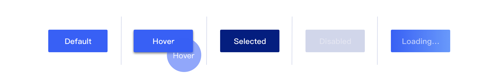
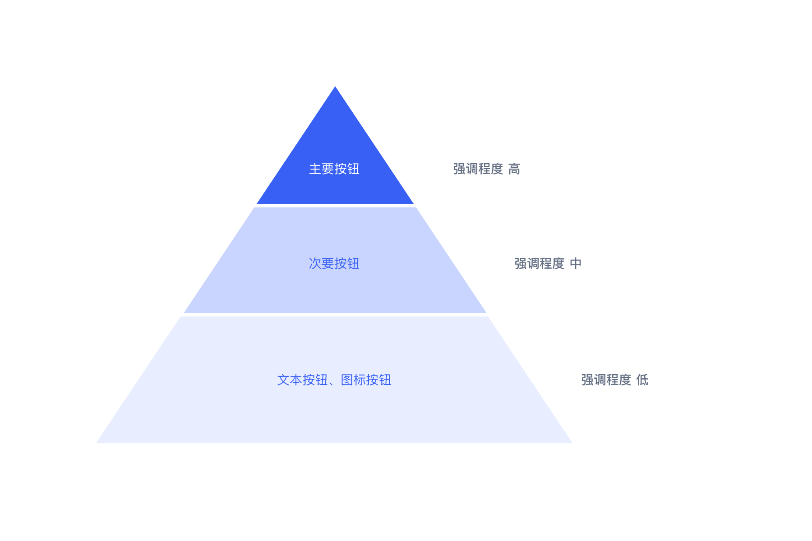
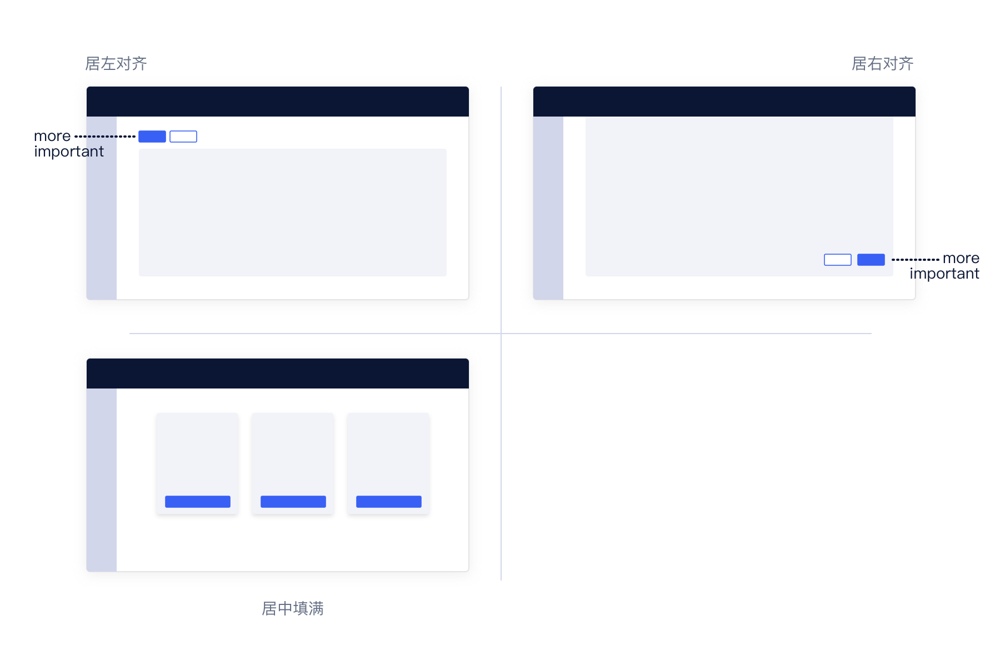
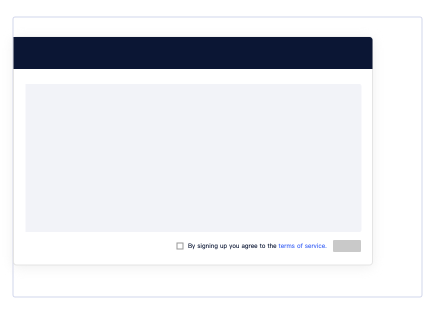

---
description:"按钮，用于触发操作的行动点。"
---

<!--副标题具体写法见源代码模式-->

## 简介

按钮，用于触发操作的行动点。一般用于：

- 模态/非模态弹窗
- 表单
- 列表
- 卡片



## 基本构成

| 种类               | 容器(A) | 文本标签(B) | 图标(C) |
| :----------------- | :------ | ----------- | ------- |
| 主要按钮           | ✓       | ✓           | 可选    |
| 次要按钮           | ✓       | ✓           | 可选    |
| 文字按钮（文字链） | ×       | ✓           | 可选    |
| 图标按钮           | 可选    | ×           | ✓       |
| 按钮组             | ✓       | ✓           | ✓       |

## 基本样式

### 种类

| 内容               | 说明                                                         |
| :----------------- | :----------------------------------------------------------- |
| 主要按钮           | 操作区域内最重要行动点，建议一个操作区域仅一个主要按钮       |
| 次要按钮           | 强调程度仅次于主要按钮的行动点，一个操作区域可能包含多个次要按钮，建议默认暴露数量不超过三个 |
| 文字按钮（文字链） | 强调程度次于上述两类，一般用于外链跳转                       |
| 图标按钮           | 强调程度次于主要按钮、次要按钮，一般用于图形语义明确且操作区域有限的情况 |
| 按钮组             | 当操作区域存在多个强调程度相当的行动点时，建议将低频使用的行动点组合放置 |

### 尺寸

<!--此处UI提供配图-->

|        | 尺寸 |
| :----- | :--- |
| Large  |      |
| Middle |      |
| Small  |      |

## 基本状态

| 状态   | 说明                                                 | 作用                                                         |
| :----- | :--------------------------------------------------- | ------------------------------------------------------------ |
| 默认   | 默认初始状态，所有按钮均包含该状态。                 | 所有按钮必须包含该状态                                       |
| 悬停   | 鼠标经过按钮时，切换至该状态，所有按钮均包含该状态。 | 暗示用户行动点可操作                                         |
| 选中   | 切换按钮包含                                         | 用于说明当前状态                                             |
| 禁用   | 当前行动点不可用，建议配合提示说明                   | 当行动点激活需要满足某类条件或因触发某项条件导致行动点不可用 |
| 加载中 | 异步操作                                             | 告知用户操作已触发，同时避免重复点击                         |

## 设计说明

### 原则

在界面中如何使用该组件？

#### 1.层级

根据行动点重要级挑选合适的按钮来进行展示。合理的选择一方面可以适度强调行动点，另一方面，对于拥有多个行动点的页面，合理的层级表达也能很好的引导用户按照设计初衷进行逐步操作。

**确保操作区域内仅一个一级行动点**

界面中常包含多个行动点，但建议根据操作频率和对主线任务的影响程度明确各行动点的优先级，同时建议单个操作区域内保留一个最高优先级的行动点并从样式和位置上与其他行动点区分开，方便用户快速理解、高效使用。比如，在资源列表页面，相较于使用主要按钮的“新建资源”，“更改业务组”建议使用次要按钮并考虑默认收起。

**多行动点时注意相关性和优先级**

当界面存在多个行动点时，在理清优先级的同时要注意各行动点之间的相关程度并据此进行布局和展示。比如，在资源列表页，资源的“启动”、“关闭”、“重置”等相关操作位置靠近。[常见问题>>](#控制默认暴露的行动点)

#### 2.反馈

按钮作为命令控件，开发者借助命令控件为用户提供功能，而用户通过按钮产生的动作来实现自己的任务目标。根据动作执行的条件不同，在控件被点击后，命令的执行节点不同。但无论如何，点击操作之后都应给到用户合适的反馈，以告知其：你刚刚的行为完成了。

- 立即执行：在网络良好的情况下，动作应立即被执行。并根据动作执行的结果给出对应的反馈。
- 稍后执行：根据加载发生的环节，可以选择将按钮切换至“加载中”状态或在当前页面的“状态”字段中显示“加载中”。并在动作执行后，给出状态变更和结果反馈。

#### 3. 一致性

控件选择上的一致性也是达成体验一致性的重要一环。因此，建议：

- **尺寸一致性**：若同类界面中有固定的操作区，建议行动点优先级可通过按钮种类进行区分，而保持尺寸一致。
  <!--需要UI支持-->

- **行为一致性**：若平台中不同业务模块中有相同的功能模块.行为设计上的一致可以大大缩减用户学习成本，同时”表里如一“的平台能够给到用户更充分的可靠感和信任感。

  > UCloud Console中多处信息修改需要进行手机验证，而用户点击“获取验证码“后，按钮都将切换成”60s后重新获取“。

  <!--需要UI支持-->

- **描述一致性**：若平台中不同业务模块中有相同的功能模块，那建议按钮的文案保持一致。

  > UCloud Console中多个产品都支持更改配置，提供这项功能的按钮显示“配置升级级”，在资源列表中显示的位置也默认都在操作列的“…”按钮组内。

  <!--需要UI支持-->

### 布局

在界面中如何摆放该组件？

#### 1. 对齐方式及建议

<!--需要UI支持-->

| 方式          | 说明                                                         | 建议                 |
| :------------ | :----------------------------------------------------------- | -------------------- |
| 顶部&局左对齐 | 一般为触发操作/流程的行动点，如页面头图或列表页操作栏中的行动点 | 优先级高的行动点偏左 |
| 底部&局右对齐 | 一般为一组信息或者一组操作的确认，如表单或弹窗操作栏中的行动点 | 优先级高的行动点偏左 |
| 底部&居中填满 | 当操作栏中仅有一个行动点时                                   | --                   |

#### 2. 调整与自适应

非必要固定，按钮布局建议基于栅格布局根据浏览器窗口进行自适应调整。在调整和自适应过程中，仍需要遵循一致性的原则，确保视觉逻辑合理。

> 当今，用户越来越习惯在不同设备端切换使用同一平台，因此平台支持自适应越来越重要。为了保证界面质量，设计者除了需要上述基本原则外，对于按钮文案也需把控质量。确保用语准确、简洁。[常见问题>>](#保证按钮文案简洁准确)

### 行为

当用户使用不同设备端访问平台或页面时，如何与界面中的按钮交互？

#### 桌面端设备

- 鼠标：点击、悬停

#### 移动端设备

- 鼠标：平板可外接鼠标，行为与桌面端设备一致
- 手指：点击

##  常见问题

### 控制默认暴露的行动点

操作区包含多个操作，需仅保留一个主要按钮，低频不重要次要按钮可以默认收起。

> - 切忌将高频使用的行动点默认收起，增加查找难度。
> - 当操作区域存在多项行动点时，若一些行动点之间存在关联性，建议分组后合理使用按钮组。按钮组相当于是按钮列表的下拉，若毫无逻辑的堆在一起，同样无法提供高效使用的体验。

   

      
<i class="u-md-suggested"></i>默认收起低频使用的行动点

      
   

   

      
<i class="u-md-not-suggested"></i>将所有行动点平铺展示

      
   

### 保证按钮文案简洁准确

建议文本标签不要过长，避免换行。

   

      
<i class="u-md-suggested"></i>文案准确、简洁

      
   

   

      
<i class="u-md-not-suggested"></i>文案冗长、啰嗦

      
   

### 合理圈定点击区域

如注册流程中的免责声明中常常会展示协议文档的链接。建议仅将协议名称作为点击区域，明确告知用户即将跳转查看的内容。

   

      
<i class="u-md-suggested"></i>仅目标文案为点击热区

      
   

   

      
<i class="u-md-not-suggested"></i>无关内容均被指定为点击热区

      
   

## 主题

| 内容 | 值           | 默认值  |
| :--- | :----------- | :------ |
| icon | icon/nothing | nothing |
| icon | icon/nothing | nothing |

## 相关文档

1. [相关文档1](https://www.ucloud.cn)
2. [相关文档2](https://www.ucloud.cn)

