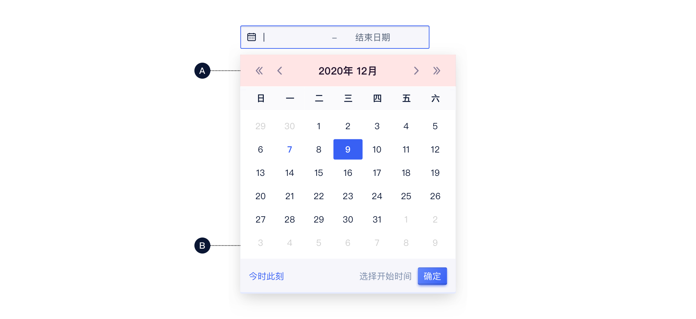
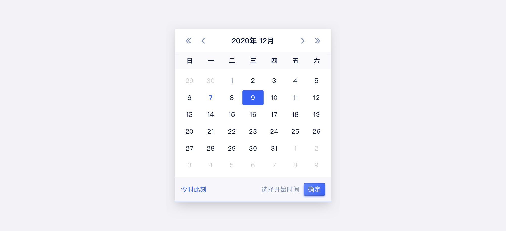
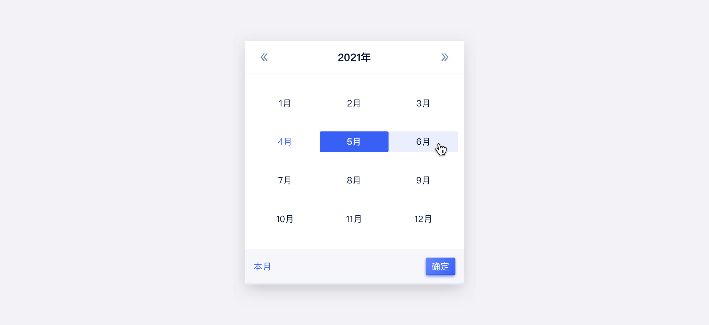
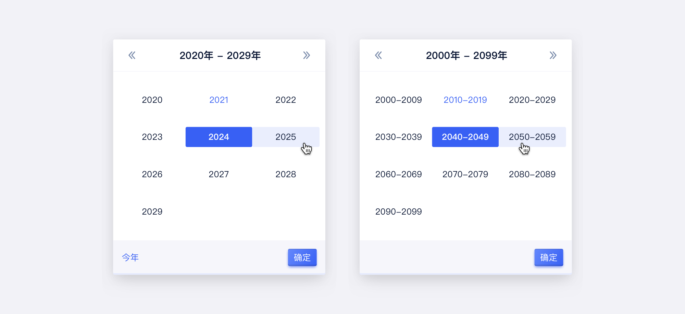
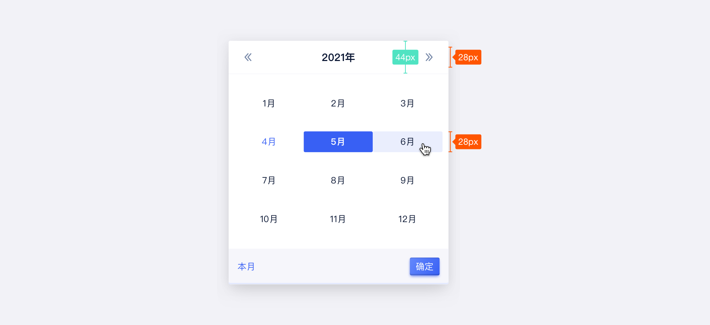
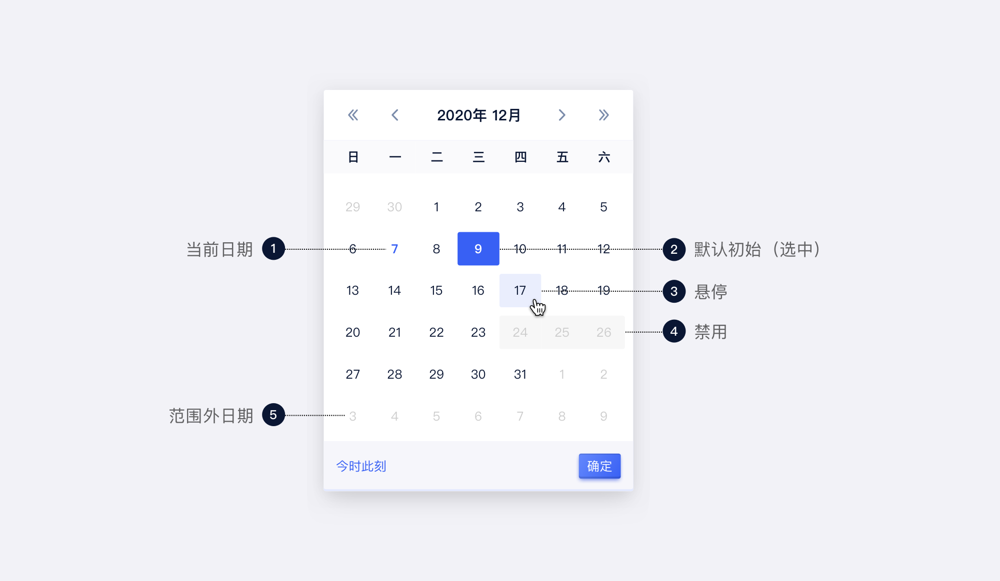
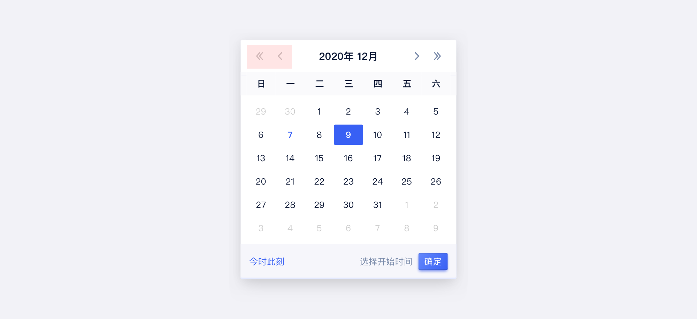

<!--副标题具体写法见源代码模式-->

## 简介

用于展示日期数据的容器，组合选择器可作为时间段或时间点选择器：

- 支持年份、月份切换
- 支持修改时区

## 基本构成

<!--图片存储路径为images下新建元素名文件夹，例/images/Name/pic.png-->

| 类型 | 标题栏（A） | 容器（B） | 操作区域（C） |
| :--: | :---------: | :-------: | :-----------: |
| 常规 |      √      |     √     |       √       |

**A.标题栏**

- 展示当前年/月/日
- 支持快速向前/向后切换
- 点击可快速进入对应时间单位的选择面板

**B.容器**

- 展示当前最小单元的数据（如，日历下最小单元为“日”）

**C.操作区域**

- 显示操作后的结果和动作按钮

  

## 基本样式

### 类型

<!--图片存储路径为images下新建元素名文件夹，例/images/Name/pic.png-->

| 类型   | 说明                                 |
| :----- | :----------------------------------- |
| 年月日 | 选择具体到“日”。默认展示今天的日期。 |
| 年月   | 选择具体到“月”。默认展示当月。       |
| 年     | 选择具体到“年”。默认展示今年。       |

#### 年月日

#### 年月

#### 年

### 尺寸

## 基本状态

| 状态                 | 说明                   | 作用                                                         |
| :------------------- | :--------------------- | ------------------------------------------------------------ |
| 标记为今日/今月/今年 | 表示当前日期           | 区别于选中时间                                               |
| 默认初始             | --                     | --                                                           |
| 悬停                 | 鼠标划过可选数据时展示 | 暗示用户当前数据可以选择                                     |
| 选中                 | 点击后状态切换         | 表示该数据已被选中                                           |
| 禁用                 | 禁用选择               | 当前数据不可选择                                             |
| 范围外日期           | 不在当前月份内         | 补全展示上个月/下个月的日期，可点击，点击后自动切换到下一个周期 |

## 设计说明

### 原则

1.日历组件一般配合选择器进行使用，组合成 “时间选择器 Time Picker”或者”日期选择器 Date Picker”。

#### 时间选择器

#### 日期选择器

2.可选范围与业务要求一致。

如业务限定出明确的可选范围，应配合业务要求适时禁用向前/向后切换操作或部分日期。

<!--

## 主题

| 内容 | 值           | 默认值  |
| :--- | :----------- | :------ |
| icon | icon/nothing | nothing |
| icon | icon/nothing | nothing |

-->

## 相关文档
1. [Datepicker 日期选择器](/component/Datepicker/)
2. [Timepicker 时间选择器](/component/Timepicker/)
