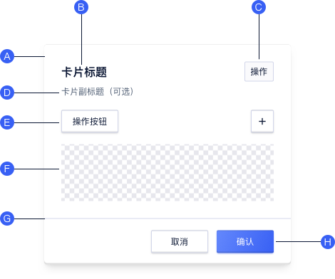
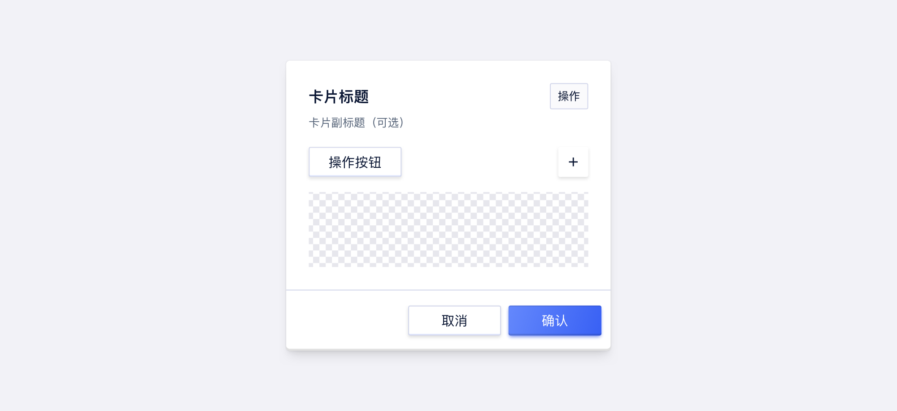
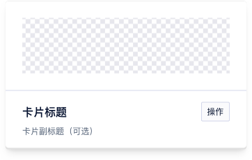
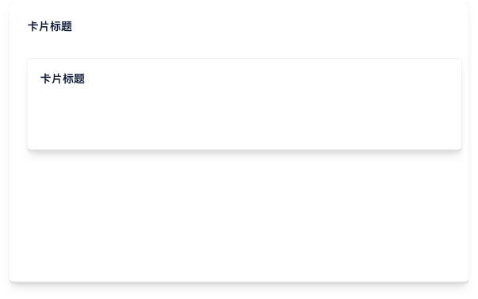
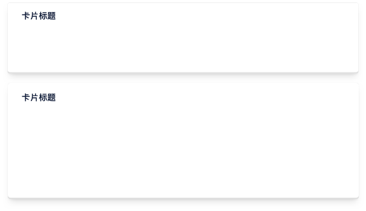
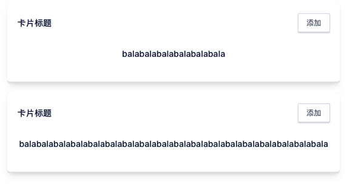
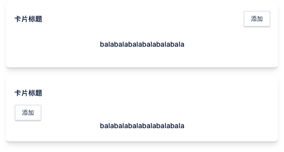

<!--副标题具体写法见源代码模式-->

## 简介

聚合同类信息的容器，使信息分类更加明确。可承载文字、列表、图片、段落，一般用于：

- 创建表单
- 概览页



## 基本构成

卡片布局可以因支持其包含的内容类型而异。以下元素在该品种中常见。

A. 容器 

- 卡片容器包含所有卡片元素，其大小取决于这些元素所占空间

B. 标题 `可选`

- 标题文本包含模块名称
- 不允许折行，可根据业务增加标签
- 可搭配选项卡使用

C. 操作区 `可选`

- 一般只有一个操作项，如修改配置、单选按钮等

D. 副标题 `可选`

- 一般作为解释说明文字出现

E. 操作按钮 `可选`

- 可作为创建、开启、刷新等操作按钮，可对卡片内容做操作或打开新页面跳转

F. 内容区域

- 内容区域不做限定，可以为图表、文字、图形等
- 内容区域高度可固定后内部滚动

G. 分割线 `可选`

- 根据实际需要选择是否需要分割线

H. 底部按钮 `可选`

- 底部动作按钮可以包括保存、取消、确定等

## 基本样式

### 常规样式

### 自定义元素顺序

卡片中元素的展示顺序可根据需求进行调整

## 基本状态

当卡片只作为纯展示容器时，整个卡片只有默认状态，不具备其他状态；当作为可选项时，可存在不同状态；

<!--需要UI支持-->

| 状态 | 说明                                               |
| :--- | :------------------------------------------------- |
| 默认 | 默认初始状态，所有卡片均有默认展示状态             |
| 悬停 | 若该卡片可选择时，鼠标经过卡片上方时，切换至该状态 |
| 选中 | 展示已被选中状态                                   |
| 禁用 | 当前选项不可被选择                                 |

## 设计说明

### 原则

#### 1.层级

**每个卡片都是独立的个体**

一张卡片可以独立存在，而不需要依赖周围的元素作为上下文；单个卡片内需是相同类型的内容，或针对同一对象的信息聚合；内容可以根据其层次结构获得不同级别的强调。

**多个卡片不可进行嵌套**

卡片作为一个容器，承载各类对象，在使用时为防止其过于复杂，建议卡片不进行嵌套

#### 2.反馈

当整个卡片为可点击时，需给出明确的指示引导用户

#### 3. 一致性

同类卡片组合使用时，样式及交互应保持一致

### 行为

- 卡片的主要作用区域通常是卡片本身
- 卡片可以支持多个操作，由于卡片展示内容较为冗杂，因此它们应该包含数量有限的操作。

##  常见问题

### 卡片作为独立个体

若展示内容有层级区分，需进行合理布局，不能将卡片嵌套

   

      
<i class="u-md-suggested"></i>多个卡片嵌套

      
   

   

      
<i class="u-md-not-suggested"></i>卡片平铺展示，层级明确

      
   

### 保证相同类型卡片样式一致

   

      
<i class="u-md-suggested"></i>同类型卡片样式一致

      
   

   

      
<i class="u-md-not-suggested"></i>同类型卡片样式不同

      
   

## 主题

| 内容 | 值           | 默认值  |
| :--- | :----------- | :------ |
| icon | icon/nothing | nothing |
| icon | icon/nothing | nothing |

## 相关文档

1. [相关文档1](https://www.ucloud.cn)
2. [相关文档2](https://www.ucloud.cn)

