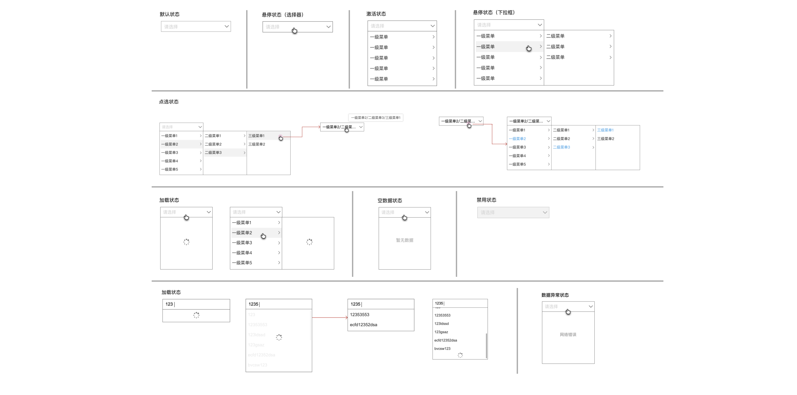

<!--副标题具体写法见源代码模式-->

## 简介

· 级联选择器是一种从一组具有关联性的数据集合中进行选择的交互组件；

· 级别数因业务需求而定，建议不超过5级。

## 基本构成

A.选择器

B.级联菜单

C.带检索的选择器

D.结果菜单

## 基本样式

| 状态               | 说明                                                         |
| :----------------- | :----------------------------------------------------------- |
| 默认状态           | 组件初始状态                                                 |
| 悬停状态（选择器） | 鼠标经过选择器时，切换至该状态                               |
| 悬停状态（下拉框） | 鼠标hover父级选项时，自动展开下一级菜单，下拉框高度对齐      |
| 点选状态           | 点选选项，下拉框全部收起，选择器中出现选中内容（包括父级关系），若内容超出组件宽度，以“...”形式展示，鼠标hover显示完整内容；选中选项后再次触发选择器，自动展开到选中项一级，同时选中项及其父级菜单全部做视觉区分处理 |
| 加载状态           | 下拉框数据加载较慢时需给出loading提示，以缓解用户的焦虑感    |
| 空数据状态         | 当数据为空时，需给出明确提示告诉用户当前没有可选的数据。     |
| 禁用状态           | 当前行动点不可用，建议配合提示说明                           |
| 数据异常状态       | 当数据由于网络问题、接口问题等情况无法正常加载时，给予用户明确提示 |

## 其它样式

#### 1.带搜索功能

部分场景需要级联选择器支持搜索功能，则在点击激活选择器时附带输入框功能，见下图：

若用户在激活选择器后，输入内容进行搜索，则收起下拉框，显示带有关键词路径的选项卡，关键词高亮显示，见下图：

点击选项后选项卡收起，选择器显示选择内容。

#### 2.带清除按钮

选择器有选项时，鼠标hover，选择器右侧下拉icon变为清楚icon，点击清除选中项，见下图：

## 设计说明

在界面中如何使用该组件？

#### 1.使用目的

- 由于子集目录隐藏，级联是一种节约屏幕空间的有效方法；
- 比起使用多个 Select 组件，可以在同一个浮层中完成选择，有较好的体验，提高效率。

#### 2.使用场景

- 多用于表单类场景中，需要从一组相关联的数据集合进行选择，例如省市区。

- 从一个较大的数据集合中进行选择时，用多级分类进行分隔，方便选择。

## 常见问题

### 清除按钮出现时机

清除按钮仅在选择器有选中项时hover出现，无选中项时hover选择器不出现清除icon。

   

      
<i class="u-md-suggested"></i>无选中项时，鼠标hover选择器，不出现清除icon。

      
   

   

      
<i class="u-md-not-suggested"></i>无选中项时，鼠标hover选择器，出现清除icon。

      
   

<!--

## 主题

| 内容 | 值           | 默认值  |
| :--- | :----------- | :------ |
| icon | icon/nothing | nothing |
| icon | icon/nothing | nothing |

## 相关文档

1. [Tag 标签](https://www.ucloud.cn)
2. [Notice 提示](https://www.ucloud.cn)

-->

