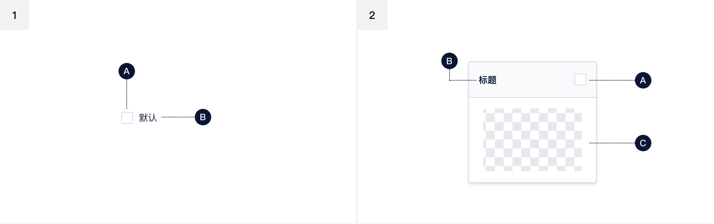
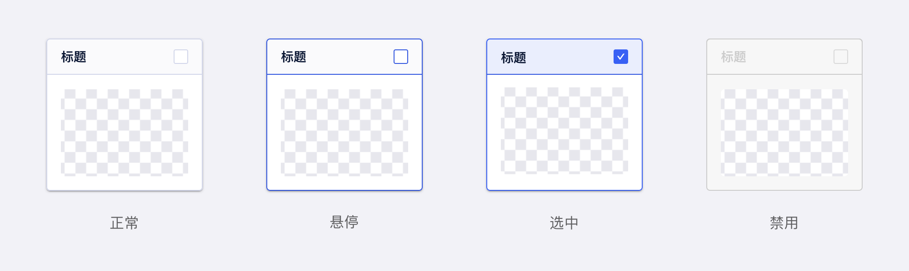
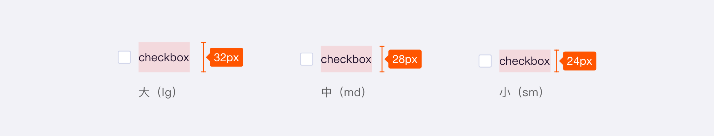
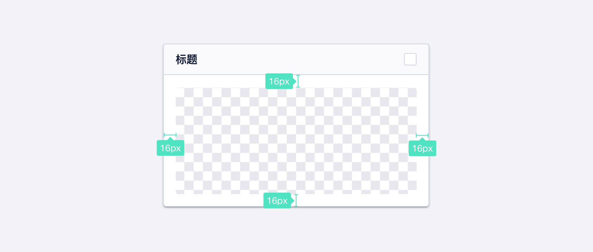
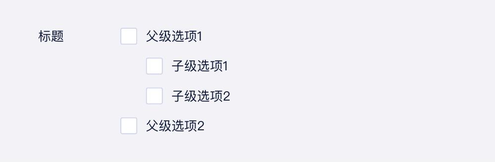
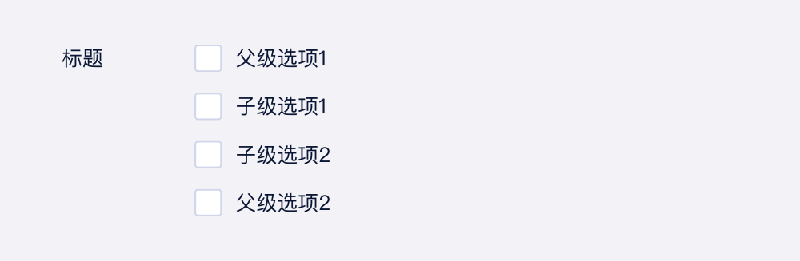
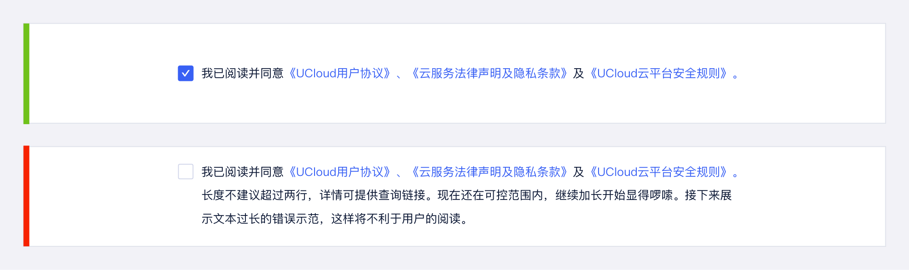
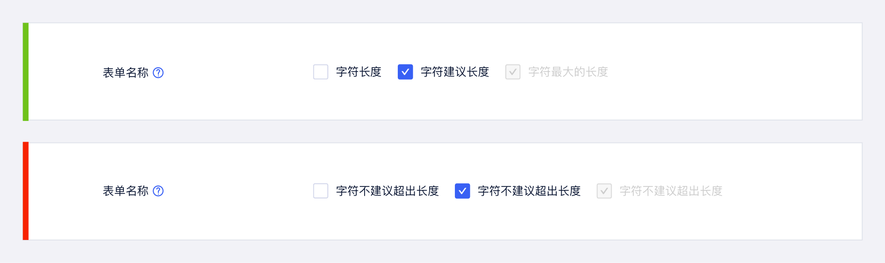
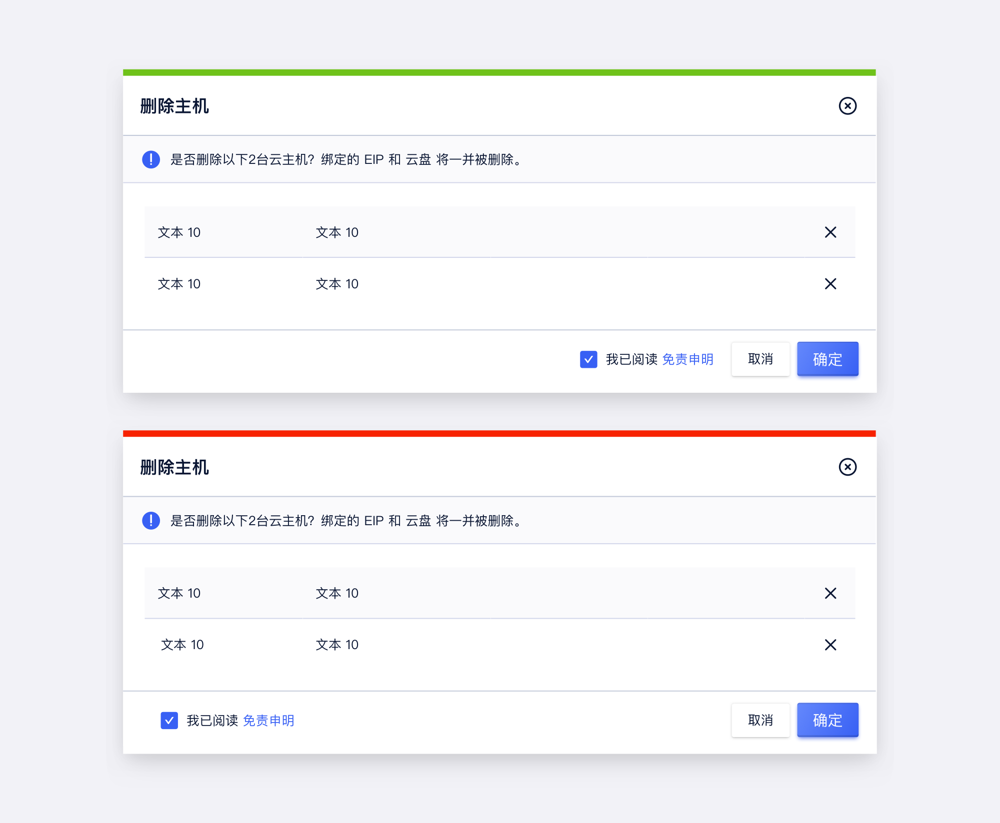
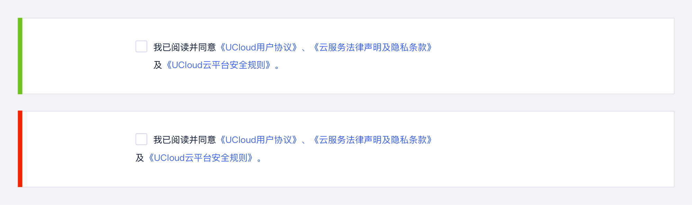

<!--副标题具体写法见源代码模式-->

## 简介

复选框是常见的选择控件之一，应用场景比较丰富。

- 用于表单及列表：复选框后一般跟随对象，通过“空”和“勾选”两种方式区分其后对象是否被选中，支持单选或多选。
- 用于确认清单：复选框后一般跟随对象，通过“空”和“勾选”两种方式区分其后对象是否开启。
- 关于层级：若对象存在多个且内含层级，可使用缩进来区分层级，同时上一级对象项目前的复选框可控制其下一级对象。

## 基本构成

<!--图片存储路径为images下新建元素名文件夹，例/images/Name/pic.png-->

| 种类     | 复选框(A) | 文本标签(B) | 内容区域（C） |
| :------- | :-------: | :---------: | :-----------: |
| 多选按钮 |     √     |      √      |      无       |
| 卡片     |     √     |      √      |       √       |

## 基本样式

### 类型

| 类型     | 说明                |
| :------- | :------------------ |
| 多选框   | 最常见的多选框，纯本文展示，建议选项文本字符不超过7个、选项个数不超过5个 |
| 多选卡片 | 相比于普通多选框，展示样式更丰富，可同时添加不同样式文本与图像素材。建议每张卡片内容量保持一致，避免卡片大小不一或过多留白 |

#### 多选框

#### 多选卡片

### 尺寸

#### 多选框

U-Design 目前对多选按钮区分了 3 种尺寸：**大（lg）、中（md）、小（sm）**。

大号按钮（lg）高32px，为目前的默认多选按钮尺寸。

在使用过程中可以根据布局空间，灵活使用不同尺寸的多选按钮。[标注明细 >](https://lanhuapp.com/url/wNh7a-q05xe)

#### 多选卡片

依据内容大小自动撑满，与容器内间距保持16**px**即可。[标注明细 >](https://lanhuapp.com/url/wNh7a-q05xe)

## 基本状态

| 状态             | 说明                                                   | 作用                                                         |
| :--------------- | :----------------------------------------------------- | ------------------------------------------------------------ |
| 默认             | 默认初始状态                                           | --                                                           |
| 悬停             | 鼠标经过按钮时，切换至该状态                           | 暗示用户行动点可操作                                         |
| 选中             | 元素切换至选中                                         | 表示其后的项目被选中                                         |
| 半选中           | 当选项存在父子级关系时，若部分子项被选中则父项为该状态 | 表示其子项中部分被选中                                       |
| 禁用             | 当前行动点不可用，建议配合提示说明                     | 表示当前选项不可选择 |
| 禁用（默认勾选） |   当前行动点不可用，建议配合提示说明                                | 表示当前选项默认勾选且不可取消                                       |

## 设计说明

### 原则

在界面中如何使用该组件？

#### 1.符合用户认知

复选框是比较常见的选择控件并被长时间、广泛应用在各种页面或平台界面上。无论从样式还是操作定义上都已在用户中形成共识，因此在设计和应用上应该优先遵循这些规则，避免用户产生误解或付出额外的学习成本。

#### 2.状态区分直观

确保默认与选中的样式差异明显，便于用户快速理解和区分。

#### 3. 选项数量限制建议

- **作为表单选项**：建议选项数目不超过**5**个，若选项过多建议分类或选用支持搜索的选择控件；[常见问题>>](#选项数量建议不超过5个)=
- **作为须知内容展示**：建议多内容项时进行文案整合，避免出现多项待勾选项。

#### 4. 内容长度限制建议

- **作为表单选项**：建议选项字符不超过**7**个；
- **作为须知内容展示**：建议长度不超过**2**行，详情可提供查询链接。[常见问题>>](#须知内容建议不超过2行)

#### 5. 父子层级选项展示建议
若选项中存在父子级关系：
- 子项相对于父级选项应向右缩进排列；[常见问题>>](#父子层级选项从操作逻辑到展示上需区分)
- 若父项被选中，则其相关子项自动全选；相反，则其相关子项全部未选；
- 若部分子项被选中，则且相关父项目为半选中状态。

### 场景

该组件应用于哪些场景？

#### 1.用于页面或弹窗内表单

通过“空”和“勾选”两种方式区分其后对象是否被选中，支持单选或多选。

#### 2.用于列表

通过“空”和“勾选”两种方式区分其后对象是否被选中，勾选后可激活批量操作。

#### 3.用于确认通知或提示

通过“空”和“勾选”两种方式区分其后对象是否已知，对象中一般包含详情链接。

#### 4.用于开关某项设置

通过“空”和“勾选”两种方式区分其后对象是否开启。

### 布局

在界面中如何摆放该组件？

#### 1. 作为选项应用于表单中

建议将复选框置于项目左侧，方便用户快速区分选中对象与未选中对象。

#### 2. 作为须知内容展示在操作附近

- 建议将复选框置于项目左侧，同时建议整个对象放置在操作左侧，提醒用户操作前完成阅读及确认；[常见问题>>](#操作前须知内容应靠近操作按钮)
- 换行时，仅与文本左对齐。[常见问题>>](#勾选框不要被文案包裹)

### 行为

当用户使用不同设备端访问平台或页面时，如何与界面中的按钮交互？

#### 桌面端设备

- 鼠标：点击、悬停
- 热区：选择框，选项名称或自定义背景热区

#### 移动端设备

- 鼠标：平板可外接鼠标，行为与桌面端设备一致
- 手指：点击
- 热区：选择框，选项名称或自定义背景热区

## 常见问题

### 须知内容换行对齐建议

   

      
<i class="u-md-suggested"></i>仅文本居左对齐

      
   

   

      
<i class="u-md-not-suggested"></i>复选控件被包裹在文案中，不便于用户识别与状态确认

      
   

### 父子层级选项从操作逻辑到展示上需区分

   

      
<i class="u-md-suggested"></i>使用缩进来区分父子级选项关系

      
   

   

      
<i class="u-md-not-suggested"></i>无缩进展示不便于用户理解信息层级关系

      
   

### 选项数量建议不超过5个

   

      
<i class="u-md-suggested"></i>数量合理的选项便于用户快速阅读

      
   

   

      
<i class="u-md-not-suggested"></i>过多的选项建议选择其他选择控件并配合搜索

      
   

### 须知内容建议不超过2行

   

      
<i class="u-md-suggested"></i>陈述简洁，必要时给予详情跳转

      
   

   

      
<i class="u-md-not-suggested"></i>过长本文会让用户放弃阅读甚至降低好感

      
   

     
   
     
### 选项字符建议不超过7个

   

      
<i class="u-md-suggested"></i>简洁且突出差异的描述更利于用户快速阅读

      
   

   

      
<i class="u-md-not-suggested"></i>描述切忌啰嗦、反复过分冗长

      
   

     
     
### 操作前须知内容应靠近操作按钮

   

      
<i class="u-md-suggested"></i>简洁且突出差异的描述更利于用户快速阅读

      
   

   

      
<i class="u-md-not-suggested"></i>描述切忌啰嗦、反复过分冗长

      
   

     
     
### 勾选框不要被文案包裹

   

      
<i class="u-md-suggested"></i>文本换行时，仅与文本左对齐。

      
   

   

      
<i class="u-md-not-suggested"></i>勾选框与文案混排，难于被察觉

      
   

     
     

     

## 主题

| 内容 | 值           | 默认值  |
| :--- | :----------- | :------ |
| icon | icon/nothing | nothing |
| icon | icon/nothing | nothing |

## 相关文档

1. [相关文档1](https://www.ucloud.cn)
2. [相关文档2](
