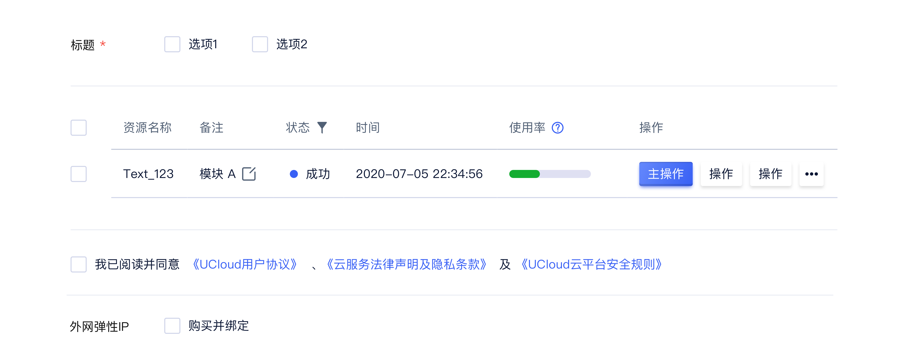
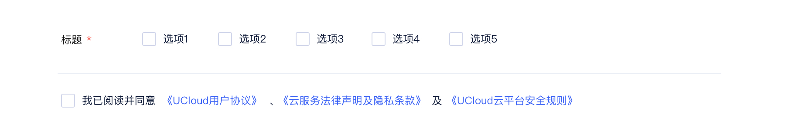
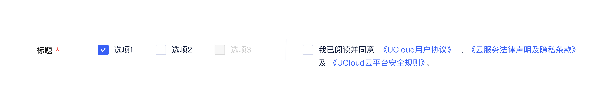
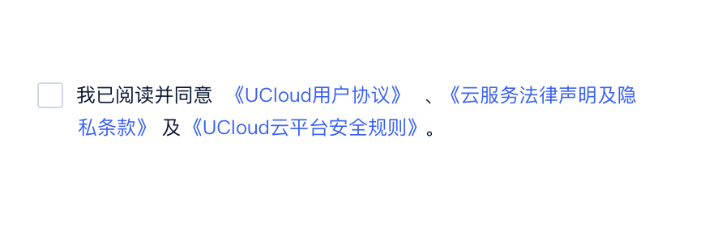
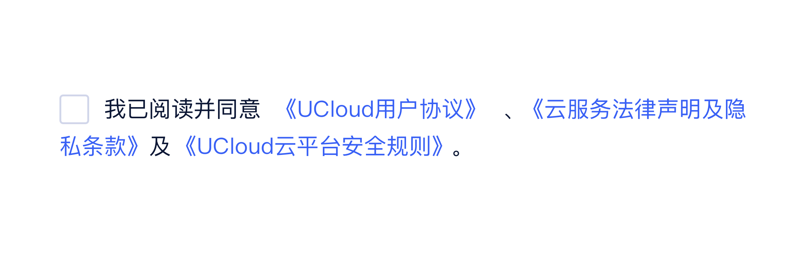

<!--副标题具体写法见源代码模式-->

## 简介

复选框是常见的选择控件之一，应用场景比较丰富。

- 用于表单及列表：复选框后一般跟随对象，通过“空”和“勾选”两种方式区分其后对象是否被选中，支持单选或多选。
- 用于确认清单：复选框后一般跟随对象，通过“空”和“勾选”两种方式区分其后对象是否开启。
- 关于层级：若对象存在多个且内含层级，可使用缩进来区分层级，同时上一级对象项目前的复选框可控制其下一级对象。

## 基本构成

<!--图片存储路径为images下新建元素名文件夹，例/images/Name/pic.png-->

| 种类     | 复选框(A) | 文本(B) |
| :------- | :-------- | ------- |
| 选项     | ✓         | ✓       |
| 须知内容 | ✓         | ✓       |

## 基本样式

### 种类

<!--图片存储路径为images下新建元素名文件夹，例/images/Name/pic.png-->

| 场景                 | 作用                                                         |
| :------------------- | :----------------------------------------------------------- |
| 用于页面或弹窗内表单 | 通过“空”和“勾选”两种方式区分其后对象是否被选中，支持单选或多选 |
| 用于列表             | 通过“空”和“勾选”两种方式区分其后对象是否被选中，勾选后可激活批量操作 |
| 用于确认通知或提示   | 通过“空”和“勾选”两种方式区分其后对象是否已知，对象中一般包含详情链接 |
| 用于开关某项设置     | 通过“空”和“勾选”两种方式区分其后对象是否开启                 |

### 尺寸

<!--图片存储路径为images下新建元素名文件夹，例/images/Name/pic.png-->

|        | 尺寸 |
| :----- | :--- |
| Large  |      |
| Middle |      |
| Small  |      |

## 基本状态

<!--图片存储路径为images下新建元素名文件夹，例/images/Name/pic.png-->

| 状态   | 说明                                                   | 作用                                                         |
| :----- | :----------------------------------------------------- | ------------------------------------------------------------ |
| 默认   | 默认初始状态                                           | --                                                           |
| 悬停   | 鼠标经过按钮时，切换至该状态                           | 暗示用户行动点可操作                                         |
| 选中   | 元素切换至选中                                         | 表示其后的项目被选中                                         |
| 半选中 | 当选项存在父子级关系时，若部分子项被选中则父项为该状态 | 表示其子项中部分被选中                                       |
| 禁用   | 当前行动点不可用，建议配合提示说明                     | 当行动点激活需要满足某类条件或因触发某项条件导致行动点不可用 |

## 设计说明

### 原则

在界面中如何使用该组件？

#### 1.符合用户认知

复选框是比较常见的选择控件并被长时间、广泛应用在各种页面或平台界面上。无论从样式还是操作定义上都已在用户中形成共识，因此在设计和应用上应该优先遵循这些规则，避免用户产生误解或付出额外的学习成本。

#### 2.状态区分直观

确保默认与选中的样式差异明显，便于用户快速理解和区分。

#### 3. 选项数量限制建议

- **作为表单选项**：建议选项数目不超过**5**个，若选项过多建议分类或选用支持搜索的选择控件；
- **作为须知内容展示**：建议多内容项时进行文案整合，避免出现多项待勾选项。

#### 4. 内容长度限制建议

- **作为表单选项**：建议选项字符不超过**7**个；
- **作为须知内容展示**：建议长度不超过**2**行，详情可提供查询链接。

<!--图片存储路径为images下新建元素名文件夹，例/images/Name/pic.png-->

### 布局

在界面中如何摆放该组件？

#### 1. 作为选项应用于表单中

建议将复选框置于项目左侧，方便用户快速区分选中对象与未选中对象。

#### 2. 作为须知内容展示在操作附近

- 建议将复选框置于项目左侧，同时建议整个对象放置在操作左侧，提醒用户操作前完成阅读及确认；
- 换行时，仅与文本左对齐。

### 行为

当用户使用不同设备端访问平台或页面时，如何与界面中的按钮交互？

#### 桌面端设备

- 鼠标：点击、悬停
- 热区：选择框，选项名称或自定义背景热区

#### 移动端设备

- 鼠标：平板可外接鼠标，行为与桌面端设备一致
- 手指：点击
- 热区：选择框，选项名称或自定义背景热区

## 常见问题

### 须知内容换行对齐建议

须知内容较长时，换行后对齐区域不包含复选框。

   

      
<i class="u-md-suggested"></i>仅文本居左对齐

      
   

   

      
<i class="u-md-not-suggested"></i>复选控件被包裹在文案中，不便于用户识别与状态确认

      
   

### 父子层级选项展示建议

若选项中存在父子级关系：

- 子项相对于父级选项应向右缩进排列；
- 若父项被选中，则其相关子项自动全选；相反，则其相关子项全部未选；
- 若部分子项被选中，则且相关父项目为半选中状态。

   

      
<i class="u-md-suggested"></i>使用缩进来区分父子级选项关系

      
   

   

      
<i class="u-md-not-suggested"></i>无缩进展示不便于用户理解信息层级关系

      
   

## 主题

| 内容 | 值           | 默认值  |
| :--- | :----------- | :------ |
| icon | icon/nothing | nothing |
| icon | icon/nothing | nothing |

## 相关文档

1. [相关文档1](https://www.ucloud.cn)
2. [相关文档2](
