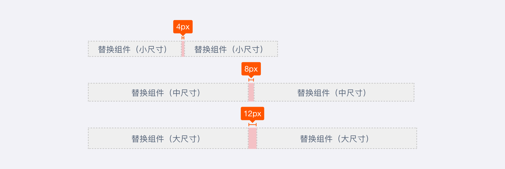

# 简介

设置组件之间的间距，避免组件紧贴在一起，拉开统一的空间。

任意尺寸组件可以视场景灵活使用配置项。

<!--

## 主题

| 内容 | 值           | 默认值  |
| :--- | :----------- | :------ |
| icon | icon/nothing | nothing |
| icon | icon/nothing | nothing |

## 相关文档

1. [Tag 标签](https://www.ucloud.cn)
2. [Notice 提示](https://www.ucloud.cn)

-->
