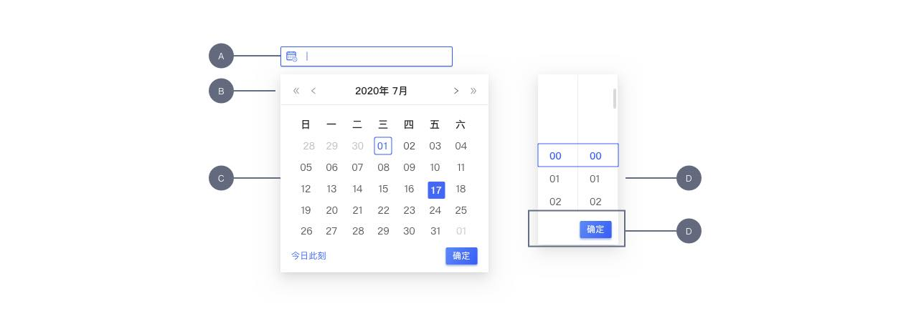
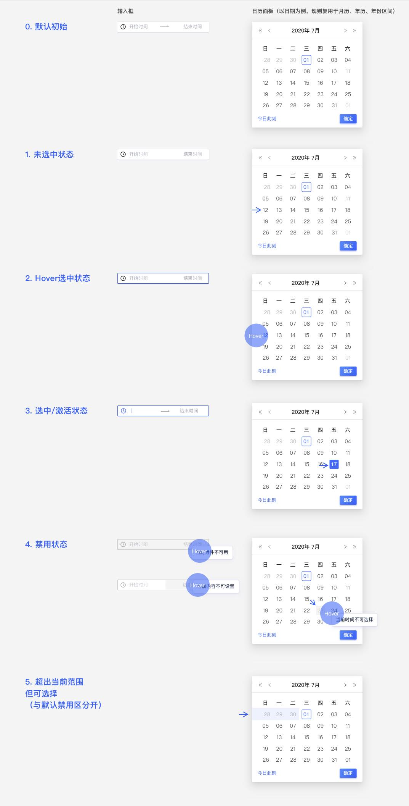
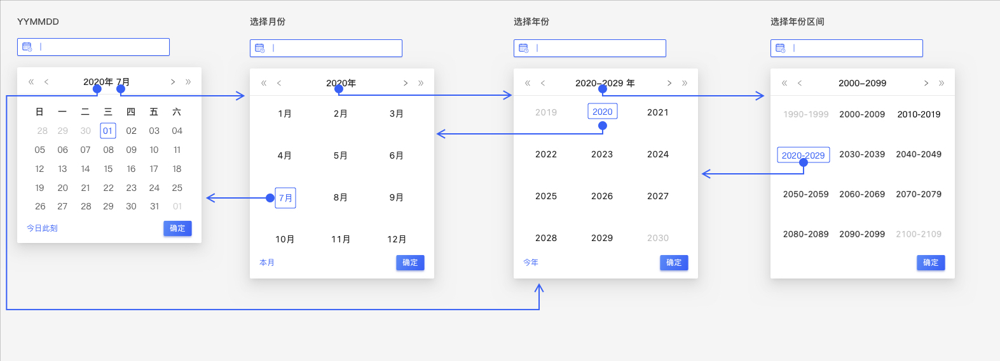
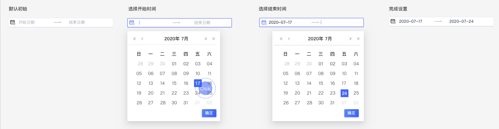
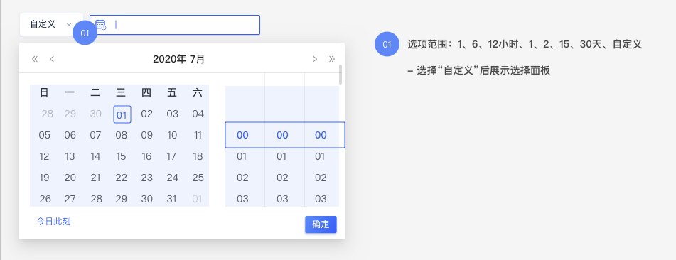

---

description: "输入或选择日期的输入控件"

---

<!--副标题具体写法见源代码模式-->

## 简介

`Datepicker`作为日期选择器。当用户需要选择某个日期节点或个日期范围，可点击打开选择面板或通过自定义输入来完成。

## 基本构成

<!--图片存储路径为images下新建元素名文件夹，例/images/Name/

| 构成        | 定义                                                         | 说明                                                         |
| :---------- | :----------------------------------------------------------- | ------------------------------------------------------------ |
| 输入框(A)   | 默认展示元素，单击该元素激活控件。用户可按照规定格式**输入**所需日期 | 需提供占位文案或默认时间                                     |
| 导航区(B)   | 默认展示当前月份，支持切换月份、年份                         | 点击“向前”/“向后”切换月份，点击当前月份/年份向上切换范围     |
| 日历面板(C) | 默认展示当前月日期，用户可在面板上通过**点击**选择日期。面板根据“导航区”展示单位切换展示日期/月份/年份等。 | 面板需区分展示项目“当前项”、“可选项”、“悬停选中项”、“选中项”、“禁用项”、“超出范围项” |
| 时间滚轮(D) | 默认展示“00:00"，用户可在滚轮上通过**点击**/**滚动**目标项目进选中框内来选择时间 | 具体行为说明见[时间点选择器]()、[时间范围选择器]()           |
| 操作底栏(E) | 可按需选配。展示时，默认提供**确定**，依业务需要可提供**今日此刻**快捷选项 | - 点击**确定**：完成当前选择、收起面板，仅保留输入框且恢复**未激活**态 - 点击**组件外空白处**：放弃当前选择、收起面板，仅保留输入框且恢复**未激活**态。 - 点击**今日此刻**：自动选中当前日期、收起面板，仅保留输入框且恢复**未激活**态。 |

| 种类  | 输入框(A) | 导航区(B) | 日历面板(C) | 时间滚轮(D) | 操作底栏(E) |
| :---- | :----------- | ------------ | ------------ | ------------ | ------------ |
| 单日期选择器 | ✓            | ✓           | ✓            | 见[时间点选择器]() | ✓        |
| 日期范围选择器 | ✓            | ✓           | ✓            | 见[时间范围选择器]() | ✓         |

## 基本样式

### 类型与样式

<!--图片存储路径为images下新建元素名文件夹，例/images/Name/pic.png-->

| 内容  | 说明                 |
| :---- | :------------------- |
| 单日期选择器 | 用来设定具体日期节点，如任一年份、任一月份、任一日 |
| 日期范围选择器 | 用来设定具体日期节点，如年份范围、月份范围、日期范围 |
> 单一日期/日期范围选择，均可能包含时间设点，该类情况见[《Timepicker 时间选择器》章节]()

### 尺寸

<!--图片存储路径为images下新建元素名文件夹，例/images/Name/pic.png-->

|        | 尺寸 |
| :----- | :--- |
| Large  |      |
| Middle |      |
| Small  |      |

## 基本状态

<!--图片存储路径为images下新建元素名文件夹，例/images/Name/pic.png-->

| 状态                   | 输入框(A)                    | 导航区(B)                       | 日历面板(C)                        | 时间滚轮(D)                                | 操作底栏(E)                 |
| :--------------------- | :--------------------------- | ------------------------------- | ---------------------------------- | ------------------------------------------ | --------------------------- |
| 默认初始/未选中/未激活 | 占位提示/当前日期/设定初始值 | 当前月份                        | 当前日期                           | 具体见[时间点选择器]()、[时间范围选择器]() | 基于空值判断，默认禁用/激活 |
| 悬停                   | 暗示可点击                   | 暗示可点击                      | 暗示可选择                         | 暗示可选择                                 | 暗示可点击                  |
| 选中/激活              | 焦点移入，暗示可输入         | /                               | 数值选中                           | 数值选中                                   | /                           |
| 禁用/不可选            | 时间固定、不可编辑           | 月份/年份/翻页icon不可更改/使用 | 不可选择，悬停需给提示             | 不可选择，悬停需给提示                     | 尚未完成设定                |
| 超出范围（可选）       | /                            | /                               | 数值超出当前范围为，悬停暗示可点击 | /                                          | /                           |

## 设计说明

### 通用原则

- 计时方式：24h计时法

- 默认初始值设定：

  - 支持空值：需提供占位提示

  - 当前日期：日期选择器若设定默认值，应设定为当前日期

  - 00:00 ：时间选择器若设定默认值，应设定为00:00

    

### 行为

当用户使用不同设备端访问平台或页面时，如何与界面中的按钮交互？

#### 1.单日期选择

用户使用【单日期选择器】可通过**点击或自定义输入**进行设定，自定义输入后键盘“Enter”或单击选中最后一位值后**自动生效**。

#### 2.日期范围选择

用户使用【日期范围选择器】可通过**点击或自定义输入**进行【开始日期】和【结束日期】的选择，每次需要【依次】完成开始日期及结束日期的选择：

- 仅日期：选中结束日期后**自动生效**
- 日期+时间：选中开始时间和结束时间后，点击**确定**即刻生效

#### 3.输入结果自动校验、自动修正、错误说明

##### 自动校验

- 连接符号（仅支持“-”、“:”）
- 字符类型（仅支持“数字“）
- 格式（模糊支持XXXXYYZZ/XXXXYZ/XXYYZZ/XXYZ）
- 字符长度（根据格式规则分开定义长度上限）
- 日期+时间，用空格隔开。若丢失空格则作错误处理

##### 自动修正

- 中英文输入法问题支持，如“—”自动修正成“-”
- 格式问题支持，如2020-1-20自动修正成2020-01-20
- 输入不符合规则的字符，自动恢复至上一次正确值

##### 错误说明

非自动修正范围的输入项（输入不符合规则或者长度超出）

- 组件报错提示
- 全局报错提示
- “确定”禁用

#### 4.配合**快捷选项**进行使用

可基于用户常关注的时间区间提供快捷选项，并提供**自定义**以触发日历面板

## 主题

| 内容 | 值           | 默认值  |
| :--- | :----------- | :------ |
| icon | icon/nothing | nothing |
| icon | icon/nothing | nothing |

## 相关文档

1. [相关文档1](https://www.ucloud.cn)
2. [相关文档2](
