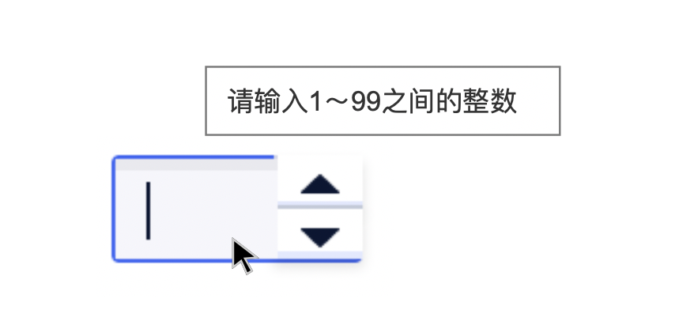
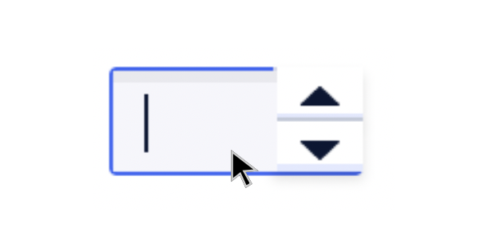

<!--副标题具体写法见源代码模式-->

## 简介

抽屉从父窗体边缘滑入，覆盖住部分父窗体内容。用户在抽屉内操作时不必离开当前任务，操作完成后，可以平滑地回到到原任务。

## 基本构成

| 输入框（A） | 数值增减器（B） |
| :---------: | :-------------: |
|      √      |        √        |

## 基本样式

| 类型   | 说明                                                         |
| :----- | :----------------------------------------------------------- |
| 样式一 | 增减按钮置于输入框右侧，常用于用户以输入为主，用户填入数值可能跨度较大的场景 |
| 样式二 | 增减按钮置于输入框两侧，以加减表示，用户填入数值跨度较小的场景，例如购买数量等 |
| 样式三 | 增减按钮置于输入框两侧，以箭头表示，常用于翻页器             |

#### 样式一

#### 样式二

#### 样式三

## 基本状态

| 状态     | 说明                               | 作用                 |
| :------- | :--------------------------------- | -------------------- |
| 默认状态 | 组件初始状态                       | -                    |
| 悬停状态 | 鼠标经过选择器时，切换至该状态     | 暗示用户行动点可操作 |
| 选中状态 | 元素切换至选中                     | 表示其后的项目被选中 |
| 禁用状态 | 当前行动点不可用，建议配合提示说明 | 表示当前选项不可选择 |

## 

## 设计说明

在界面中如何使用该组件？

#### 使用场景    

- 当输入内容为数值，且数据需要做正确性检查、自动订正时使用。

## 常见问题

### 输入数值有限定条件时应给予前置提示

   

      
<i class="u-md-suggested"></i>输入框激活时，应冒泡给予数值限定条件提示。

      
   

   

      
<i class="u-md-not-suggested"></i>输入前不给予提示容易引起用户的无效操作。

      
   

## 
