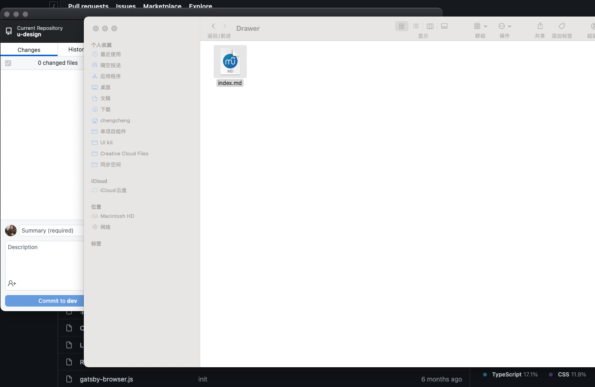
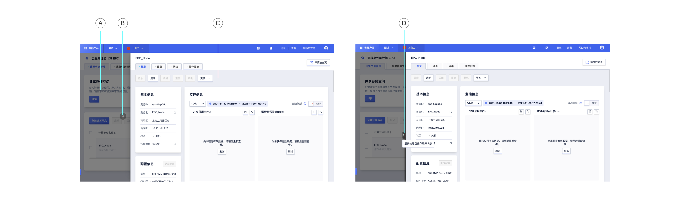

<!--副标题具体写法见源代码模式-->

## 简介

抽屉从父窗体边缘滑入，覆盖住部分父窗体内容。用户在抽屉内操作时不必离开当前任务，操作完成后，可以平滑地回到到原任务。

## 基本构成

|  遮罩区（A）   | 关闭按钮（B）  | 内容区（C） | 抽屉模式切换按钮（D） |
| :------------: | :------------: | :---------: | :-------------------: |
|       √        |       √        |      √      |           √           |
| 点击可关闭抽屉 | 点击可关闭抽屉 |             | 鼠标hover抽屉侧边出现 |

## 基本样式

| 类型   | 说明                                                         |
| :----- | :----------------------------------------------------------- |
| 样式一 | 宽度较窄的抽屉，适用于内容体量较小的场景，常用于单列信息展示。 |
| 样式二 | 宽度较大的抽屉，适用于内容体量较大的场景。                   |

#### 样式一

#### 样式二

## 

## 设计说明

在界面中如何使用该组件？

#### 使用场景    

- 在当前任务流中插入临时任务，创建或预览附加内容，例如协议条款。

- 当父级页面需要一个子窗体承载信息，但居中弹窗容纳不下内容且替换页或新开页面过于脱离父体时，可使用抽屉组件。

  

#### 使用注意

- 原路返回，由哪个页面弹出弹窗，关闭弹窗后显示哪个页面。

- 弹出弹窗时锁定背景页面禁止跟随弹窗滚动。

- 抽屉页面上可以更深一步操作弹出弹窗或再叠加一个抽屉。

  

## 
