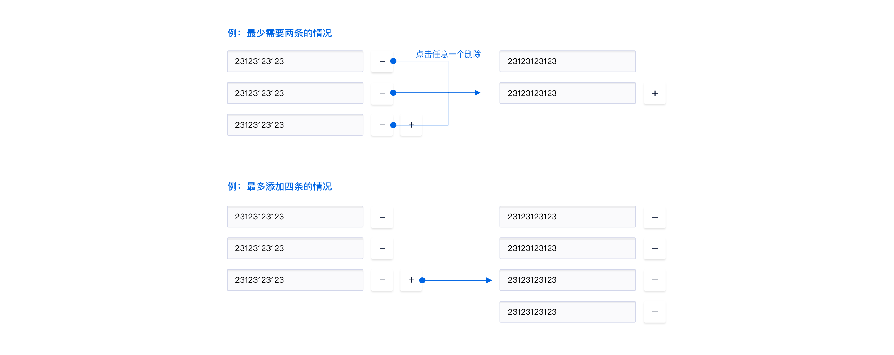

<!--副标题具体写法见源代码模式-->

## 简介

一种用户可自行增减表单数量的组件。

## 基本构成

| 输入框(A) | 删除按钮(B) | 添加按钮(C) |
| :-------: | :---------: | :---------: |
|     √     |      ✓      |      ✓      |

## 设计说明

在界面中如何使用该组件？

#### 1.自增表单与自增表格的区别

-  自增表单通常是针对单个文本框的表单，通过增减按钮调整文本框的数量；
-  自增表格通常是针对一组表单进行增减，例如select与文本框的组合等。

#### 2.自增表单与多行文本框的区别

- 自增表单优点：可读性强、便于单条修改删除、可逐条校验报错；缺点：占用页面空间较大。

- 多行文本框优点：输入操作方便，便于一次性复制黏贴；缺点：无法单条校验、阅读性稍弱。

  

#### 3.自增表单的报错   

- 自增表单建议使用逐条报错，便于用户即时发现并纠正问题。

  

#### 4.其它一些用法   

- 若存在默认不支持删除与编辑的表单，则后方不放置删除按钮：

  

- 若表单有最大或最少条数限制，则增减到对应数量时隐藏增减按钮：

  
