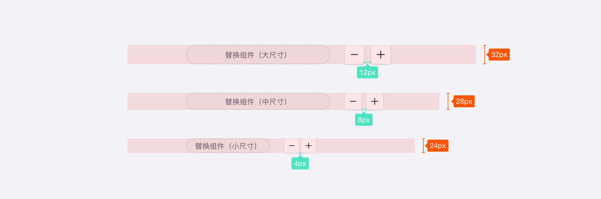
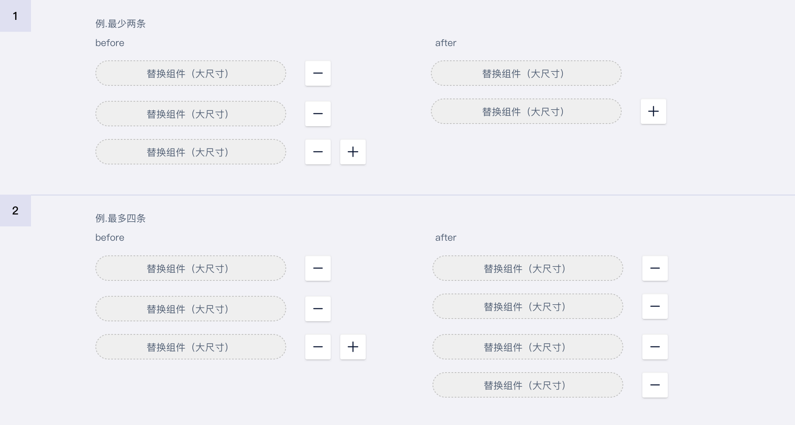
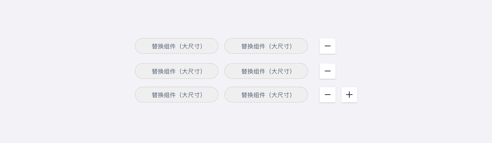

## 简介

一种用户可自行增减表单数量的组件。

## 基本构成

| 组件(A) | 增减按钮(B) |
| :-----: | :---------: |
|    √    |    可选     |

**A.组件**

**B.增减按钮**（可选）

## 基本样式

### 尺寸

U-Design 目前对按钮区分了 3 次种尺寸：**大（lg）、中（md）、小（sm）**

## 设计说明

在界面中如何使用该组件？

### 1.自增表单与多行文本框的区别

- 自增表单优点：可读性强、便于单条修改删除、可逐条校验报错；缺点：占用页面空间较大。

- 多行文本框优点：输入操作方便，便于一次性复制黏贴；缺点：无法单条校验、阅读性稍弱。

  

### 2.自增表单的报错   

- 自增表单建议使用逐条报错，便于用户即时发现并纠正问题。

  

### 3.其它一些用法   

- 若存在默认不支持删除与编辑的表单，则后方不放置删除按钮；

  

- 若表单有最大或最少条数限制，则增减到对应数量时隐藏增减按钮。

## 常见问题

### 自增表单与自增表格混淆

-  自增表单通常是针对单个组件的表单，通过增减按钮调整组件的数量；自增表格通常是针对一组表单进行增减，例如select与文本框的组合等。

   

      
<i class="u-md-suggested"></i>正确场景

      
   

   

      
<i class="u-md-not-suggested"></i>混淆场景

      
   

