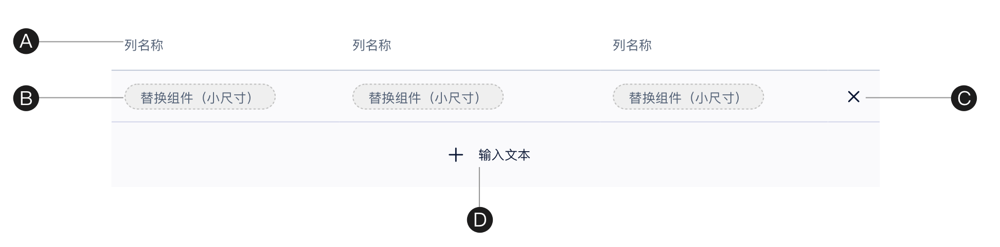
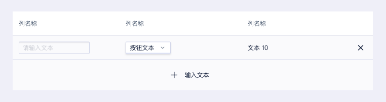
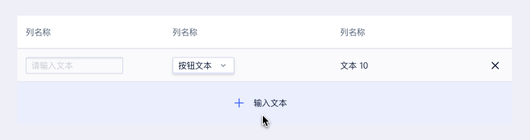
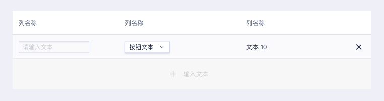
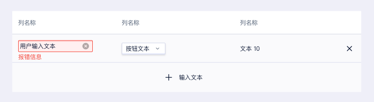
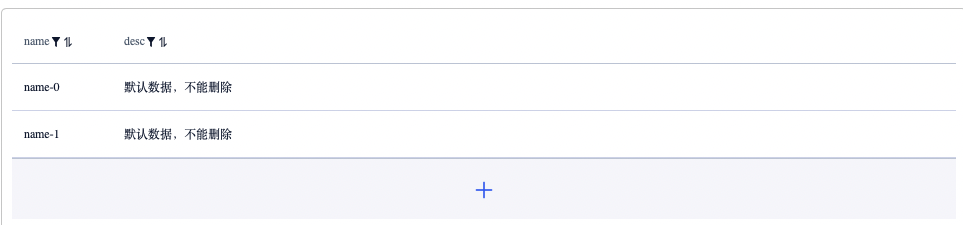
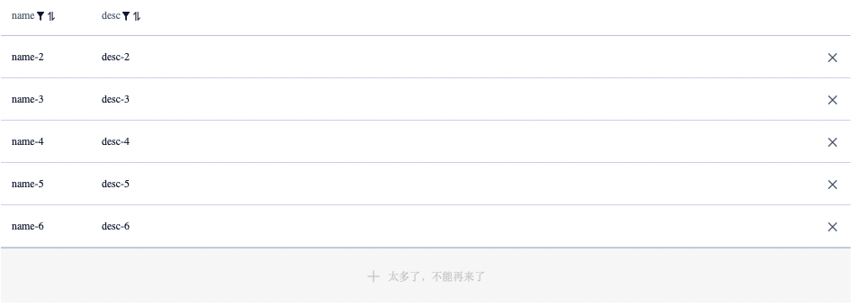

```
description: "自增表格，用于列表项的编辑删除。"
```

<!--副标题具体写法见源代码模式-->


## 简介

自增表格，用于列表项的编辑删除。一般用于：

- 模态/非模态弹窗

- 表单

  

## 基本构成



| 表头（A） | 内容区（B） | 操作栏(C) | 自增按钮(D) |
| :-------: | :---------: | :-------: | :---------: |
|     ✓     |      ✓      |     ✓     |      ✓      |

A、表头

表头可用来解释当前数据内容，根据需求可包含解释说明的操作。

B、内容区

展示具体内容，可展示文本内容，或需设置的输入项等。

C、操作栏

主要作为删除操作的入口，根据不同业务需求放置其他操作。

D、自增按钮

默认展示icon，若有需求可添加提示文字；有添加行数限制时，到达限制后按钮可禁用。


## 基本状态

|      | 状态 | 说明                                                 |
| ---- | :--- | :--------------------------------------------------- |
| 1    | 默认 | 默认初始状态，所有按钮均包含该状态。                 |
| 2    | 悬停 | 鼠标经过按钮时，切换至该状态，所有按钮均包含该状态。 |
| 3    | 禁用 | 当前行动点不可的用，建议配合提示说明                 |
| 4    | 报错 | 异步操作                                             |

默认状态



悬停状态



禁用状态



报错状态



## 设计说明


在表单中如何使用该组件？

#### 场景

区别于自增表单，自增表格通常针对一组数据设置进行增减，可以较好的节约空间。

#### 行为

#### 1.新增内容方式

- 触发弹窗：若自增内容较复杂，内容较多或有依赖关系，点击新增后触发弹窗进行内容填写；表格内展示为文本信息。
- 新增一行：若自增内容较简单，点击新增按钮后在表格底端新增一行进行填写；表格内包含表单填写组件。

#### 2.表格行数限制

**最小行数限制**

若表格有最小行数限制，则删除至最小行数时，删除操作隐藏



若表格有最大行数限制，则添加至最大行数时，自增按钮禁用，不可点击




## 相关文档

1. [Table表格]https://udesign.ucloud.cn/component/Table/)
2. [Form表单](https://udesign.ucloud.cn/component/Form/）
3. [EditableList 自增表单](https://udesign.ucloud.cn/component/EditableList/）

