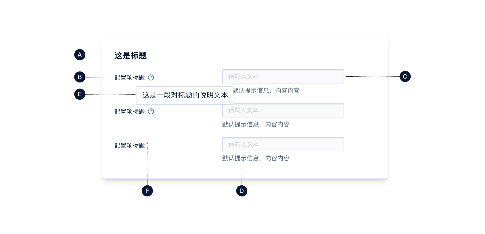
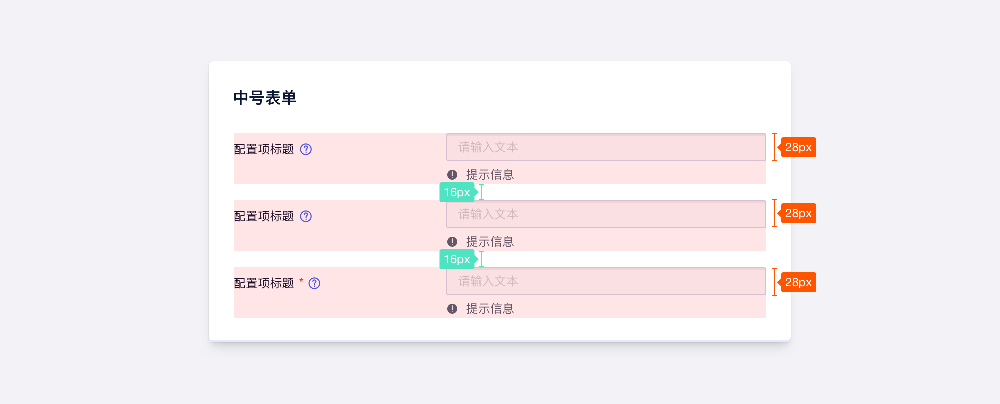
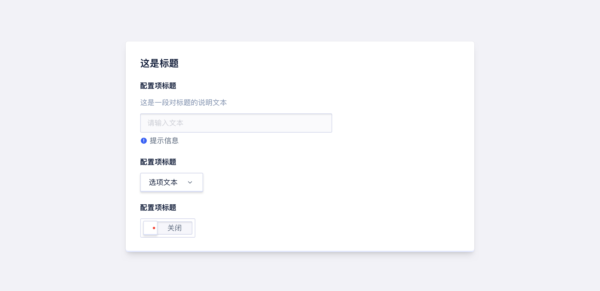
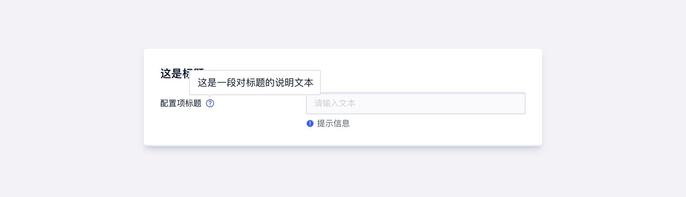
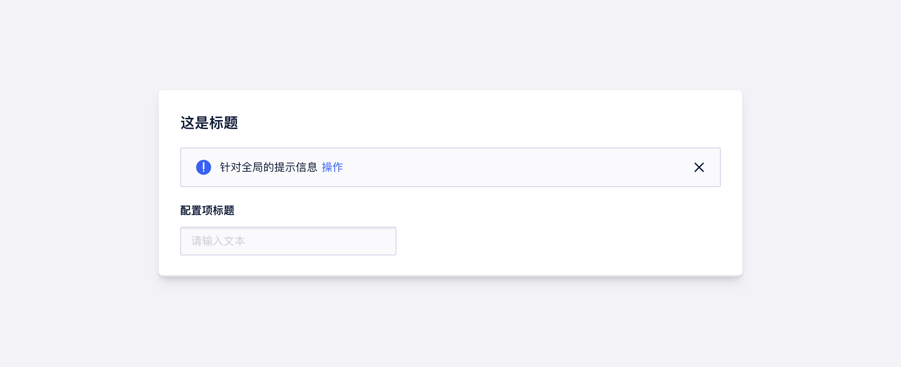
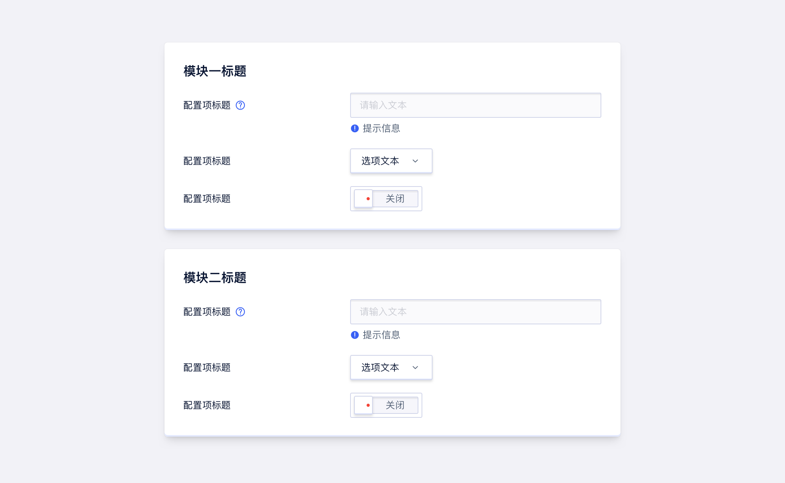
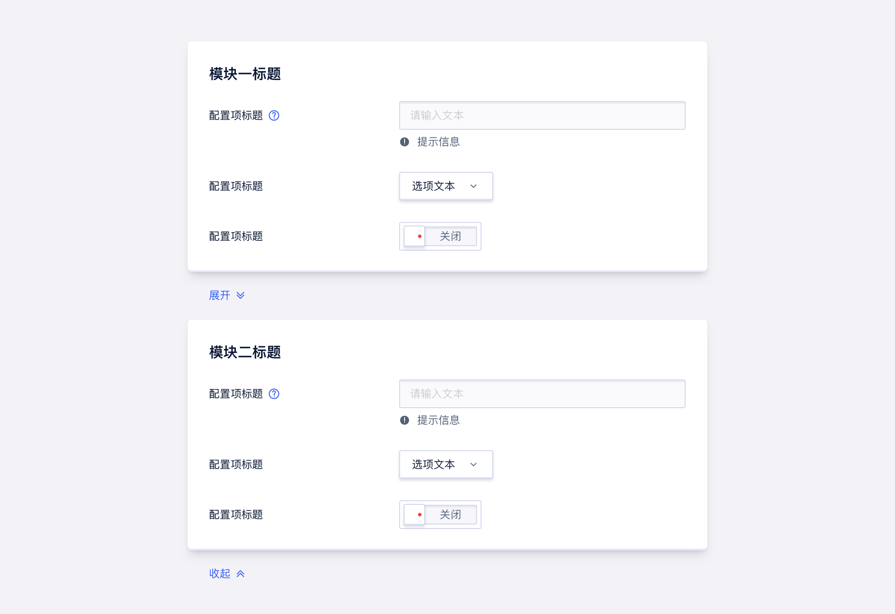
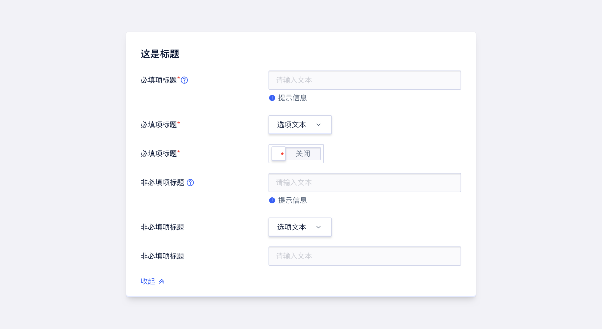

<!--副标题具体写法见源代码模式-->

## 简介

- 表单 `Form` 是信息添加、录入的通用形式，是用户输入的重要交互方式。

- 表单 `Form` 作为其他组件（单选 `Radio`、 数字输入框 `NumberInput`、 输入框 `Input`等等）的容器的同时，还为其他组件提供布局的功能。

- U-Design 的表单 `Form` 只负责布局和展示，不提供任何逻辑功能和表单校验。

## 基本构成

| 标题（A） | 配置项标题（B） | 输入域（C） |提示信息（D） |说明信息（E） |必选项标识（F） |
| :-------: | :-------: | :-------: | :-------: | :-------: | :-------: |
|     √     |     √     |     √     | 可选   | 可选  | 可选   |

**A.标题**

- 帮助对信息进行分组，方便用户填写

**B.配置项标题**

- 主要是解释输入项的含义，一般不宜太长，需要简明扼要，快速让用户理解

**C.输入域**

- 可交互输入的区域，是构成表单的核心内容，用来收集用户操作的信息；

- 作为容器主要放置：单选 `Radio`、 数字输入框 `NumberInput`、 输入框 `Input`等组件

**D.提示信息（可选）**

- 包含帮助信息、占位符和反馈信息提示

**E.说明信息（可选）**

<!--交互补充交互补充交互补充交互补充交互补充交互补充交互补充-->

**F.必选标识（可选）**

- 告知用户当前项为必填项，不可为空值

## 基本样式

### 尺寸
表单 `Form` 预设了 `md`、`lg`两种尺寸，高度分别为28px、32px。

中号表单

大号表单

### 布局
表单中的标签放置理论具体可以参考 [这篇文章](https://www.uxmatters.com/mt/archives/2006/07/label-placement-in-forms.php) ，U-Design 目前提供了以下两种布局形式：

#### 横向对齐
优点：文字开头按阅读视线对齐，符合人们的阅读习惯，节约纵向空间。

缺点：填写速度慢，标签长度和输入框弹性小。

#### 纵向对齐
优点：采用顶部对齐的标签样式，浏览表单所需的时间最短；同时标签长度弹性大。

缺点：非常占纵向空间。

<!--<!--交互在合适的地方对这两张图补充一下说明-->

<!--对于配置项标题的说明信息在纵向布局时直接暴露出来-->

## 基本状态

提示信息搭配有预设颜色的icon时，——————<!--提示信息的基本状态，交互来说明一下-->

## 设计说明

### 帮助信息
有些场景下需要帮助性信息，来辅助用户完成表单填写。当帮助信息的重要级比较高时，可以直接放在改输入框的附近。如果帮助信息的重要级比较低，则可以通过 文字提示 `Tooltip` 组件来实现，获取鼠标焦点的时候，则展开信息，失去焦点则消失（在气泡展开时，切忌勿挡住input输入框）。

如果是针对全局的帮助性信息，可以放在表单的顶部；

如果只是针对某个元素提醒，则应将两者放在一起，让用户知道当前处于什么地方，在针对什么进行引导、辅助。

### 反馈提示

包括实时 (操作中) 校验用户录入数据的合规性，和告知用户操作后的结果状态两种。U-Design 的 表单 `Form` 只负责提供反馈样式，不提供任何逻辑功能和表单校验。

### 分模块
化繁为简是人处理复杂事物常用的方法，如果需要一次性输入、提交大量数据，我们为了提高用户填写效率，减少用户心理负担，可将填写内容进行分模块，用户可以在填写好一段内容后进行心理上停顿休息，减少视觉疲劳和心理压力。

### 高级选项默认收起，点击展开

对于表单内容很多，且存在一些没那么重要的非必填项时，可以选择默认隐藏；

用户有欲望填写时点击展开，才会暴露给用户进行输入填写。

### 表单宽度应该暗示填写内容的长度
表单宽度应该暗示填写内容的长度，与输入预期成正比。

## 相关文档

1. [AutoComplete 自动填充]()
2. [Form 表单](http://10.179.234.214:8000/component/Form/)
