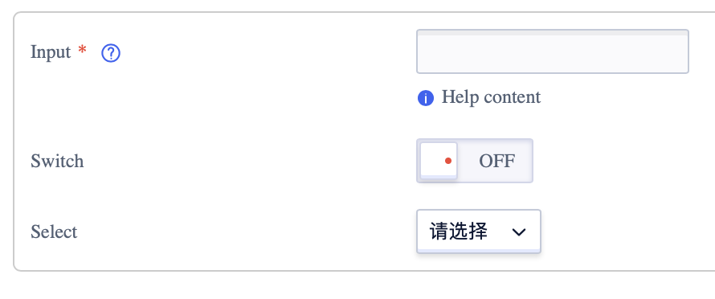
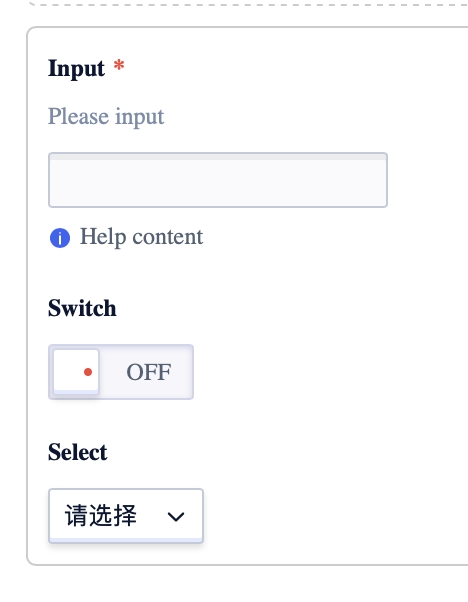
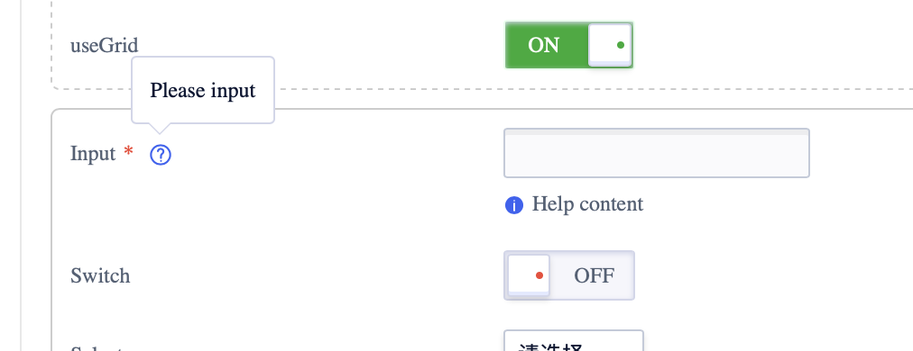
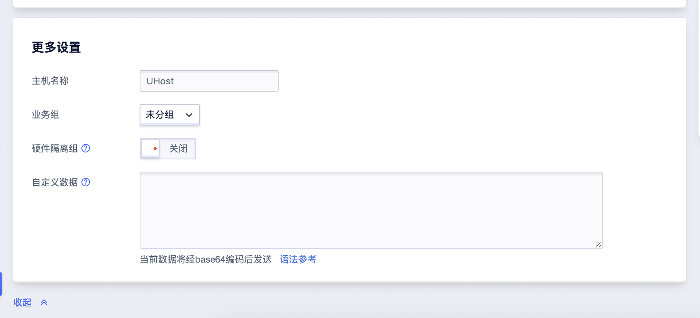

<!--副标题具体写法见源代码模式-->

## 简介

表单 `Form` 是信息添加、录入的通用形式，是获取用户输入的重要交互方式。

表单 `Form` 作为其他组件（单选 `Radio`、 数字输入框 `NumberInput`、 输入框 `Input`等等）的容器的同时，还为其他组件提供布局的功能。

U-Design的表单 `Form` 只负责布局和展示，不提供任何逻辑功能和表单校验。

## 基本构成

|      | 构成  | 可选  |描述                            |
| :--: | :-----| :--- |:------------------------------ |
|  1   | 标题 | 可选 |帮助对信息进行分组，方便用户填写  |
|  2   | 标签| - |标签文本主要是解释输入项的含义，一般不宜太长，需要简明扼要，快速让用户理解；另外，还可以通过标签告知用户哪些是必填项 |
|  3   | 输入域| - |可交互输入的区域，是构成表单的核心内容，用来收集用户操作的信息。作为容器主要放置：单选 `Radio`、 数字输入框 `NumberInput`、 输入框 `Input`等组件 |
|  4   | 提示信息| 可选 |包含帮助信息、占位符和反馈信息提示 |

## 基本样式

### 尺寸
表单 `Form` 预设了 `md`、`lg`两种尺寸

### 布局

#### 左对齐
优点：文字开头按阅读视线对齐，符合人们的阅读习惯，节约纵向空间。

缺点：填写速度慢，标签长度和输入框弹性小。

#### 顶对齐
优点：采用顶部对齐的标签样式，浏览表单所需的时间最短；同时标签长度弹性大。

缺点：非常占纵向空间。

## 设计说明

### 帮助信息
有时候需要帮助性信息，来辅助用户完成表单填写。当提示的重要级比较高时，可以直接放在改输入框的附近。如果提示的重要级比较低，则可以通过 文字提示 `Tooltip` 组件来实现，获取鼠标焦点的时候，则展开信息，失去焦点则消失（在气泡展开时，切忌勿挡住input输入框）。

如果是针对全局的帮助性信息，可以放在表单的顶部；如果只是针对某个元素提醒，则应将两者放在一起，让用户知道当前处于什么地方，在针对什么进行引导、辅助。

### 分模块
如果需要一次性输入、提交大量数据，我们为了提高用户填写效率，减少用户心理负担，可将填写内容进行分块。

分类、分模块的排版方式让用户感觉更好，用户可以在填写好一段内容后进行心理上停顿休息，减少视觉疲劳和心理压力。

### 高级选项默认收起，点击展开

对于表单内容很多，且存在一些没那么重要的非必填项，可以选择默认隐藏；用户有欲望填写时点击展开可进行输入填写。

比如：UCloud的 云主机 UHost 购买表单页面里的「更多设置」模块，因为重要级比较低，默认为收起，用户点击展开，才会暴露给用户。

### 表单宽度应该暗示填写内容的长度
表单宽度应该暗示填写内容的长度，与输入预期成正比。

## 相关文档

1. [AutoComplete 自动填充](http://10.179.234.214:8000/component/AutoComplete/)
2. [Form 表单](http://10.179.234.214:8000/component/Form/)
