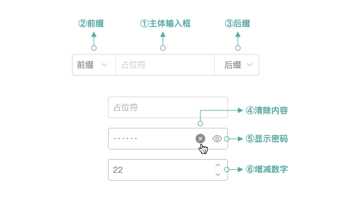

<!--副标题具体写法见源代码模式-->

## 简介

输入框`Input` 允许用户在单行中输入和编辑文本或数值，用于单行文本信息的输入。

通常每个输入项都会搭配对应的标题，具体内容请参考[表单]() `Form` 。

## 基本构成

|      | 构成  | 可选  |描述                            |
| :--: | :-----| :--- |:------------------------------ |
|  1   | 主体输入框 | - |用于单行文本信息的输入  |
|  2   | 前缀| 可选 |前后缀为用户提供了默认的固定信息，减少了用户的操作成本。 |
|  3   | 后缀| 可选 |同上 |
|  4   | 清除内容按钮| 可选 |一键快速清空输入框 |

## 基本样式
### 状态
U-Design 的输入框 `Input` 具有4种状态：

1、默认

2、获取焦点

3、报错

4、禁用

### 尺寸
U-Design 为输入框 `Input` 预设以下3种尺寸，以满足不同的页面需求，高度分别为22px、26px、30px：

### 类型

1、基础样式

2、带前缀的

3、带后缀的

4、可清空的

## 设计说明

### 避免使用占位符作为标题
避免使用占位符作为标题，因为一旦填写表单，占位符文本就会被覆盖。当占位符不再可见时，必须使用标签来指示表单字段的含义。

<!--配图分为左右两部分，左边是占位符作为标题，获取焦点后就看不到标题了，右侧是正常的-->

### 对输入的字符长度进行限制
避免使用占位符属性作为标签的替代品。这很重要，因为一旦填写表单，占位符文本就会被覆盖。当占位符不再可见时，必须使用标签来指示表单字段的含义。

### 提供格式范例
对于某些具有特殊格式的输入信息（如年月日等），我们在设计占位符的时候就可以预先把格式写入其中，告诉用户信息输入的必要格式，起到提前防错效果。

### 可根据业务场景为输入项提供默认值

## 相关文档

1. [AutoComplete 自动填充](http://10.179.234.214:8000/component/AutoComplete/)
2. [Form 表单](http://10.179.234.214:8000/component/Form/)
