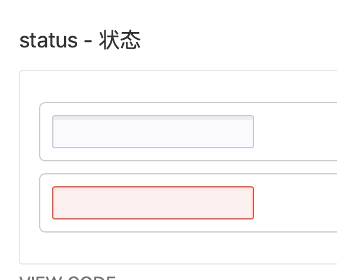
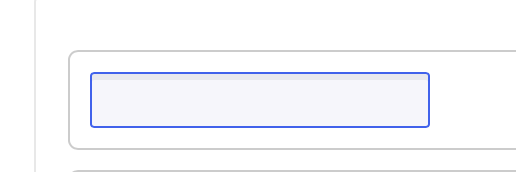
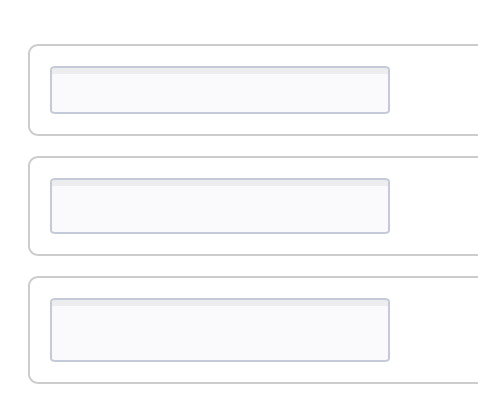
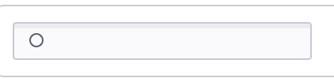
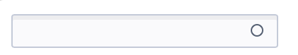

<!--副标题具体写法见源代码模式-->

## 简介

文本输入字段允许用户在一行中输入和编辑文本或数值。用于单行文本信息的输入。

## 基本构成

|      | 构成       | 可选                            |备注                            |
| :--: | :--------- | :------------------------------ |:------------------------------ |
|  1   | 主体输入框 | 逻辑同 [输入框]() `Input` 一致  |逻辑同 [输入框]() `Input` 一致  |
|  2   | 联想选择框 | 逻辑同 [下拉菜单]() `Menu` 一致 |逻辑同 [下拉菜单]() `Menu` 一致 |

占位文字为用户提供了输入提示或当前内容的范本，用户输入了内容后就会消失。当用户清除输入内容后重新出现。

## 基本样式
### 状态
U-Design 的输入框 `Input` 具有4种状态：

1、默认

2、获取焦点

3、报错

4、禁用

### 尺寸
U-Design 为输入框 `Input` 预设以下3种尺寸，以满足不同的页面需求，高度分别为22px、26px、30px：

### 类型
1、带前缀的

2、带后缀的
前后缀为用户提供了默认的固定信息，减少了用户的操作成本。

3、可清空的

4、最基础的

## 设计说明

#### 避免使用展位度
避免使用占位符属性作为标签的替代品。这很重要，因为一旦填写表单，占位符文本就会被覆盖。当占位符不再可见时，必须使用标签来指示表单字段的含义。

#### 对输入的字符长度进行限制
避免使用占位符属性作为标签的替代品。这很重要，因为一旦填写表单，占位符文本就会被覆盖。当占位符不再可见时，必须使用标签来指示表单字段的含义。

#### 提供格式范例
对于某些具有特殊格式的输入信息（比如手机号码、出生年月、信用卡到期日等等），我们在设计占位符的时候就可以预先把格式写入其中，告诉用户信息输入的必要格式，起到提前防错效果。

## 相关文档

1. [AutoComplete 自动填充](http://10.179.234.214:8000/component/AutoComplete/)
2. [Form 表单](http://10.179.234.214:8000/component/Form/)
