---
<<<<<<< HEAD
description: "输入框，通过鼠标或键盘输入内容。"

---

<!--副标题具体写法见源代码模式-->

## 简介

提供录入信息的能力。一般用于：

- 需要用户输入表单内容时
- 进行搜索等其他场景下



## 基本构成

卡片布局可以因支持其包含的内容类型而异。以下元素在该品种中常见。

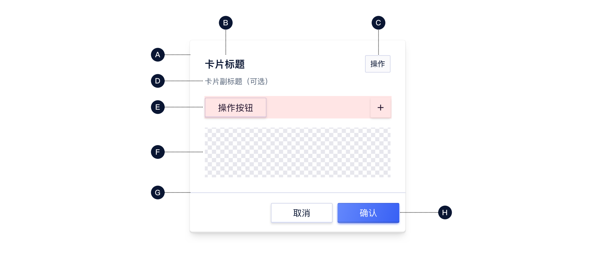

| 类型 | 容器（A） | 标题（B） | 操作按钮（C） | 副标题（D） | 操作区域（E） | 内容区域（F） | 分割线（G） | 底部按钮（H） |
| :--: | :-------: | :-------: | :-----------: | :---------: | :-----------: | :-----------: | :---------: | :-----------: |
| 常规 |     √     |   可选    |     可选      |    可选     |     可选      |       √       |    可选     |     可选      |

##### A. 容器 

- 卡片容器包含所有卡片元素，其大小取决于这些元素所占空间

##### B. 标题 `可选`

- 标题文本包含模块名称
- 不允许折行，可根据业务增加标签
- 可搭配选项卡使用

##### C. 操作按钮 `可选`

- 一般只有一个操作项，如修改配置、单选按钮等

##### D. 副标题 `可选`

- 一般作为解释说明文字出现

##### E. 操作区域 `可选`

- 可作为创建、开启、刷新等操作按钮，可对卡片内容做操作或打开新页面跳转

##### F. 内容区域

- 内容区域不做限定，可以为图表、文字、图形等
- 内容区域高度可固定后内部滚动

##### G. 分割线 `可选`

- 根据实际需要选择是否需要分割线

##### H. 底部按钮 `可选`

- 底部动作按钮可以包括保存、取消、确定等

## 基本样式

### 常规样式

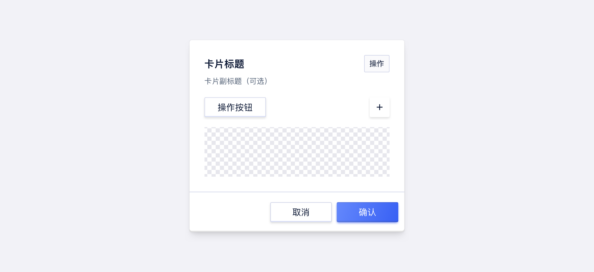

### 自定义元素顺序

卡片中元素的展示顺序可根据需求进行调整

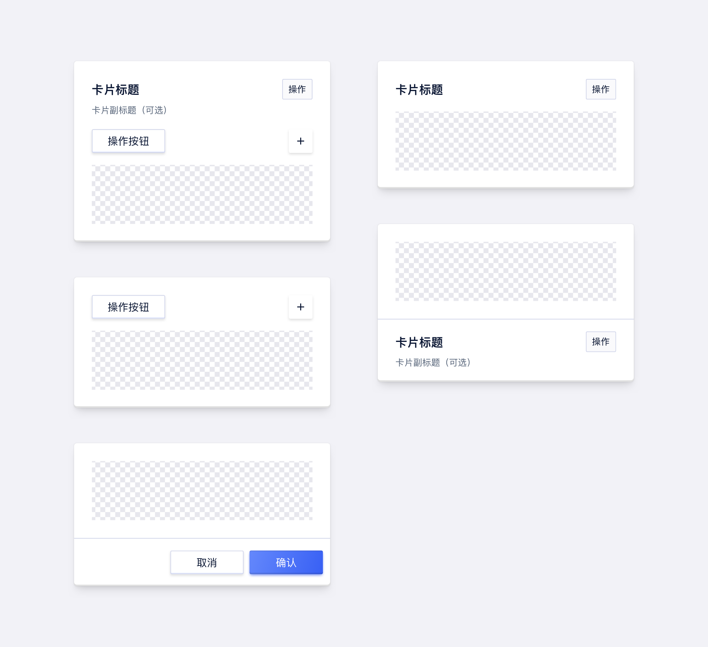
=======
description: "通过鼠标或键盘输入内容,提供录入信息的能力。"
---
<!--副标题具体写法见源代码模式-->

## 简介

输入框`Input` 允许用户在单行中输入和编辑文本或数值，用于单行文本信息的输入。

通常每个输入项都会搭配对应的标题，具体内容请参考[表单]() `Form` 。

## 基本构成

| 主体输入框（A） | 前后缀（B） |清除内容按钮（C）                            |
| :----:| :--: |:-----------------------------: |
| √ | 可选 |可选  |

**A.主体输入框**

- 用于单行文本信息的输入

**B.前后缀(可选)**

- 为用户提供默认的固定信息，减少了用户的操作成本；可将前后缀根据需求设置为行动点，如搜索等。

**C.清除内容按钮（可选）**

- 一键快速清空输入框

## 基本样式

| 类型   | 描述                                         |
| :----- | :------------------------------------------- |
| 基础   | 简单的输入框，是默认的使用样式               |
| 自定义 | 可以自定义前后缀、清除按钮，以及前后缀的样式 |

### 基础样式

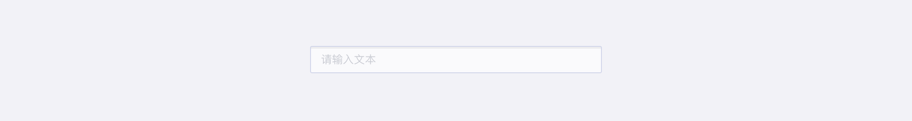

### **自定义样式**

带前缀

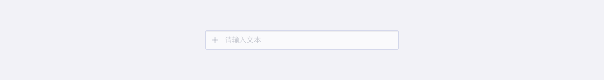

带后缀

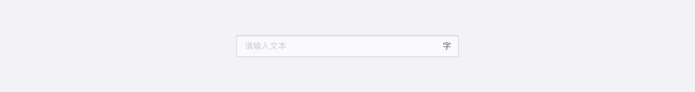

带清除按钮

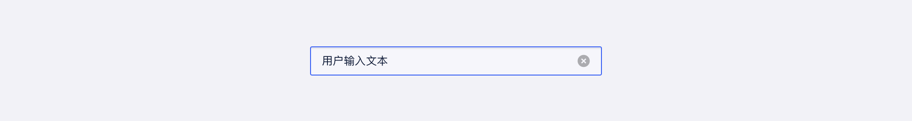

自定义前后缀

### 尺寸

U-Design 目前对输入框区分了 3 次种尺寸：**大（lg）、中（md）、小（sm**），高度分别为30px、26px、22px。

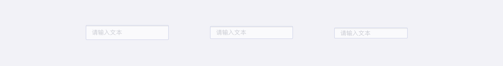
>>>>>>> ccf0abbfa2b13aa90209be4c41859f62f1155a1a

## 基本状态

<<<<<<< HEAD
当卡片只作为纯展示容器时，整个卡片只有默认状态，不具备其他状态；当作为可选项时，可存在不同状态。

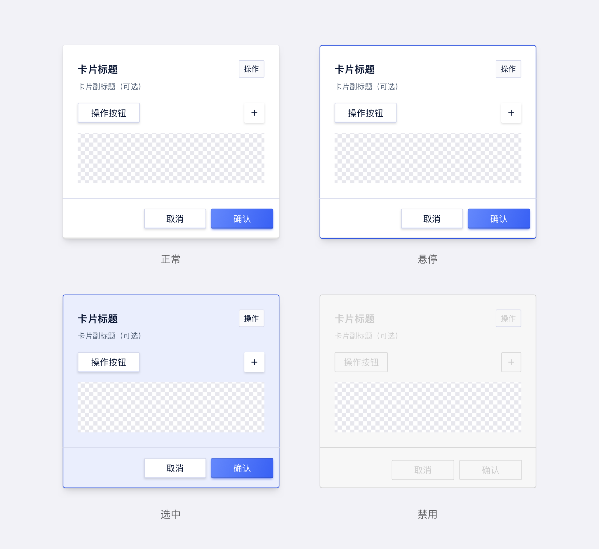

| 状态 | 说明                                               |
| :--- | :------------------------------------------------- |
| 默认 | 默认初始状态，所有卡片均有默认展示状态             |
| 悬停 | 若该卡片可选择时，鼠标经过卡片上方时，切换至该状态 |
| 选中 | 展示已被选中状态                                   |
| 禁用 | 当前选项不可被选择                                 |
=======
U-Design 的输入框 `Input` 具有5种状态：默认、悬停、激活、禁用、报错。

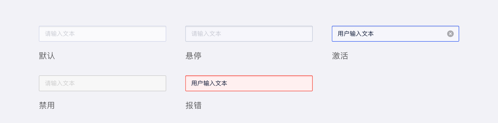
>>>>>>> ccf0abbfa2b13aa90209be4c41859f62f1155a1a

## 设计说明

<<<<<<< HEAD
### 原则

#### 1.层级

**每个卡片都是独立的个体**

一张卡片可以独立存在，而不需要依赖周围的元素作为上下文；单个卡片内需是相同类型的内容，或针对同一对象的信息聚合；内容可以根据其层次结构获得不同级别的强调。

**多个卡片不可进行嵌套**

卡片作为一个容器，承载各类对象，在使用时为防止其过于复杂，建议卡片不进行嵌套。[常见问题>](http://10.179.234.214:8000/component/Card/#%E5%8D%A1%E7%89%87%E4%BD%9C%E4%B8%BA%E7%8B%AC%E7%AB%8B%E4%B8%AA%E4%BD%93)

#### 2.反馈

当整个卡片为可点击时，需给出明确的指示引导用户。

#### 3. 一致性

同类卡片组合使用时，要保持相同卡片中布局样式保持一致[常见问题>>](http://10.179.234.214:8000/component/Card/#%E4%BF%9D%E8%AF%81%E7%9B%B8%E5%90%8C%E7%B1%BB%E5%9E%8B%E5%8D%A1%E7%89%87%E6%A0%B7%E5%BC%8F%E4%B8%80%E8%87%B4)

### 行为

- 卡片的主要作用区域通常是卡片本身；
- 卡片可以支持多个操作，由于卡片展示内容较为冗杂，因此它们应该包含数量有限的操作。

##  常见问题

### 卡片作为独立个体

若展示内容有层级区分，需进行合理布局，不能将卡片嵌套。

   

      
<i class="u-md-suggested"></i>卡片平铺展示，层级明确

      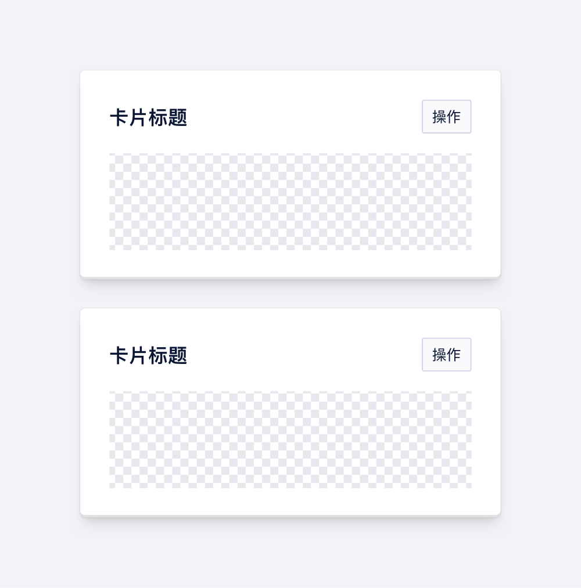
   

   

      
<i class="u-md-not-suggested"></i>多个卡片嵌套

      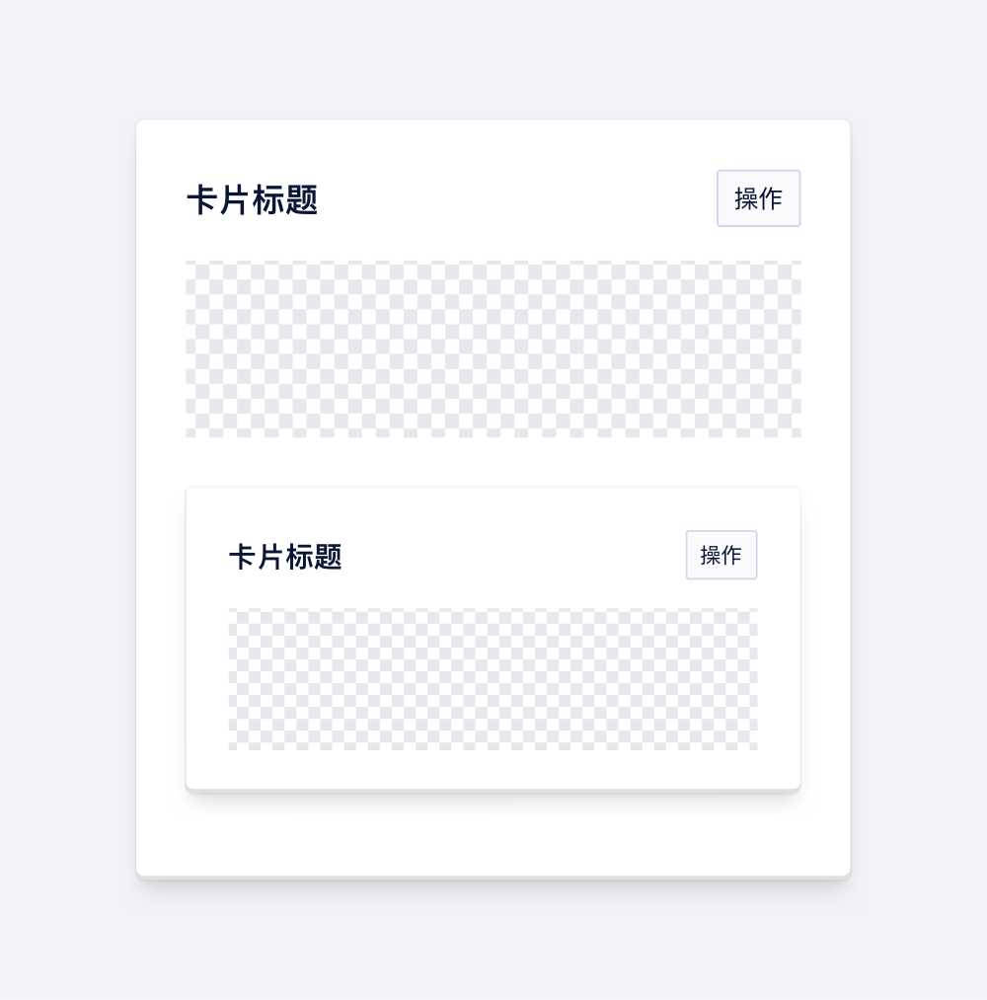
   

### 保证相同类型卡片样式一致

   

      
<i class="u-md-suggested"></i>同类型卡片样式一致

      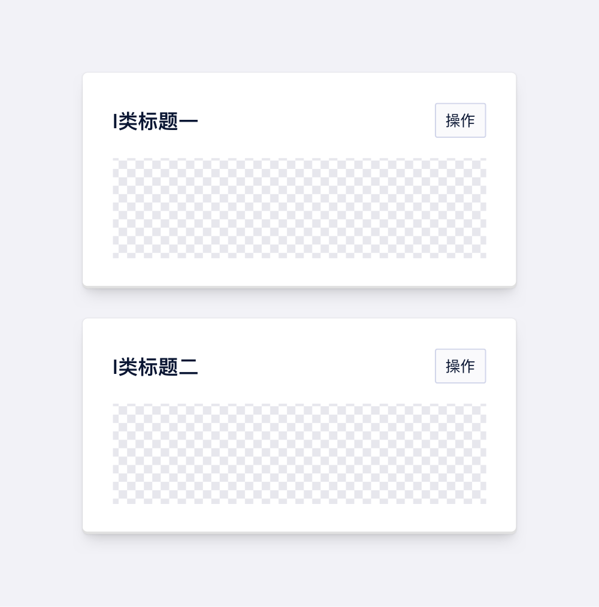
   

   

      
<i class="u-md-not-suggested"></i>同类型卡片样式不同

      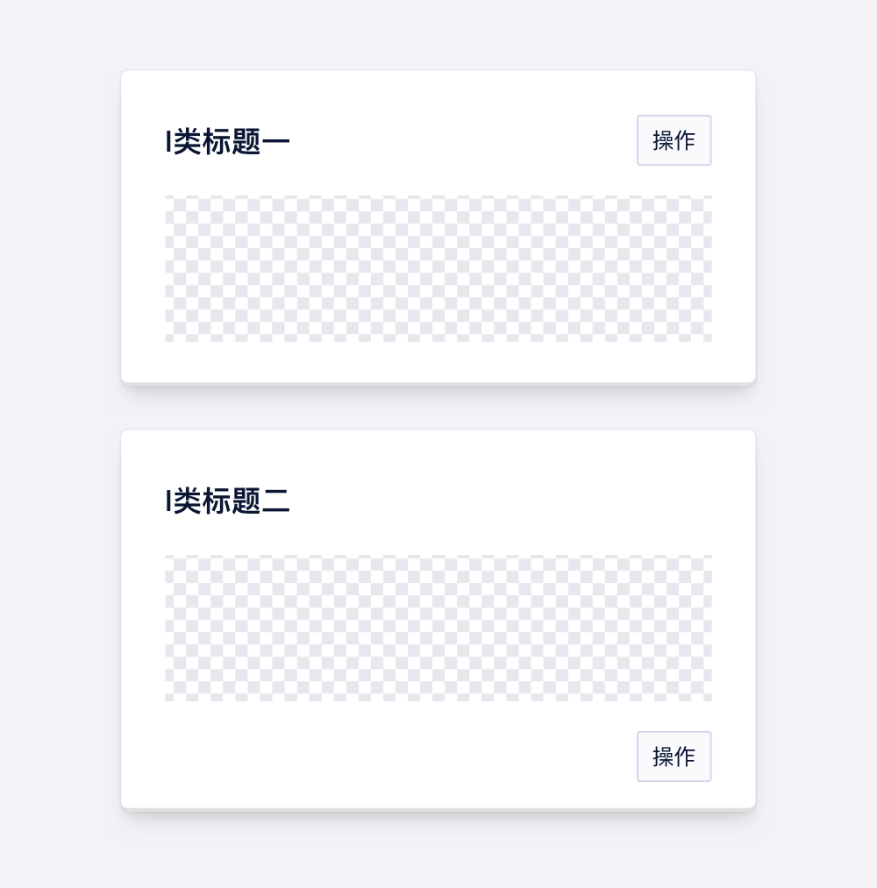
   

=======
### 避免使用占位符作为标题

- 避免使用占位符作为标题，因为一旦填写表单，占位符文本就会被覆盖；当占位符不再可见时，必须使用标签来指示表单字段的含义。

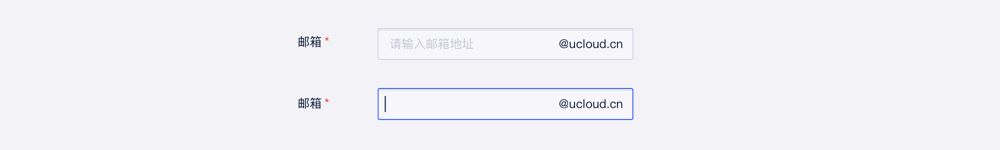

### 提供格式范例

- 对于某些具有特殊格式的输入信息（如年月日等），我们在设计占位符的时候就可以预先把格式写入其中，告诉用户信息输入的必要格式，起到提前防错效果。

### 可根据业务场景为输入项提供默认值
- 对于用户而言，有的时候不得不填写一些比较长的表单，而表单中的条目越多，对于用户而言相应耗费的时长、难度越高。符合业务场景的默认值设计，能够有效的缓解用户填写较长表单的时候的麻烦。

### 输入建议
- 如果需要给用户提供输入建议，请参考[自动填充]() `AutoComplete` 

<!--
>>>>>>> ccf0abbfa2b13aa90209be4c41859f62f1155a1a

## 主题

| 内容 | 值           | 默认值  |
| :--- | :----------- | :------ |
| icon | icon/nothing | nothing |
| icon | icon/nothing | nothing |
<<<<<<< HEAD

## 相关文档

1. [相关文档1](https://www.ucloud.cn)
2. [相关文档2](https://www.ucloud.cn)

=======
-->

## 相关文档

1. [AutoComplete 自动填充](/component/AutoComplete/)
2. [Form 表单](/component/Form/)
>>>>>>> ccf0abbfa2b13aa90209be4c41859f62f1155a1a
