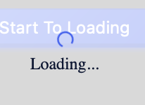

<!--副标题具体写法见源代码模式-->

## 简介
当页面或局部处于等待异步数据加载或正在渲染时，可以使用 **加载中Loading** 展示加载中状态。合适的加载动效可以告知用户他们的请求正在处理中，从而有效地缓解用户的焦虑。

## 基本构成

| 类型                   | 加载动画(A) | 说明文案(B) |
| :--------------------- | :-----: | :-----: |
| 主按钮 `primary`       |    ✓    |   可选    |

1、加载动画：

指示当前内容正在加载中的动画

2、文案(可选)：

U-Design默认文案为「Loading」。

## 基本样式

### 单加载动画

<!--这是一张单gif的图片-->
产品设计应以以乐趣和愉悦为目的，而不仅仅是产品性能的提高。U-Design的默认加载动画设计的比较通用，使用者可以根据场景设置更加情感化的加载动画。

### 单加载动画+文案

如果使用者需要提供更多上下文，请自定义。

## 设计说明
- 操作耗时小于一秒钟时，不建议使用 **加载中Loading** 。
- 避免在一个页面上，同时显示多个加载中的图标，如果无法避免这种情况，可以考虑将加载态放置到更高级别的页面容器上。

## 相关文档

1. [Progress 进度条](https://www.ucloud.cn)
