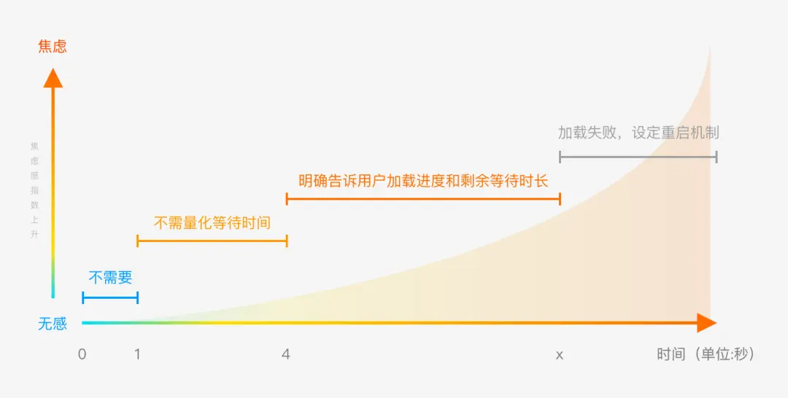
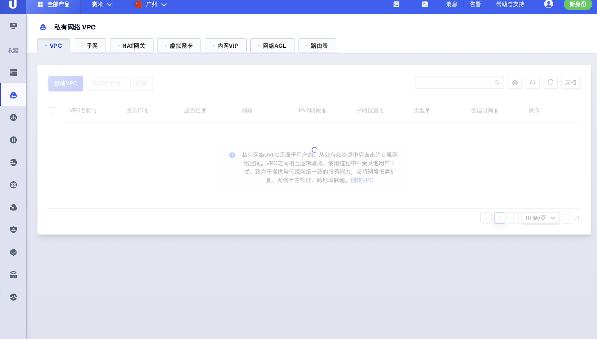
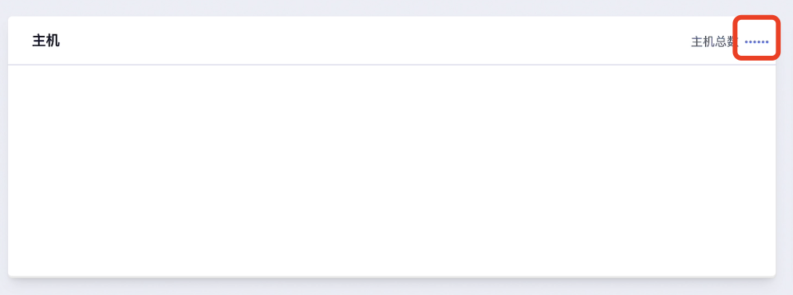

<!--副标题具体写法见源代码模式-->

## 简介
因操作导致的页面跳转、刷新等使页面元素或信息发生变化行为，页面都需要向服务器发送请求信息，服务器接收到后再发送反馈信息，而由于网络及页面自身处理信息的原因导致这个信息对换的过程可能发生延长从而需要一个“反馈”即 **加载中Loading** 来缓和用户的等待。

加载对用户来说是一种反馈，是用户触发、系统反应的过程。

当页面或局部处于等待异步数据加载或正在渲染时，可以使用 **加载中Loading** 展示加载的状态。

用户感知的等待时间，是 **加载中Loading** 设计的发力点。合适的加载动效可以告知用户他们的请求正在处理中，从而有效地缓解用户的焦虑。在处理时间不变前提下，填补用户等待的时间，减少用户因等待而产生的焦虑情绪。

## 基本构成

|                   | 加载动画(A) | 说明文案(B) |
| :--------------------- | :-----: | :-----: |
| 加载中 `Loading`       |    ✓    |   可选    |

A、加载动画：

指示当前内容正在加载中的动画

B、文案(可选)：

U-Design默认文案为「Loading」。

## 基本样式
当加载时间不可控，或时间很长的情况下，要尽可能缩短用户等待的主观“感知时间”，从而缓解用户等待焦虑，减少负面情绪产生。在用户自然等待过程中，可以通过图形、文字等的吸引，暂时性转移用户注意力，分散等待焦虑。

### 图标加载

产品都应该有品牌传达的诉求，加载页可以帮助进行品牌透出，提高用户对品牌的感知。

具体可以通过加载图标展现品牌元素、品牌色等，进行整体品牌气质的传递，形成品牌感知。

**图标加载** 时，应当使图标保持动态，减少停顿，避免用户产生「卡」的主观感受。

### 文字和图片共同显示的加载

当加载等待时间达到了一个临界值，还是可能造成大部分用户误认为是网络或程序bug而选择跳出。所以在长时间加载等待的场景下，我们应该通过添加文字，明确地告诉用户当前加载的进度百分比或预计等待时间，以便用户知道自己的等待是有结果的。
我结合了 **用户等待4秒原则** 和 UX 研究咨询公司 Nielsen Norman Group（NN/g 尼尔森诺曼集团）的一篇文献中提出的 **用户等待心理模型** ，得出了以下参考结论：

用户是一个复杂的群体，他们其实并不关心所谓的量化时间，他们只希望：加载尽量快，快到不要中断我的操作流，如果实在快不起来，那就告诉我还要等多久。

## 基本状态
### 全屏加载

全屏展示加载状态，阻止用户操作。

### 容器加载

### 元素加载

只对指定的元素进行加载，不影响页面其他内容。

## 设计说明
- 操作耗时小于一秒钟时，不需要使用 **加载中Loading** 。
- 大多数产品的页面加载速度都在这个区间，用户几乎不会注意到这种加载延迟。所以我们不需要增加额外的加载动效来填充这段加载时间，不然可能会起到画蛇添足的反面效果。试想一下，如果在每个页面加载的过程中都加上加载动效，不仅会分散用户的注意力，并且屏幕上总出现不断跳动的内容，会让人感到很焦躁。
- 避免在一个页面上，同时显示多个加载中的图标，如果无法避免这种情况，可以考虑将加载态放置到更高级别的页面容器上。

## 相关文档

1. [Progress 进度条](https://www.ucloud.cn)
