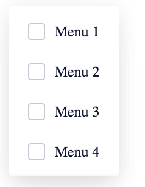
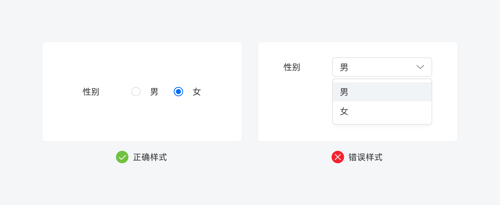
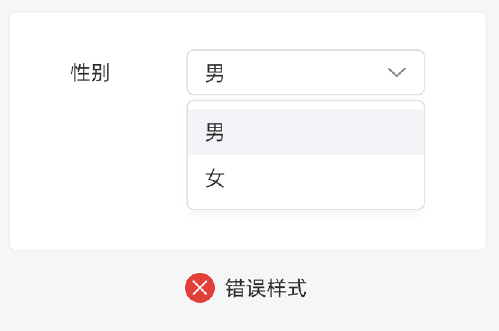

<!--副标题具体写法见源代码模式-->

## 简介

U-Design 的 下拉菜单 `Menu` 通常和 选择器 `Select`结合使用，帮助用户从包含多个属性或值的综合列表中选择一个或多个项。

下拉菜单 `Menu` 还可以用于收纳一组命令操作：当页面上的操作命令过多时，用此组件可以收纳操作元素。点击或移入触点，会出现一个下拉菜单。可在列表中进行选择，并执行相应的命令。

## 基本构成

1、复选框（可选）

表头不仅仅可以解释当前数据内容的属性，还可以集成：批量操作、排序筛选、解释说明等操作，而这些功能均不是必要元素，需根据用户场景适当的选配。

2、项描述

在展示信息的同时，帮助用户批量操作，提高效率，实现如批量删除等需求。

3、背景卡片（可选）

展示行与列的具体内容

## 基本样式

## 设计说明

### 自定义列

B端中后台通常会对应不同的角色及场景需求，根据目的及信息主体的不同，让用户根据自己的需求来定义表格的展示列。

## 常见问题

   

      
<i class="u-md-suggested"></i>当选项很少（5个或更少）时，单选优于下拉菜单

      
   

   

      
<i class="u-md-not-suggested"></i>选项较少时，使用Menu交互形式过重。

      
   

## 相关文档

1. [相关文档1](https://www.ucloud.cn)
2. [相关文档2](https://www.ucloud.cn)
