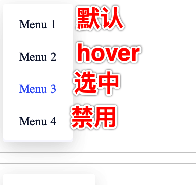
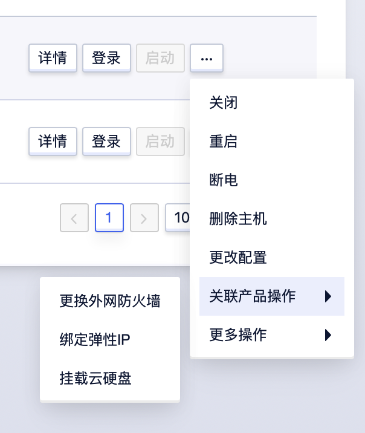

<!--副标题具体写法见源代码模式-->

## 简介

U-Design 的 下拉菜单 `Menu` 通常和 选择器 `Select` 结合使用，帮助用户从包含多个属性或值的综合列表中选择一个或多个项。选项过多时，下拉菜单可能会滚动，具体取决于展开时包含的项目数量。

下拉菜单 `Menu` 还可以用于收纳一组命令操作：当页面上的操作命令过多时，用此组件可以收纳操作元素。点击或移入触点，会出现一个下拉菜单。可在列表中进行选择，并执行相应的命令。

## 基本构成

1、复选框（可选）

表头不仅仅可以解释当前数据内容的属性，还可以集成：批量操作、排序筛选、解释说明等操作，而这些功能均不是必要元素，需根据用户场景适当的选配。

2、项描述

在展示信息的同时，帮助用户批量操作，提高效率，实现如批量删除等需求。

3、背景卡片（可选）

展示行与列的具体内容

## 基本样式

### 单选菜单

用户只能从互斥选项列表中选择一项，选项的样式包括：默认、hover、选中、禁用。

### 多选菜单
允许用户选择多个选项

### 多层级菜单

## 设计说明
 
### 以可预测的方式对选项进行排序

选项的排序应该具有一定的逻辑性，如常用项优先，或者按照字母、数值或者时间等进行排序。

### 描述尽可能简短

文本值应尽可能短，因为列表仅限于使用单行，太长的值可能会被截断。

### 不可用的选项置灰

不能选择的选项不要删除，应保留在视图中并用灰色表示。如果用户将鼠标悬停在变灰的选项上超过一秒钟，可以考虑显示一条简短的气泡帮助说明为什么禁用该选项以及如何使其处于活动状态。

### 通过点击触发下拉框，而不是悬停触发

悬停菜单会迫使用户必须将指针放在菜单内，如果用户指针离开下拉菜单，菜单将被关闭，这无疑增加了用户的操作难度。

### 找到不同控件中的平衡关系

使用下拉菜单是避免用户输入内容的便捷方法，众所周知，打字需要用户付出大量的认知成本，这就是为什么下拉列表在表单设计中很常见的原因。

但是下拉菜单并不是万能的，使用下拉菜单（尤其是表单中的下拉菜单）时，应平衡表单类型、用户类型等各种其他因素的关系，这需要设计师从众多控件中进行权衡。

### 自定义列

提供最佳选项：为用户提供系统最佳项，默认情况下可以处于选中状态；
淡化替代选项：由于下拉列表隐藏了其他可用选项，因此很好地淡化了替代选项。这在默认值可以满足大多数用户的情况下，并且替代选项对非专业用户来说是危险的情况下是有利的；
节省空间：如果界面只能为用户提供很少的空间，下拉菜单非常实用。虽然下拉菜单很小，但是可以在很小的空间中包含大量信息；
操作熟悉：下拉菜单是大多数用户熟悉的选择控件，在计算机应用程序中使用广泛；
输入可预测：通过输入文本字段收集用户信息是不可预测的，用户可能会输入错误，拼写错误或误解输入内容。下拉菜单通过提供的选项，可以预测用户的输入内容；
灵活：下拉菜单最大的优点就是一个下拉列表就能包含所有选项，无需根据选项数量而更改设计。

当下拉菜单包含太多选项时需要滚动，会放慢用户输入速度；
下拉菜单默认情况下会隐藏可用选项，用户无法感知选项内容；
下拉列表看起来像已经完成，当用户填写表格时，会在视觉上扫描要填写的空字段，单选按钮和复选框更容易被发现；

## 常见问题

   

      
<i class="u-md-suggested"></i>当选项很少（5个或更少）时，单选优于下拉菜单

      
   

   

      
<i class="u-md-not-suggested"></i>选项较少时，使用Menu交互形式过重

      
   

## 相关文档

1. [相关文档1](https://www.ucloud.cn)
2. [相关文档2](https://www.ucloud.cn)
