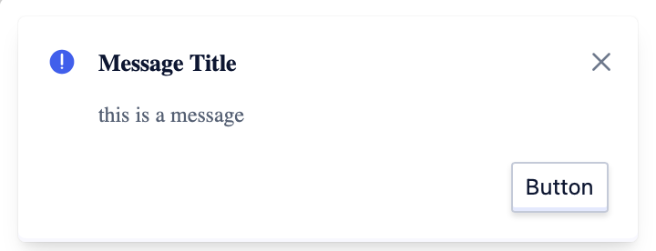
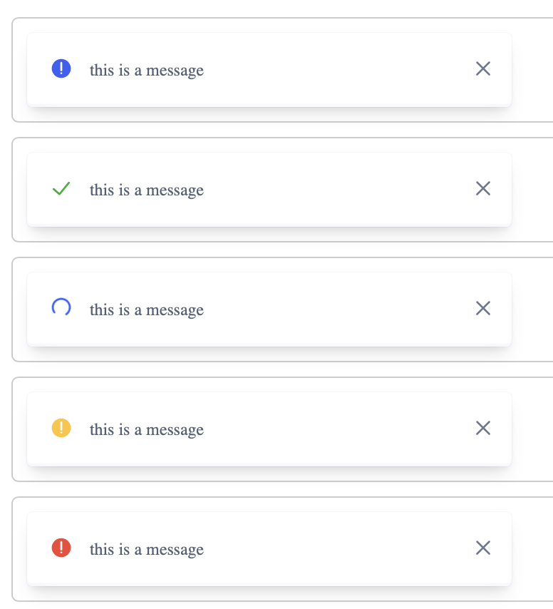
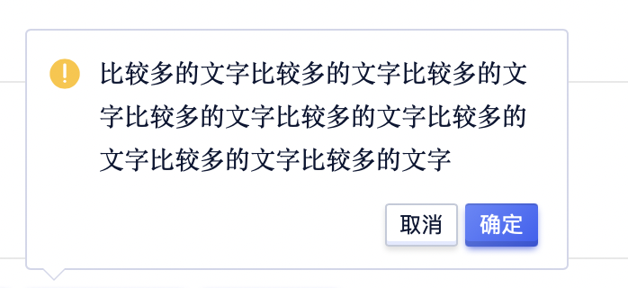
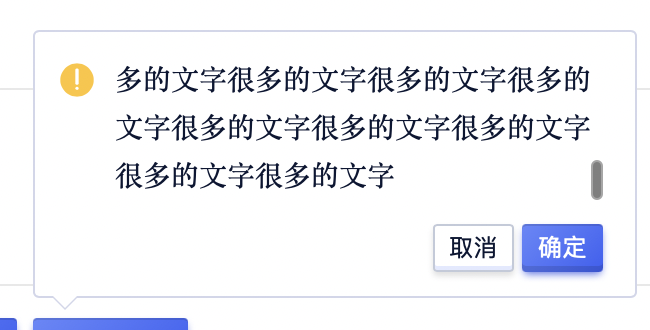
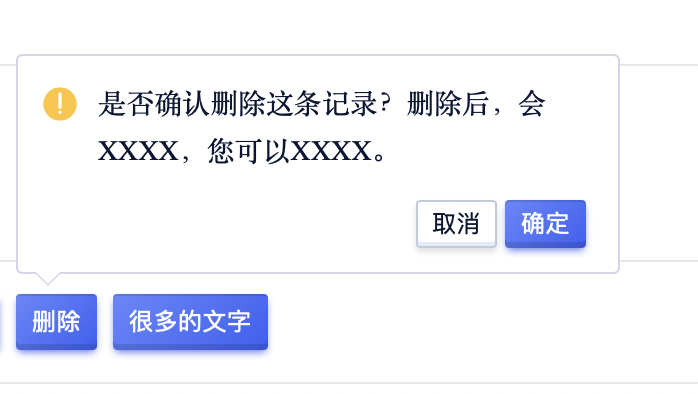
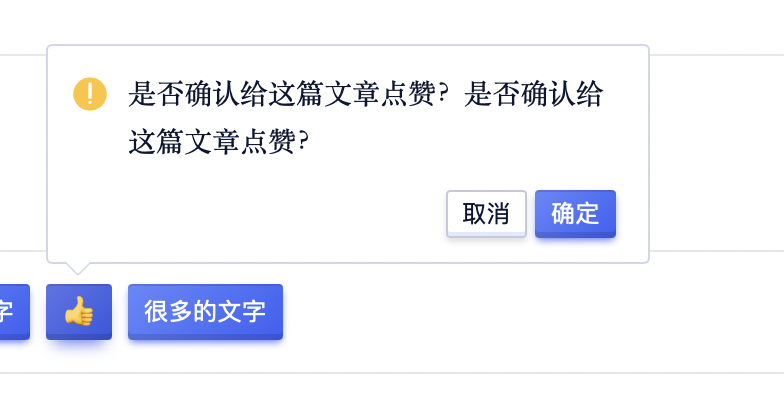

<!--副标题具体写法见源代码模式-->

## 简介

对用户的操作作出轻量的全局反馈。全局展示操作反馈信息。
- 可提供成功、警告和错误等反馈信息。
- 顶部居中显示并自动消失，是一种不打断用户操作的轻量级提示方式。

## 基本构成

| 图标（A） | 标题（B） | 信息（C） | 操作按钮（D） |关闭按钮（D） |
| :-------: | :-----------: | :-----------: | :-------: |:-------: |
|   √    |       √       |     √     |     √     | √     |

**A.图标（必选）**

告知用户通知的类型

**B.标题（必选）**

为用户提供通知的快速概述

**C.信息（必选）**

提供通知更详细的信息

**D.操作按钮（必选）**

为用户提供通知相关的查看或处理入口

**D.关闭按钮（必选）**

关闭通知

## 基本状态

### 正常的文本

3行内文本，高度自适应

### 超长的文本（不建议）

文本超过3行，出滚动条，滚动展示

## 设计说明
<!--可以做一个gif-->
气泡确认框没有蒙层，点击确认框以外的区域即可关闭。

## 常见问题

### 避免滥用

气泡确认框 `PopConfirm` 是会打断用户操作流的设计，是迫不得已的折中方案：
- 其会增加用户操作步骤，降低操作效率；
- 打断用户流程，降低转化率；
- 影响产品品质，损害用户体验印象。
所以要不要选择使用 气泡确认框 `PopConfirm` ，需要从多个因素去权衡利弊。

**低成本的操作**

> 对于低成本的操作可以不设置二次确认。

> 举个例子：从操作频率上讲：录入表单，或者新建一个表单，查看详情都是最最最最基本操作，所以无需设置二次确认。

**中成本的操作**

> 操作之后，会使其产生较严重的后果，但并不至于造成不可挽回的后果。所以我们可以在产生严重后果之前设置 气泡确认框 `PopConfirm` ，确认操作，并提醒即将产生的结果。

**高成本操作**

> 在操作后会产生很严重或者不可挽回的后果，需要让用户仔细想清楚的时候，提前预知操作风险，阻断流程并且再次确认。

> 比如删除账号、修改数据、提交/发送重要内容时，可以使用弹窗 `PopConfirm`直接打断用户。

   

      
<i class="u-md-suggested"></i>对于中成本的操作，提示用户可能会带来的后果，以及用户可以执行什么操作。

      
   

   

      
<i class="u-md-not-suggested"></i>对低成本的操作进行确认，会显得多此一举。

      
   

## 相关文档

1. [Popover 气泡卡片](https://udesign.ucloud.cn/component/Popover/)
2. [Tooltip 文字提示](https://udesign.ucloud.cn/component/Tooltip/)