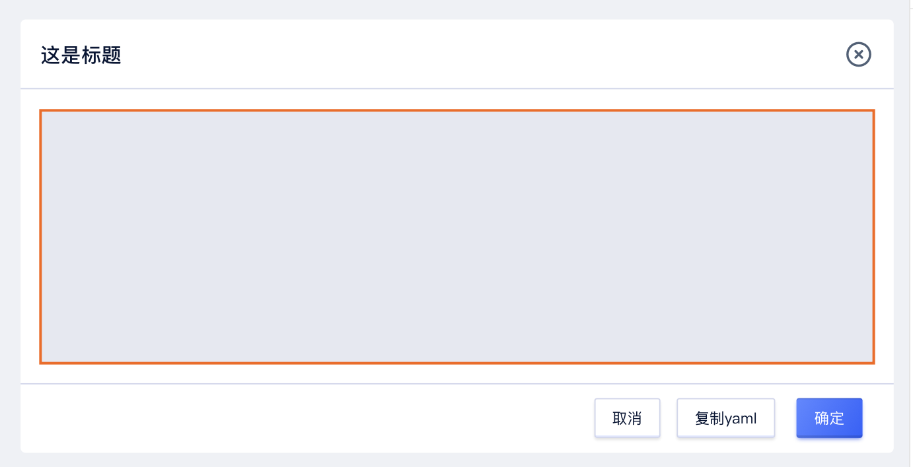
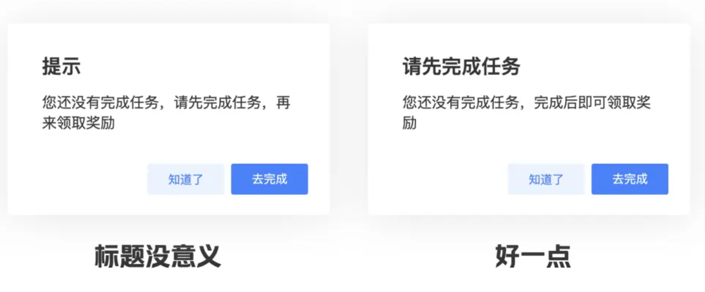

<!--副标题具体写法见源代码模式-->

## 简介

弹窗 `Modal` 一种临时窗口，是打断用户当前操作流程，获取用户视觉焦点的对话框。

常用于提供反馈信息、确认操作行为等场景，也可用于承载简单的表单信息填写、表格信息展示等，使用户在不离开当前页面的情况下，能够快速执行简单的操作。

弹窗 `Modal` 通常会出现在屏幕的中间位置，会对界面的主要内容造成遮挡。

## 基本构成

| 标题（A） | 关闭按钮（B） | 内容区域（C） | 底部操作区域（D） | 提示信息（E） |蒙层（F）|
| :-------: | :-----------: | :-----------: | :---------------: | :-----------: |
|     √     |       可选       |       √       |         √         |     可选      |可选      |

## 基本样式

### 尺寸

弹窗 `Modal` 预设了 `sm`、`md`、`lg`三种尺寸，宽度分别为400px、700px、800px。

**小号弹窗**

主要用于重要级比较高的信息提示，是一种强提醒，可以确保用户知晓，常用于重要操作后结果的展示，或危险、警告等信息的展示。

如果仅用于反馈操作结果的状态信息，不希望干扰用户的操作流时，建议使用 [Message 全局提示](https://udesign.ucloud.cn/component/Message/) 组件。

**中号弹窗**
中号弹窗是最常使用的尺寸。

**大号弹窗**
大号弹窗
主要用于计费相关的，
右侧有相对应的内容需要设置，
如「续费管理」的批量续费；
以及容纳表格等宽度较宽的内容。

### 弹窗高度

内容区域设置最大高度：实际内容区域未达到限制时，弹窗高度根据内容区域高度自适应；内容区域超过最大高度后，内容区域出现滚动条，其他构成元素不随内容区域滚动。 

### 默认提示

弹窗的默认提示与弹窗等宽，位于内容区域与弹窗标题之间，具体设置，可以参考[Notice 提示](https://udesign.ucloud.cn/component/Notice/)。

***这为保持整体页面整洁度，该提示样式请慎用！建议不要有，如必须有最多只能一条***

### 报错提示

弹窗全局的报错，在内容区顶部进行报错。内容区域内表单/表格的报错，遵循 [Form 表单](https://udesign.ucloud.cn/component/Form/) 和 [Table 表格](https://udesign.ucloud.cn/component/Table/) 的报错原则。

## 设计说明

### 按钮数量
如果有放置多个按钮的需求，从右到左依次为： 主按钮、次按钮、取消。3个操作按钮作为弹窗操作区的上限。

### 弹窗标题

若弹窗是由用户主动触发的，那么弹窗标题应该与用户触发弹窗的操作按钮同名，或者至少有相同的关键字。此时弹窗是用户操作后的反馈，用户需要通过弹窗的标题来确认自己是否进入了正确的模块、进行了正确的操作。

如果弹窗是系统主动弹出的，弹窗标题简单陈述问题、询问行为或者作出行为建议。内容区的说明文字展开来解释出现问题的原因，以及操作后的后果。避免使用无效标题。

### 弹窗的关闭方式

弹窗 `Modal` 作为一个非常底层的控件，应该兼顾大部分用户的不同习惯，从而保持整个系统有比较好的可用性。因此，U-Design建议在弹窗的右上角添加“x”作为关闭操作性弹窗的最短路径，并且佐以键控、点击遮罩等多种关闭方式；除非要求用户明确表态（比如要求同意协议）的情况，可以只通过操作按钮关闭。

当然，更便捷的关闭方式代表着更多的误触，如何平衡可用性和误触，就要根据具体场景具体分析。

### 模态与非模态
弹窗分为模态与非模态两种，支持开发者根据场景自定义。
- 模态：模态弹窗通常能较好的获取用户的视觉焦点，并通过承载的内容、按钮主次层级来引导用户完成他们的需求。模态弹窗可以通过蒙层关闭。
- 非模态：相比模态弹窗，非模态弹窗属较为轻量，触发后以一种非阻碍的的方式呈现，不会打断用户的当前操作，主要是给予用户即时反馈，让用户清楚应用当前的交互后状态。非模态弹窗不强制用户操作，可支持窗口可拖拽。

### 异步加载
适用于当前操作需要异步完成时，加载完成后会自动关闭对话框，加载形式为内容区蒙层加载。

## 常见问题

### 模态对话框与抽屉使用时的区别

   

      
<i class="u-md-suggested"></i>当内容较少时使用弹窗展示，当内容较多时使用抽屉展示。

      
   

   

      
<i class="u-md-not-suggested"></i>当内容较多时，弹窗内会出现滚动条，不便于用户使用。

      
   

## 相关文档

1. [Button 按钮](/component/Button/)
2. [Form 表单](/component/Form/)
