<!--副标题具体写法见源代码模式-->

## 简介

弹窗 `Modal` 是打断用户当前操作流程，获取用户视觉焦点的对话框。属于一种重量性反馈，一般用于用户进行重要的操作。通常会出现在屏幕的中间位置，会对界面的主要内容造成遮挡。

## 基本构成

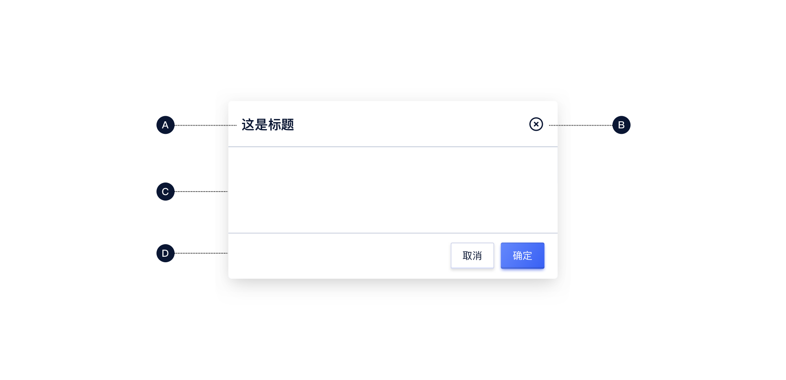

| 标题（A） | 关闭按钮（B） | 内容区域（C） | 底部操作区域（D） | 提示信息（E） |
| :-------: | :-----------: | :-----------: | :---------------: | :-----------: |
|     √     |       √       |       √       |         √         |     可选      |
**A.标题（可选）**

- 包含帮助信息、占位符和反馈信息提示

## 基本样式

### 尺寸
弹窗 `Modal` 预设了 `sm`、`md`、`lg`三种尺寸，宽度分别为400px、700px、800px，高度随内容自适应。

**小号弹窗**
主要用于重要级比较高的信息提示，是一种强提醒。用于一些比较重要的反馈并且需要确保用户已经知道的场景下，常用于重要操作后结果的展示，或危险、警告等信息的展示。

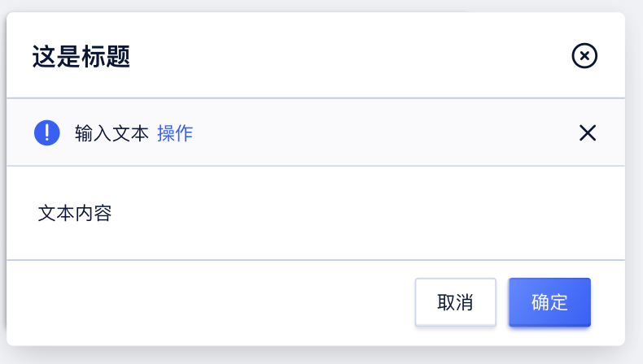

**中号弹窗**

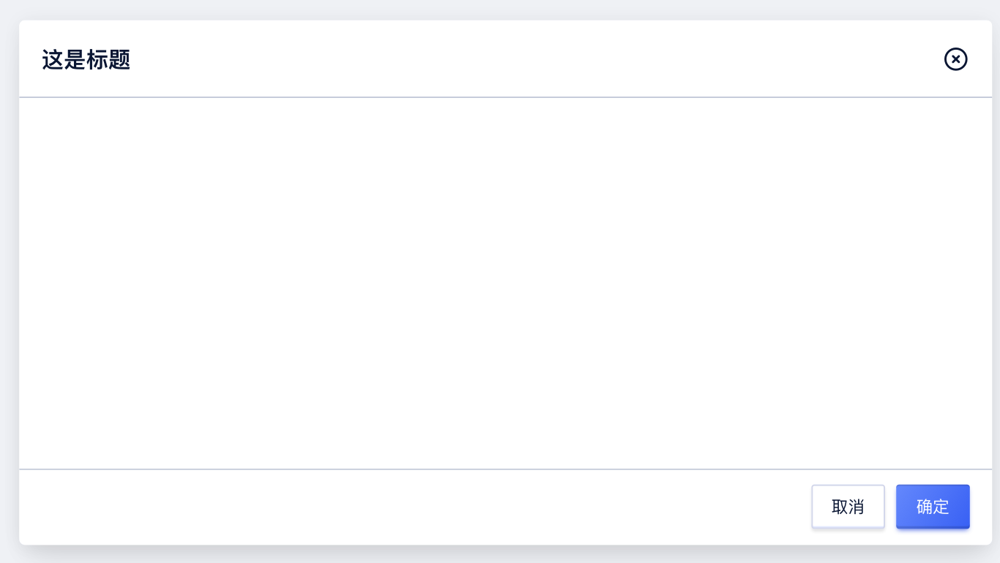

**大号弹窗**

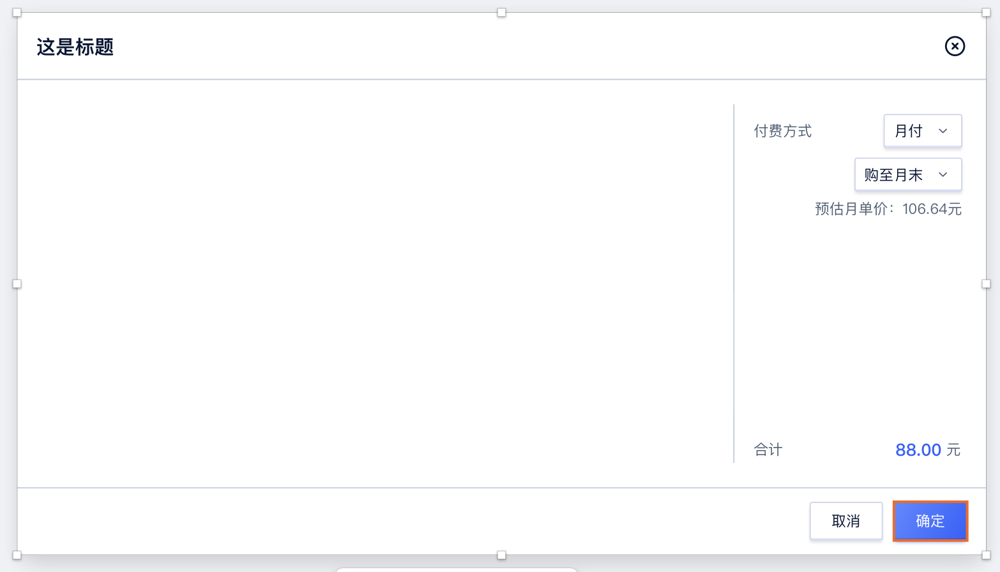

### 弹窗高度
内容区域如未限定最大高度, 弹窗根据表单内容自适应高度。
如内容区对最大高度进行了限制, 则表单内出现滚动条。 
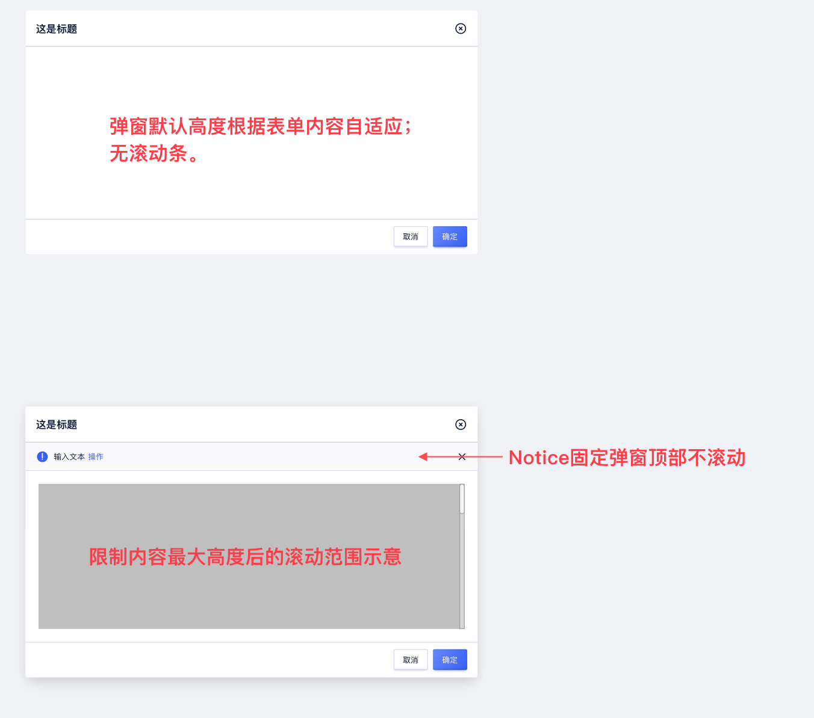

### 默认提示
弹窗的默认提示与弹窗等宽，位于内容卡片与弹窗标题之间，具体提示条相关设置，可以参考[Notice 提示](https://udesign.ucloud.cn/component/Notice/)。

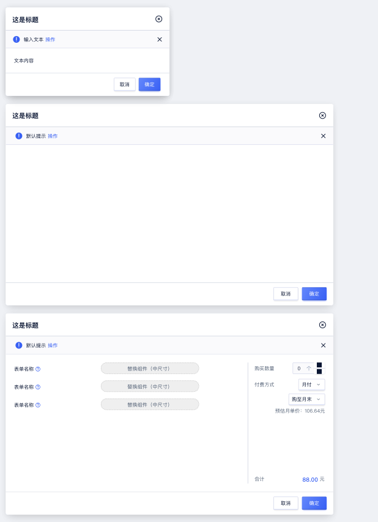

### 报错提示
弹窗全局的报错，在内容区顶部进行报错。
弹窗区内表单/表格的报错，遵循 [Form 表单](https://udesign.ucloud.cn/component/Form/) 和 [Table 表格](https://udesign.ucloud.cn/component/Table/) 的报错原则。

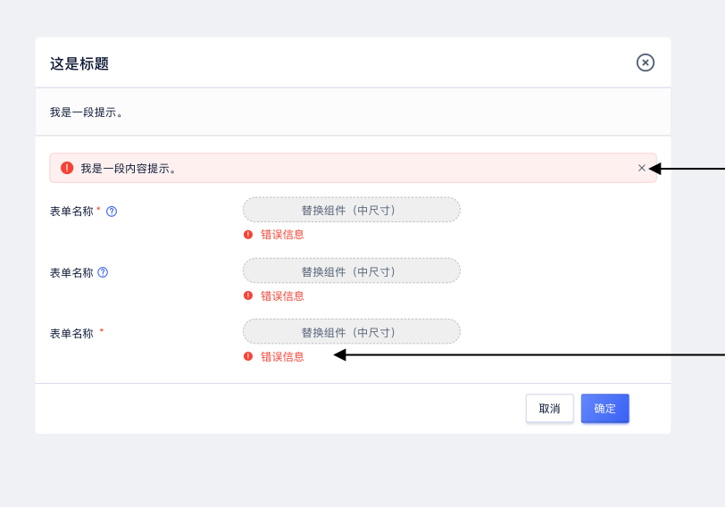

## 设计说明

在界面中如何使用该组件？

### 1.使用场景    

当用户需要快速执行简单的操作、确认信息或反馈提示，但又不希望脱离原有页面时使用模态弹窗。

### 2.弹窗中的提示信息    

当弹窗中需要出现提示信息时，可在标题栏下方用Notice展示。

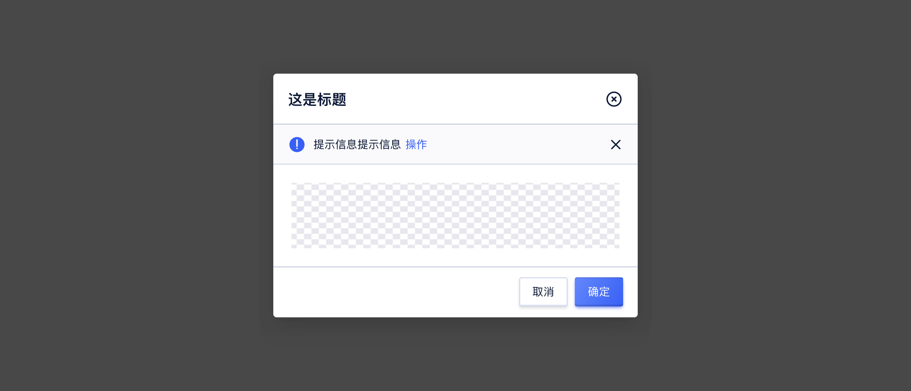

### 3.弹窗标题

假如这个弹窗是由用户主动触发的，那么弹窗标题应该与用户触发弹窗的操作按钮同名，或者至少有相同的关键字。此时弹窗是用户操作后的反馈，用户需要通过弹窗的标题来确认自己是否进入了正确的模块、进行了正确的操作。

### 4.弹窗的关闭方式

作为一个非常底层的控件，弹窗 `Modal` 应该兼顾大部分用户的不同习惯，来保持整个系统有比较好的可用性。因此，建议在右上角添加“x”作为关闭操作性弹窗的最短路径，并且佐以键控、点击遮罩等多种关闭方式；除非要求用户明确表态（比如要求同意协议）。

当然，更便捷的关闭方式代表着更多的误触，如何平衡可用性和误触，就要根据具体场景具体分析了。

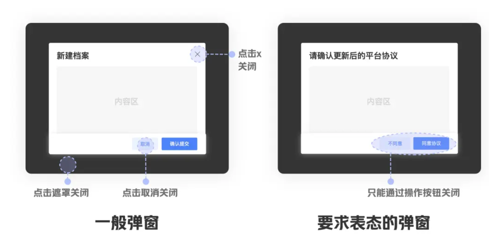

## 常见问题

### 模态对话框与抽屉使用时的区别

   

      
<i class="u-md-suggested"></i>当内容较少时使用弹窗展示，当内容较多时使用抽屉展示。

      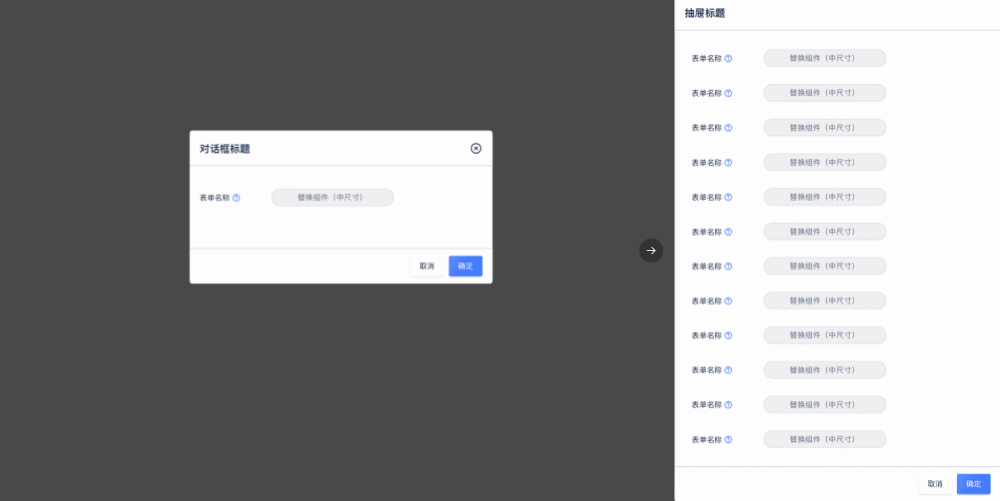
   

   

      
<i class="u-md-not-suggested"></i>当内容较多时，弹窗内会出现滚动条，不便于用户使用。

      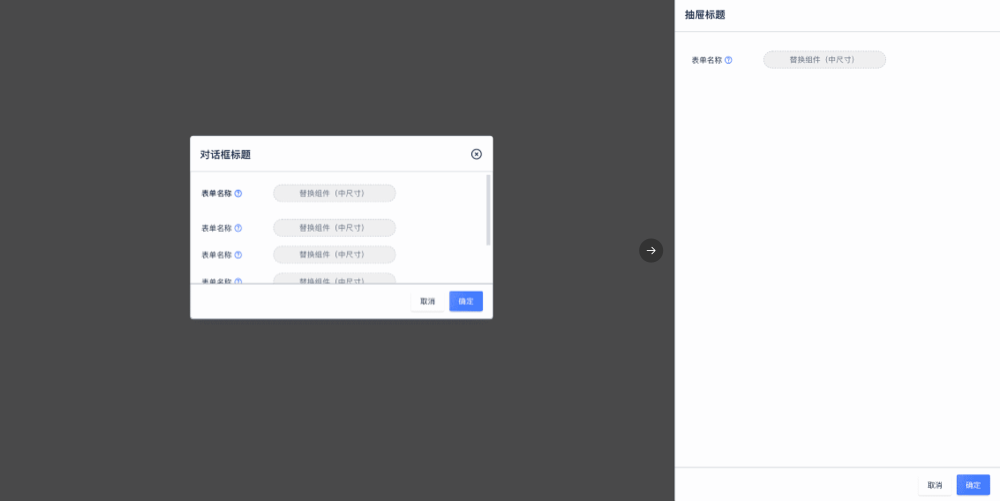
   

## 相关文档

1. [Button 按钮](/component/Button/)
2. [Form 表单](/component/Form/)

