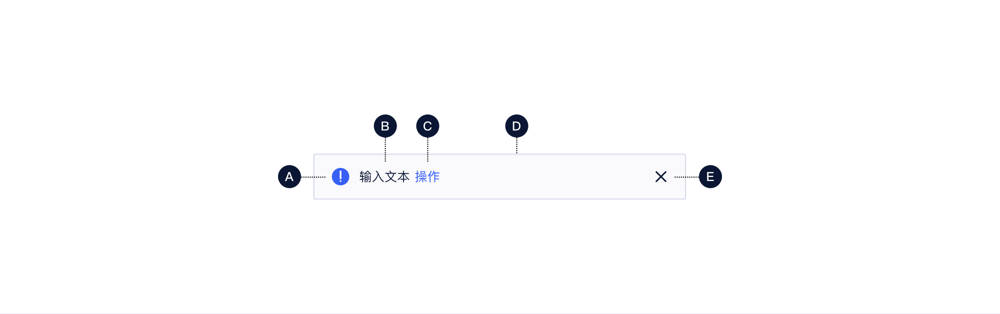
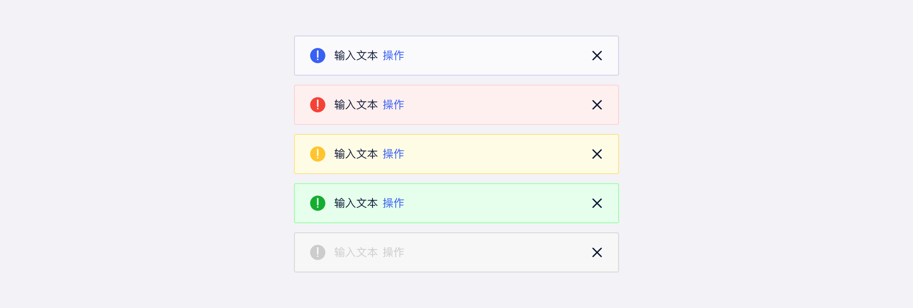
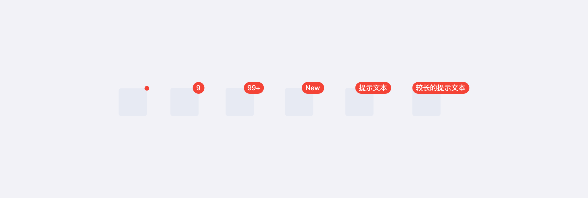

<!--副标题具体写法见源代码模式-->

## 简介

提示 `Notice` 是用作信息通知的控件。它包含有关对象或状态的信息，可以嵌入到对象或页面的详细信息区域中，给出用户下一步的行动点。

## 基本构成

| 图标（A） | 通知文案（B） | 操作按钮（C） | 容器（D） | 关闭按钮（E） |
| :-------: | :-----------: | :-----------: | :-------: | :-----------: |
|   可选    |       √       |     可选      |     √     |     可选      |

**A.图标（可选）**

主要用来表示提示的重要程度，其色值与背景颜色配套使用，U-Design预设部分图标，用户也可以根据自己的需求自定义。

**B.通知文案**

有关对象或状态的描述信息。使用时可根据场景需求，在文案内添加超链接。

**C.操作按钮（可选）**

如果需要引导用户执行下一步操作的时候，如：查看下一条通知，则可以根据需求自定义操作按钮。

**D.容器**

**E.关闭按钮（可选）**

根据提示的属性，可选择是否可以关闭。

## 基本状态

U-Design预设了五种语义类型：默认、成功、警告、报错、不可用。

## 设计说明

信息类组件的触发场景存在于用户之间以及系统和用户之间。通知组件的设计选择需要根据具体的场景来定，一些重要性极低的信息，可以采取 [徽标数](http://10.179.234.214:8000/component/Badge/) `Badge`的形式进行弱提示，对用户当前的操作，几乎无干扰；但是一些重要性极高的信息，需要用户立即关注并采取措施的信息，可以采取 [弹窗](http://10.179.234.214:8000/component/Modal/) `Modal`进行页面级独占式的通知。

## 相关文档

1. [Badge 徽标数](http://10.179.234.214:8000/component/Badge/)
2. [PopConfirm 气泡确认框](http://10.179.234.214:8000/component/PopConfirm/)
3. [弹窗](http://10.179.234.214:8000/component/Modal/)
