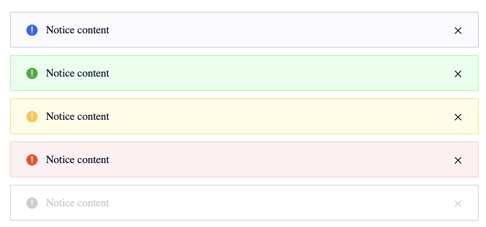

<!--副标题具体写法见源代码模式-->

## 简介

表格是数据呈现的载体，用于展示多条结构类似的数据，被公认为是展现结构化数据最为清晰、高效的形式。通过表格，可对数据进行排序、搜索、筛选或其他自定义操作。

## 基本构成

1、icon：可选
2、通知文案：必须
3、操作按钮
4、关闭按钮
5、背景

## 基本样式

U-Design预设了五种样式：
默认
成功
警告
报错
不可用

## 设计说明

### 自定义列

B端中后台通常会对应不同的角色及场景需求，根据目的及信息主体的不同，让用户根据自己的需求来定义表格的展示列。

## 相关文档

1. [相关文档1](https://www.ucloud.cn)
2. [相关文档2](https://www.ucloud.cn)
