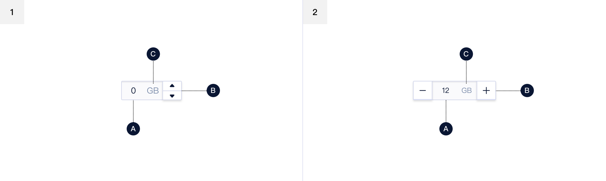
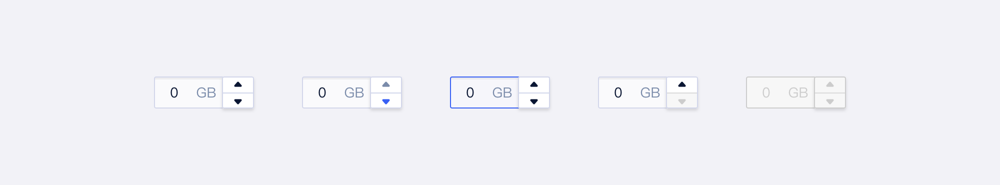
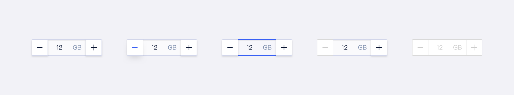
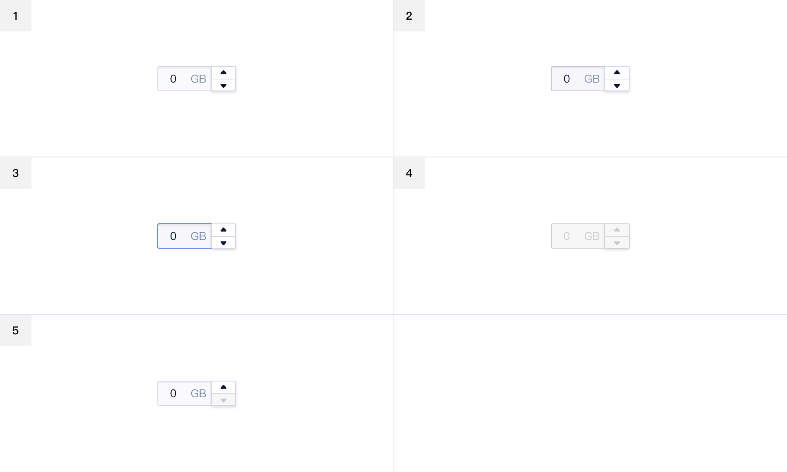
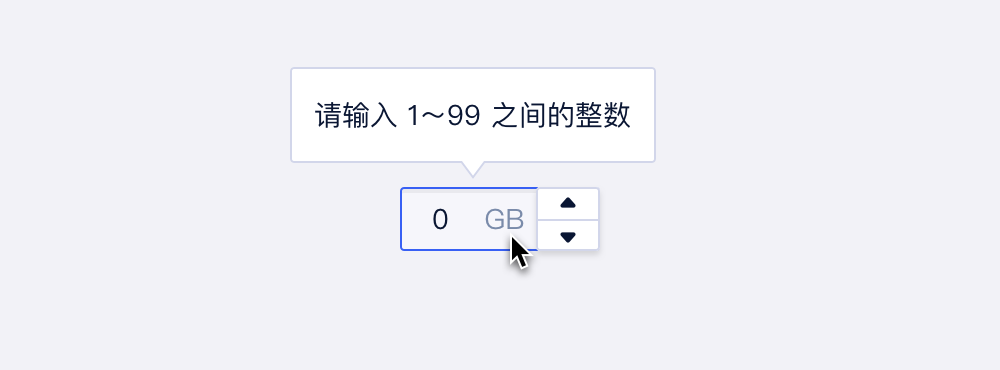
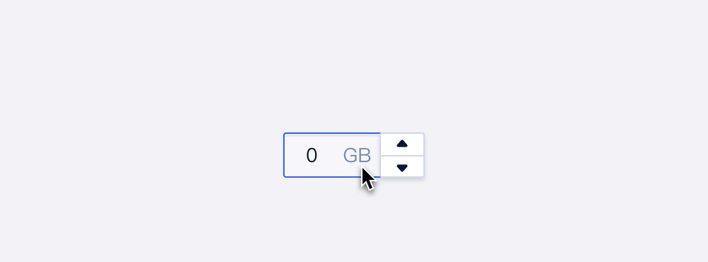

<!--副标题具体写法见源代码模式-->

## 简介

仅允许输入标准的数字值，可定义范围的输入组件，并对输入的数据做正确性检查、自动订正。

## 基本构成

|      | 类型     | 输入框（A） | 数值增减器（B） |
| ---- | :------- | :---------: | :-------------: |
| 1    | 垂直按钮 |      √      |        √        |
| 2    | 左右按钮 |      √      |        √        |

## 基本样式

| 类型     | 说明                                                         |
| :------- | :----------------------------------------------------------- |
| 垂直按钮 | 增减按钮置于输入框右侧，常用于用户以输入为主，用户填入数值可能跨度较大的场景 |
| 左右按钮 | 增减按钮置于输入框两侧，以加减表示，用户填入数值跨度较小的场景，例如购买数量等 |

#### 垂直按钮

#### 左右按钮

## 基本状态

|      | 状态     | 说明                               | 作用                            |
| :--: | :------- | :--------------------------------- | :------------------------------ |
|  1   | 默认状态 | 组件初始状态                       | -                               |
|  2   | 悬停状态 | 鼠标经过选择器时，切换至该状态     | 暗示用户行动点可操作            |
|  3   | 选中状态 | 元素切换至选中                     | 表示其后的项目被选中            |
|  4   | 禁用状态 | 当前行动点不可用，建议配合提示说明 | 表示当前选项不可选择            |
|  5   | 按钮禁用 | 当数值达到边界值时，对应按钮禁用   | 暗示与禁止用户不能继续增/减数值 |

## 

## 设计说明

在界面中如何使用该组件？

#### 使用场景    

- 当输入内容为数值，且数据需要做正确性检查、自动订正时使用。

## 常见问题

### 输入数值有限定条件时应给予前置提示

   

      
<i class="u-md-suggested"></i>输入框激活时，应冒泡给予数值限定条件提示。

      
   

   

      
<i class="u-md-not-suggested"></i>输入前不给予提示容易引起用户的无效操作。

      
   

<!--

## 主题

| 内容 | 值           | 默认值  |
| :--- | :----------- | :------ |
| icon | icon/nothing | nothing |
| icon | icon/nothing | nothing |

-->

## 相关文档

1. [Input 输入框](/component/Input/)
2. [Autocomplete 自动填充](/component/Autocomplete/)

