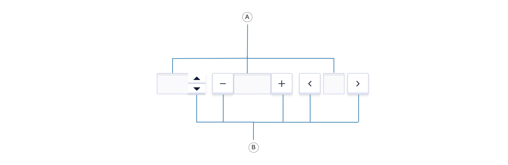
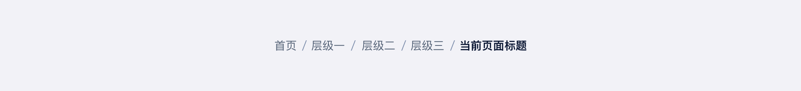
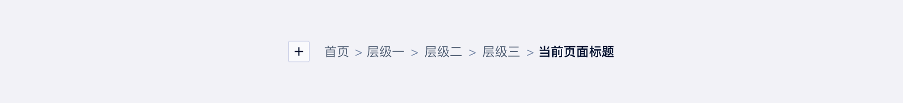
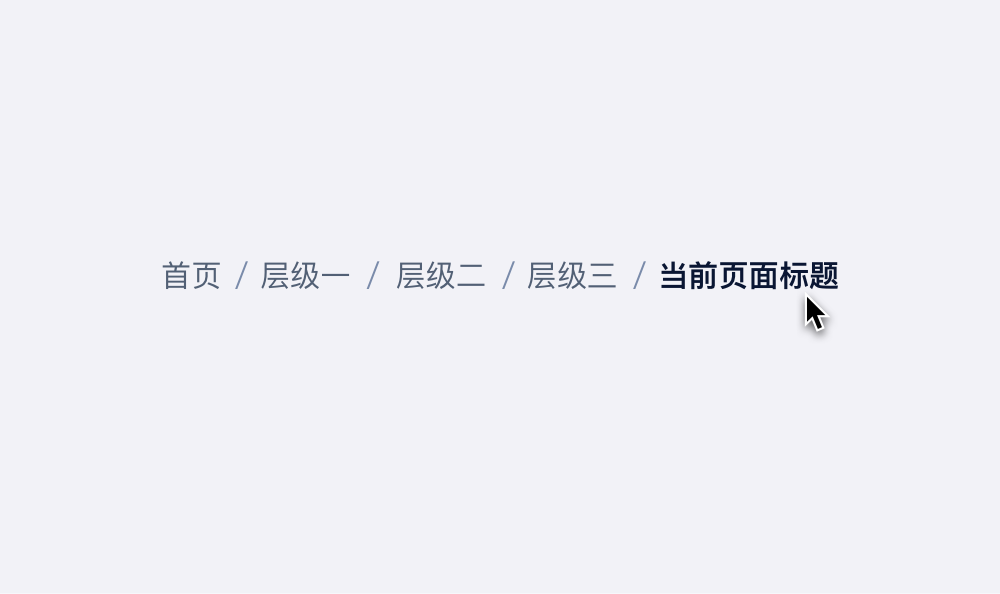

<!--副标题具体写法见源代码模式-->

## 简介

仅允许输入标准的数字值，可定义范围的输入组件，并对输入的数据做正确性检查、自动订正。

## 基本构成

| 输入框（A） | 数值增减器（B） |
| :---------: | :-------------: |
|      √      |        √        |

## 基本样式

| 类型   | 说明                                       |
| :----- | :----------------------------------------- |
| 常规   | 包含路径、当前页面、连接符的基本样式       |
| 自定义 | 可自定义配置项，下拉菜单、连接符、返回按钮 |

#### 常规

#### 自定义

## 设计说明

在界面中如何使用该组件？

#### 1.使用目的

-  表明当前页面所处的位置，感知产品属性之间的所属关系。      
-  面包屑可以减少的用户返回上一级页面的所需的操作次数。     
-  临时性，动态性，占用屏幕空间小，干扰性小。

#### 2.使用场景    

- 当网站内拥有分类明晰、组织明确的多层次线性结构的时候，应当使用面包屑。      
- 当网站不具备逻辑清晰的层次结构的时候，不建议使用面包屑。

#### 3.使用时的注意事项      

- 不要在移动端页面上使用面包屑。

  <<<<<<< HEAD
  =======

=======

>>>>>>> e6e84208aa5fccf72d28e39b7e36a0238cbc984e

- 层级要精简，最多五层。

## 常见问题

### 当前页面在面包屑中不可点击

​     

   

      
<i class="u-md-suggested"></i>鼠标移至面包屑当前页面上，无交互反馈，不可点击。

      
   

   

<<<<<<< HEAD
      
<i class="u-md-not-suggested"></i>面包屑中当前页面只起到定位作用，点击没有任何意义。

      
=======
      
<i class="u-md-not-suggested"></i>鼠标移至面包屑当前页面上，有交互反馈，可以点击。

      
>>>>>>> e6e84208aa5fccf72d28e39b7e36a0238cbc984e
   

## 
