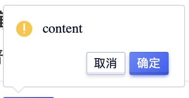

<!--副标题具体写法见源代码模式-->

## 简介

用户在使用产品时需要做各种决策，尤其是B端客户每天都面对增、删、改、查。如果因为操作员的其中某些指令造成的后果需要用户花费大量成本去挽回，比如提交了未完成、未检查的表单，删除了重要数据等，为了减少甚至避免对重要数据的误操作，或对重要操作的误触，我们需要在必要且合适的时候，使用 气泡确认框 `PopConfirm` 让用户进行二次确认：你是否要这么做？

气泡确认框 `PopConfirm` 通常用于不会造成严重后果的二次确认场景，其会在点击元素上弹出浮层进行提示确认。气泡确认框没有蒙层，点击确认框以外的区域即可关闭。

通过气泡确认框 `PopConfirm` 可以对用户的操作进行二次确认，防止误操作。

## 基本构成

| 图标（A） | 通知文案（B） | 操作按钮（C） | 容器（D） | 关闭按钮（E） |
| :-------: | :-----------: | :-----------: | :-------: | :-----------: |
|   可选    |       √       |     可选      |     √     |     可选      |

**A.图标（可选）**

主要用来表示提示的重要程度，其色值与背景颜色配套使用，U-Design预设部分图标，用户也可以根据自己的需求自定义。

## 基本状态

U-Design预设了五种语义类型：默认、成功、警告、报错、不可用。

## 设计说明

## 常见问题

### 避免滥用

气泡确认框 `PopConfirm` 其实是打断用户操作流的设计，只是迫不得已的折中方案：
- 其会增加用户操作步骤，降低操作效率；
- 打断用户流程，降低转化率；
- 影响产品品质，损害用户体验印象。
所以要不要选择使用气泡确认框 `PopConfirm`的方式，需要从多个因素去权衡利弊。

对于什么时候需要气泡确认框 `PopConfirm`的情况，其实可以从当前操作的带来的不可逆的维度+错误结果导致的严重程度，以及出现的频次。

**低成本操作**

> 对于低成本的操作可以不设置二次确认。

> 举个例子：从操作频率上讲：录入表单，或者新建一个表单，查看详情都是最最最最基本操作，所以无需设置二次确认。

**中成本操作**

> 比如是日常的一些操作，但是没有明确后果也会使其产生较严重的后果，但并不至于造成不可挽回的后果。所以我们可以在产生严重后果之前设置二次确认，确认并提醒即将产生的结果并二次询问。

**高成本操作**

> 在操作后会产生很严重或者不可挽回的后果，需要让用户仔细想清楚的时候，提前预知操作风险，阻断流程并且再次确认。

> 比如删除账号、修改数据、提交/发送重要内容，通常用户会填比较多信息，如果不做二次确认，容易导致用户误操作提交错误内容。比如出行填写预订信息的证件实时核对，提交保存时候的再次确认。

> 在C端用户的操作会带来损失的情况下的二次确认，比如拼夕夕的活动提醒；用损失厌恶引导评论。这都是从心理学去挽留用户。

### 优化微文案

对于二次确认的功能无论是从信息获取角度还是提升用户体验，都要注意减少用户的挫败感。

给大家总结好公式：打断原因+需要用户什么操作+操作带来的后果+按钮文案无歧义（注意不宜过长！！！）

歧义案例：

有些操作比如“取消订单”中包含了“取消”一类的字眼，为避免歧义，按钮的文案应尽量不使用“确定/取消”。可将操作带来的后果直接写在按钮上，减少误会。

   

      
<i class="u-md-suggested"></i>在引导用户转化的时候，二次确认会中断整个用户购买流程。

      
   

   

      
<i class="u-md-not-suggested"></i>操作很频繁且误操作带来的影响小于操作成本，就可以考虑不使用二次确认。

      
   

### 须知内容换行对齐建议

   

      
<i class="u-md-suggested"></i>在引导用户转化的时候，二次确认会中断整个用户购买流程。

      
   

   

      
<i class="u-md-not-suggested"></i>操作很频繁且误操作带来的影响小于操作成本，就可以考虑不使用二次确认。

      
   

## 相关文档

1. [Badge 徽标数](/component/Badge/)
2. [PopConfirm 气泡确认框](/component/PopConfirm/)
3. [Modal 弹窗](/component/Modal/)
