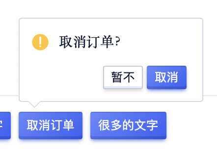
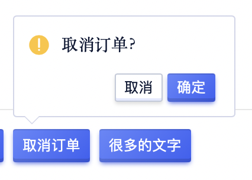
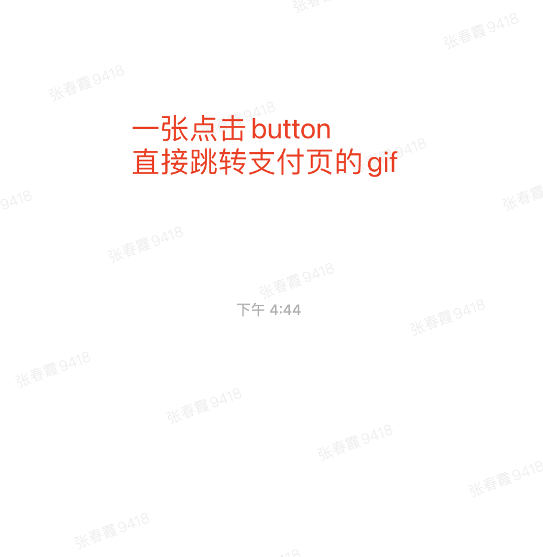
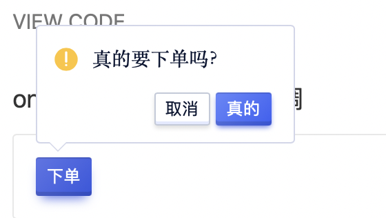

<!--副标题具体写法见源代码模式-->

## 简介

用户在使用产品时需要做各种决策，为了减少甚至避免对重要数据的误操作，或对重要操作的误触，我们需要在必要且合适的时候，让用户对操作进行二次确认。

气泡确认框 `PopConfirm` 通常用于中成本的操作的二次确认，其会在点击元素上弹出浮层进行提示确认。防止误操作。

## 基本构成

| 图标（A） | 文案（B） | 操作按钮（C） | 容器（D） |
| :-------: | :-----------: | :-----------: | :-------: |
|   √    |       √       |     √     |     √     |

**A.图标（必选）**

主要用来表示提示的重要程度，U-Design预设部分图标，用户也可以根据自己的需求自定义。

**B.文案（必选）**

U-Design建议 气泡确认框 `PopConfirm` 的文案公式如下：打断原因+操作带来的后果+用户可以做什么操作。需要注意，整条文案不宜过长。

**C.操作按钮（必选）**

**D.容器（必选）**

## 基本状态

### 正常的文本

3行内文本，高度自适应

### 超长的文本（不建议）

文本超过3行，出滚动条，滚动展示

## 设计说明
<!--可以做一个gif-->
气泡确认框没有蒙层，点击确认框以外的区域即可关闭。

## 常见问题

### 避免滥用

气泡确认框 `PopConfirm` 是会打断用户操作流的设计，是迫不得已的折中方案：
- 其会增加用户操作步骤，降低操作效率；
- 打断用户流程，降低转化率；
- 影响产品品质，损害用户体验印象。
所以要不要选择使用 气泡确认框 `PopConfirm` ，需要从多个因素去权衡利弊。

**低成本的操作**

> 对于低成本的操作可以不设置二次确认。

> 举个例子：从操作频率上讲：录入表单，或者新建一个表单，查看详情都是最最最最基本操作，所以无需设置二次确认。

**中成本的操作**

> 操作之后，会使其产生较严重的后果，但并不至于造成不可挽回的后果。所以我们可以在产生严重后果之前设置 气泡确认框 `PopConfirm` ，确认操作，并提醒即将产生的结果。

**高成本操作**

> 在操作后会产生很严重或者不可挽回的后果，需要让用户仔细想清楚的时候，提前预知操作风险，阻断流程并且再次确认。

> 比如删除账号、修改数据、提交/发送重要内容时，可以使用弹窗 `PopConfirm`直接打断用户。

   

      
<i class="u-md-suggested"></i>对于中成本的操作，提示用户可能会带来的后果，以及用户可以执行什么操作。

      
   

   

      
<i class="u-md-not-suggested"></i>对低成本的操作进行确认，会显得多此一举。

      
   

### 优化微文案

对于二次确认的功能无论是从信息获取角度还是提升用户体验的角度，都要注意减少用户的挫败感。

   

      
<i class="u-md-suggested"></i>可将操作直接写在按钮上，减少误会。

      
   

   

      
<i class="u-md-not-suggested"></i>如“取消订单”中包含了“取消”一类的字眼，为避免歧义，按钮的文案应尽量不使用“确定/取消”。

      
   

### 用户转化关键节点避免使用二次确认

   

      
<i class="u-md-suggested"></i>在引导用户转化的时候，不需要进行二次确认。

      
   

   

      
<i class="u-md-not-suggested"></i>二次确认会中断整个用户购买流程。

      
   

## 相关文档

1. [Popover 气泡卡片](https://udesign.ucloud.cn/component/Popover/)
2. [Tooltip 文字提示](https://udesign.ucloud.cn/component/Tooltip/)