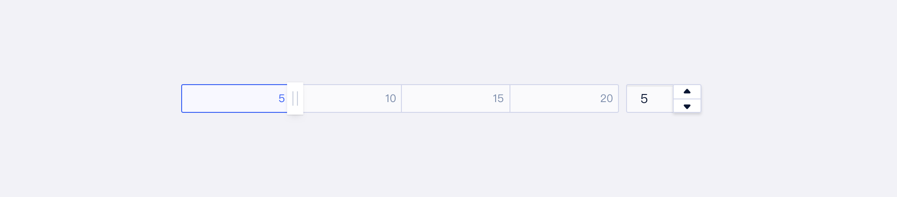
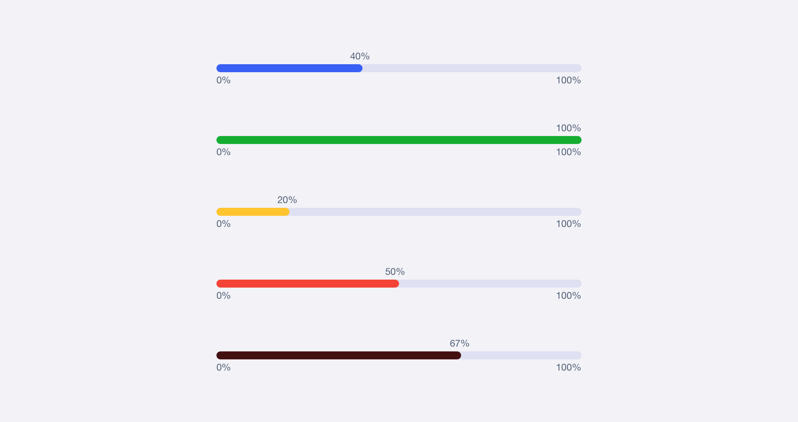

## 简介

Progress 是用于展示实时状态或进度等信息。一般用于：

- 展示用户资源当前使用情况，用可视化方式提供数据比例反馈
- 展示用户操作实时进度，告知当前状态和预期

## 基本构成

| 当前进度（A） | 完整进度（B） | 数值（C） |
| :-----------: | :-----------: | :-------: |
|       √       |       √       |   可选    |

## 基本样式

### 类型

#### 条状进度条

需要准确计数的场景。

以线形表示进度的组件，可以选择性地配有文字等补充显示进度和状态。

### 颜色

颜色也有表示状态的功能性。针对进度条`PROGRESS`，U-Design预设了四种语义类型：默认、成功、警告、报错。

| 状态   | 色值                      |
| :----- | :------------------------ |
| 默认   | `T_COLOR_BG_PRIMARY_1`    |
| 成功   | `T-COLOR-BRAND-GREEN-6`   |
| 警告   | `T_COLOR_LEGEND_YELLOW_6` |
| 报错   | `T_COLOR_LEGEND_RED_6`    |
| 自定义 | `T_COLOR_BRAND_xxxxx_6`   |

- 现有颜色无法满足需求时可使用其他自定义色值`T_COLOR_BRAND_xxxxx_6`，“xxxxx”代表颜色名。

## 设计说明

### 场景

该组件应用于哪些场景？

- 无法预估进程的时间，建议使用「加载 Loading」
- 进程确定在 1 秒内的操作

#### 1.展示资源使用情况

通过进度条展示资源用量及比例等数值，可单个使用，也可多个组合使用

#### 2.展示某个操作当前进度和状态

- 当某操作需要较长时间才能完成时，为用户显示该操作的当前进度和状态；
- 当一个操作会打断当前界面，或者需要在后台运行，且耗时可能超过 2 秒时；
- 当需要显示一个操作完成的百分比。

### 布局

在界面中如何摆放该组件？

- 作为展示项应用于表格中
- 出现在message或弹窗中展示进度

### 行为

- 数值随进度增长变动
- 若有更多信息需展示，鼠标hover进度条后，出现tooltip展示详细信息
- 可通过进度条颜色区分当前状态类型
