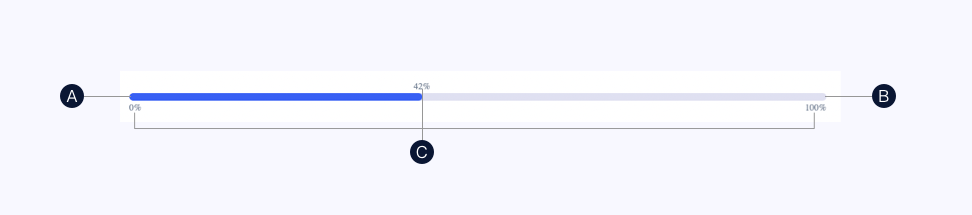

<!--副标题具体写法见源代码模式-->

## 简介

Progress 是用于展示实时状态或进度等信息。一般用于：

- 展示用户资源当前使用情况，用可视化方式提供数据比例反馈
- 展示用户操作实时进度，告知当前状态和预期



## 基本构成

| 当前进度（A） | 完整进度（B） | 数值（C） |
| :-----------: | :-----------: | :-------: |
|       √       |       √       |   可选    |

## 基本样式

### 类型

#### 条状进度条

需要准确计数的场景。

一般出现在通知图标或头像的右上角，用于显示需要处理的消息条数； 由于界面显示空间有限，因此注意视场景和信息类型决定封顶数字显示。

### 颜色

[^需UI同学自行补充]: 

## 设计说明

### 场景

该组件应用于哪些场景？

#### 1.展示资源使用情况

以框架右边为中心点, 水平居中对齐。建议徽标内容不要过长。

### 行为

当用户使用不同设备端访问平台或页面时，如何与界面中的按钮交互？

#### 桌面端设备

- 鼠标：点击、悬停

#### 移动端设备

- 鼠标：平板可外接鼠标，行为与桌面端设备一致

- 手指：点击

  

##  常见问题

   

      
<i class="u-md-suggested"></i>文本内容简洁、长度适中

      
   

   

      
<i class="u-md-not-suggested"></i>文本内容过于啰嗦冗长

      
   

<!--

## 主题

| 内容 | 值           | 默认值  |
| :--- | :----------- | :------ |
| icon | icon/nothing | nothing |
| icon | icon/nothing | nothing |

-->

## 相关文档

1. [Tag 标签](/component/Tag/)
2. [Notice 提示]/component/Notice/)
