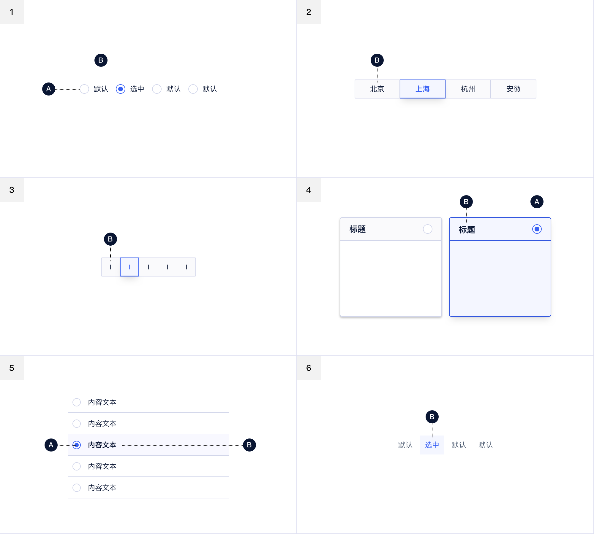
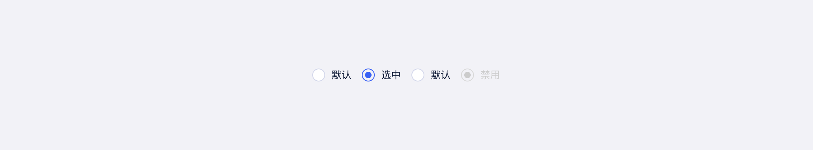
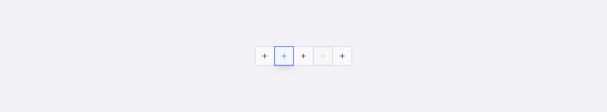
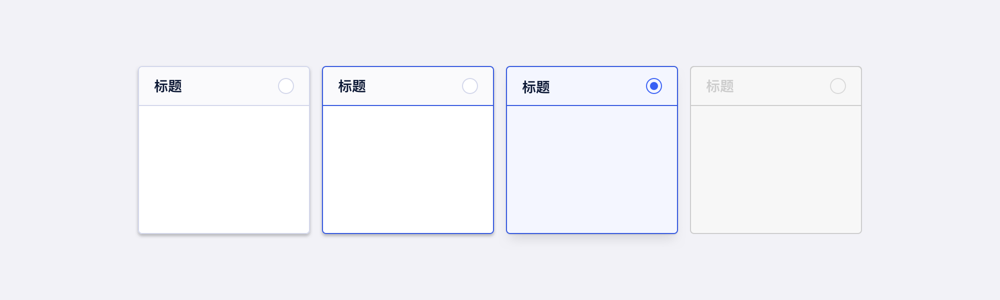
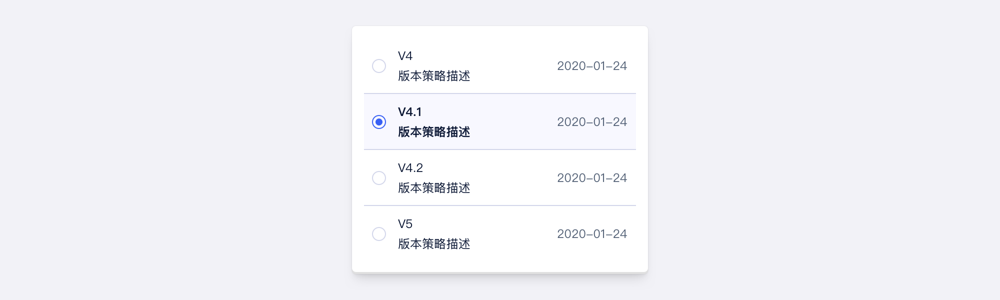
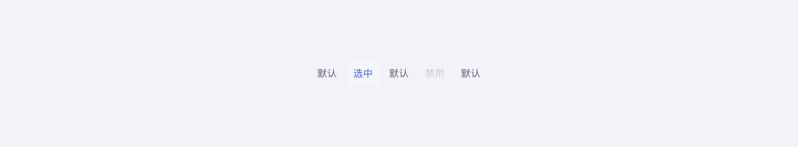
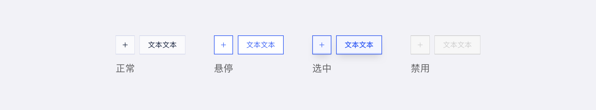
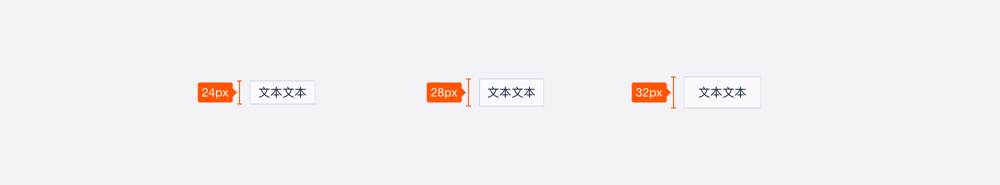
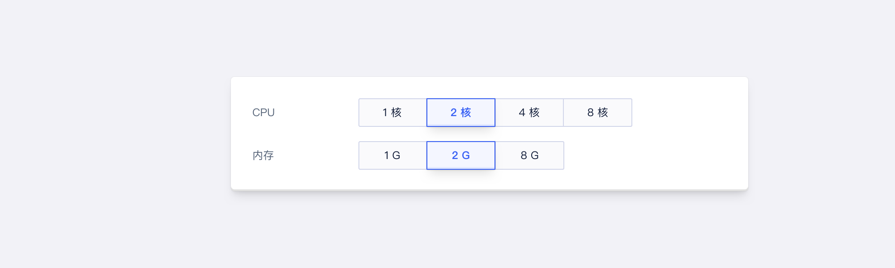
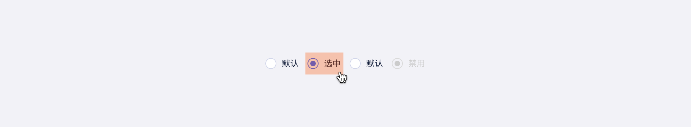

<!--副标题具体写法见源代码模式-->

## 简介

Radio单选 用于完成在多个备选项中完成单选任务的组件，但是如果选项较多，建议使用 下拉组件。Radio 所有选项默认可见，方便用户在比较中选择，因此选项不宜过多。Radio单选 的选项之间是互斥的，用户选择一个选项时，之前的选择将会自动取消。

## 基本构成

|      | 类型              | 单选按钮 (A) | 单选内容 (B) |
| :--: | :---------------- | :----------: | :----------: |
|  1   | 默认 `default`    |      ✓       |      ✓       |
|  2   | 文本按钮 `button` |      -       |      ✓       |
|  3   | 图标按钮 `button` |      -       |      ✓       |
|  4   | 卡片`card`        |      ✓       |      ✓       |
|  5   | 列`list`          |      ✓       |      ✓       |
|  6   | 标签`tag`         |      -       |      ✓       |

1、单选按钮：指示选择状态的单选按钮。

2、单选内容：描述要选择或取消选择的信息。

## 基本样式
### 类型

默认

文本按钮

图标按钮

卡片

列

标签

### 状态

### 尺寸

U-Design 目前对Radio 单选区分了 3 次种尺寸：大（lg）、中（md）、小（sm）。

## 设计说明

### 选项不宜过多
给用户的选择最好不要超过9个选项，否则建议使用下拉选择组件。

### 选项的排列应具有逻辑性

Radio单选 的选项应该按某种逻辑顺序排列，例如从最简单的操作到最复杂的操作、从可能性最大到可能性最小的，或者从最低风险到最高风险的，从而用户心理状态符合某种预期，帮助用户更好的理解表单。

### 为用户提供较大的点击区域

根据费茨定律，目标越大，交互成本越低。单选按钮本质上很小，用户操作时很难点击到它们。U-Design 让用户不仅可以通过单击圆圈来选择选项，还可以通过单击文字来选择，以减小用户的操作成本。

### 建议默认选中一个建议选项

默认给用户一个建议值，从而提高用户完成表单的速度，但是这要根据具体场景来看，是否需要提供默认值。

## 相关文档

1. [复选](https://www.ucloud.cn)
2. [相关文档2](https://www.ucloud.cn)
