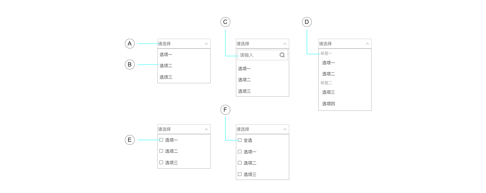
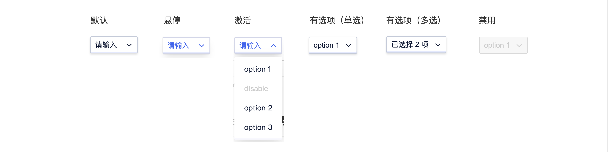
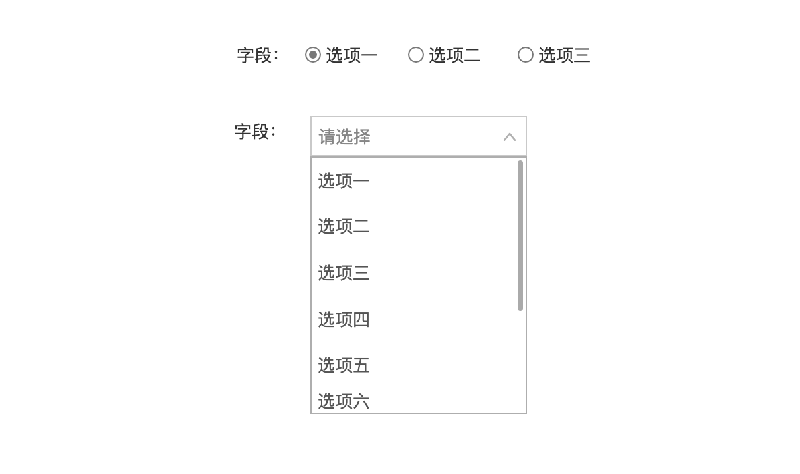
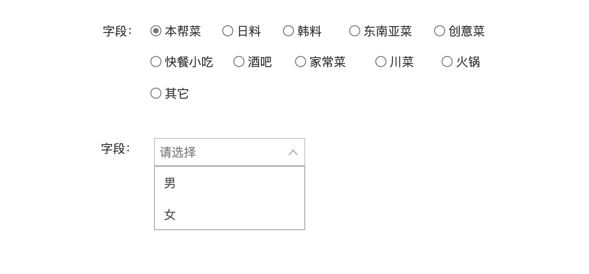

<!--副标题具体写法见源代码模式-->

## 简介

当选项过多时，使用下拉菜单展示并选择一个或多个选项内容。

## 基本构成

| 选择器（A） | 下拉菜单（B） | 搜索框（C） | 分组标签（D） | 复选框（E） | 全选项（F） |
| :---------: | :-----------: | :---------: | :-----------: | :---------: | :---------: |
|      √      |       √       |      √      |       √       |      √      |      √      |

## 基本样式

| 类型       | 说明                                                         |
| :--------- | :----------------------------------------------------------- |
| 基础用法   | 下拉选择器的基础用法，分为单选与多选。                       |
| 带搜索功能 | 搜索框可同时用于单选或多选选择器中，通常在选项数量较大，用户需要通过搜索才能方便找到选项时使用。 |
| 带分组标签 | 分组标签可同时用于单选或多选选择器中，当选项需要进行分类辅助用户查找选项时使用，标签不支持点选。 |

#### 基础用法

#### 带搜索功能

#### 带分组标签

## 基本状态

| 状态           | 说明                               | 作用                   |
| :------------- | :--------------------------------- | ---------------------- |
| 默认状态       | 组件初始状态                       | -                      |
| 悬停状态       | 鼠标经过选择器时，切换至该状态     | 暗示用户行动点可操作   |
| 激活状态       | 点击选择器切换该状态               | 提示用户进一步选择操作 |
| 有选项（单选） | 用户选择选项后显示该状态           | 选择器显示已选择内容   |
| 有选项（多选） | 用户选择选项后显示该状态           | 选择器显示已选择数量   |
| 禁用状态       | 当前行动点不可用，建议配合提示说明 | 表示当前选项不可选择   |

## 设计说明

在界面中如何使用该组件？

#### 使用场景    

- 当选项过多且选项没有层级关系时，使用下拉菜单展示并选择内容。

  

#### 特殊用法    

- 当选择器支持空值时，选项中应给予空值选项。

## 常见问题

### Select与Radio使用时的区别

   

      
<i class="u-md-suggested"></i>选项小于5项时建议使用radio，选项大于等于5项时建议使用select。

      
   

   

      
<i class="u-md-not-suggested"></i>选项过多时使用radio容易使表单整体看起来臃肿，当选项太少时若使用select不利于用户快速选择。

      
   

## 
