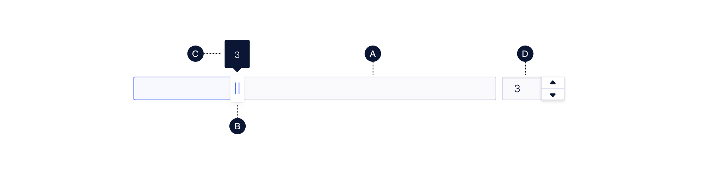
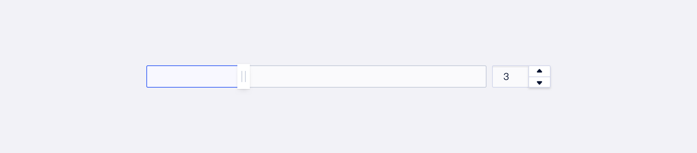
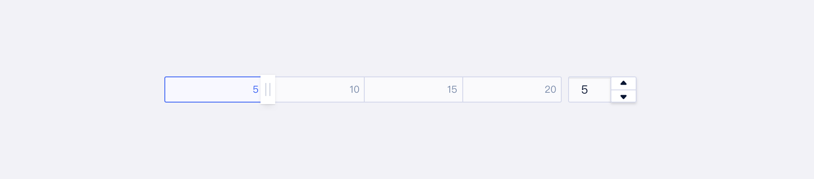
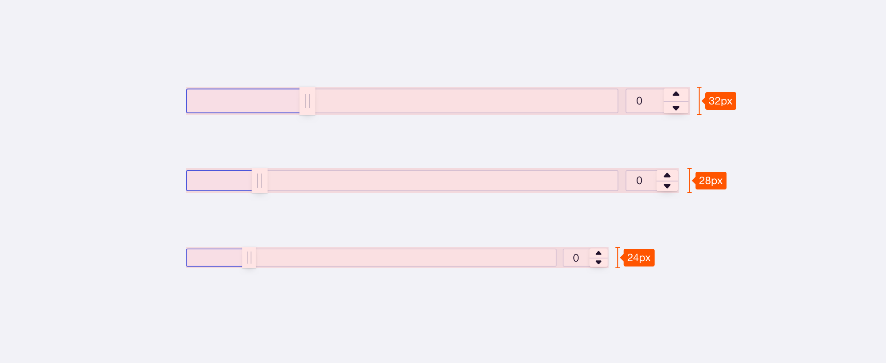

<!--副标题具体写法见源代码模式-->

## 简介

通过拖动滑块选择合适的数值。一般用于：

- 在数值输入过程中，需要提供实时的可视化数据比例反馈
- 在数值区间/自定义区间内进行选择数值



## 基本构成

| 滑动轴（A） | 游标（B） | 节点值（C） | 数字输入框（D） |
| :---------: | :-------: | :---------: | :-------------: |
|      √      |     √     |    可选     |      可选       |

**A.滑动轴**

滑动轴显示用户的可选范围，最小值出现在轴的最左端，最大值出现在最右端。

**B.游标**

游标是一个位置指示器，可以沿轴移动，显示对应位置的选定值。

**C.节点值（可选）**

鼠标hover或拖拽游标时显示对应数值。

**D.数字输入框（可选）**

可通过输入框设置精确、快速地调整数值。

## 基本样式

### 类型

| 类型       | 描述                                         |
| :--------- | :------------------------------------------- |
| 基础样式   | 默认使用样式                                 |
| 自定义样式 | 对滑块进行刻度值的配置，对滑块有更清晰的描述 |

基础样式

自定义样式—带刻度值的滑块

### 尺寸

U-Design 目前对滑块区分了 3 次种尺寸：**大（lg）、中（md）、小（sm**），高度分别为32px、28px、24px。

## 基本状态

| 状态 | 说明                                                    |
| :--- | :------------------------------------------------------ |
| 默认 | 默认初始状态                                            |
| 悬停 | 滑块可拖动时，hover游标后出现反馈                       |
| 激活 | 拖拽游标时，展示游标激活状态，且tooltip展示对应节点数值 |
| 禁用 | 当前数值不可调整                                        |

## 设计说明

### 原则

#### 1.自定义

根据实际场景需求来设定滑动轴的最小值、最大值、默认值、步长和刻度

#### 2.反馈

- 滑动过程中用户应得到即时的反馈，直观看到已选值与整体范围的关系
- 拖拽过程中，tooltip展示明确的节点数值

### 行为

如何通过滑块组件进行数值的选择？
（此处方式展示需讨论下是否可以加入gif或录屏做示意）

#### 方式一

拖动滑块进行数值选择，拖拽过程中随时显示准确数值。

#### 方式二

点击游标外的滑动轴上任意位置，自动定位到指定节点位置。

#### 方式三

通过在输入框中精确输入数值，游标位置与输入数值保持同步。

## 相关文档

1. [NumberInput 数字输入框](https://udesign.ucloud.cn/component/NumberInput/)
