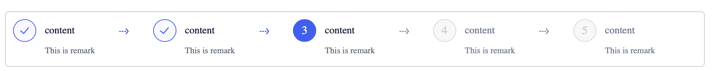
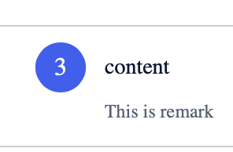
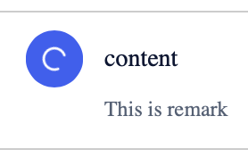
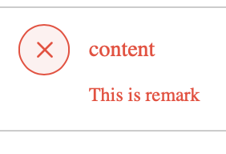
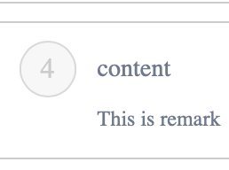

<!--副标题具体写法见源代码模式-->

## 简介

**步骤条Steps** 是一种常见的导航形式，具有导航的通用属性：告知用户在哪里以及能去哪里。

当任务较为复杂或者存在先后关系时，可将其分解成一系列步骤，从而简化任务，**步骤条Steps** 可以引导用户按照流程完成任务，可以帮助用户对操作流程长度和步骤有个预期，并且知道自己当前步骤，同时也可以对用户的任务完成度有明确的度量。

## 基本构成

| 标题| 备注 |序号 |箭头 |
| :-----: | :-----: |:-----: |:-----: |
|    可选    |   可选    |   ✓必须  | ✓必须    |

1、标题(可选)

当前步骤的描述性的词语或短语，不建议太长

2、备注(可选)

用于对标题进行补充说明，建议言简意赅，短句为佳

3、序号(必须)

当前步骤的序号

4、箭头(必须)

步骤与步骤之间的连接箭头，需要注意区分已完成的步骤与未完成的步骤前的箭头样式。

## 基本样式

U-Design的步骤条有以下状态：

已完成：用户已经完成的步骤

进行中：指示用户当前正在进行的步骤

加载中：节点正在对数据进行加载

报错：节点内容报错

待完成：用户尚未操作的步骤

## 设计说明

- 建议步骤数大于2步时才使用步骤条
- 应尽量将简化步骤流程，建议不多于6步，过多的步骤或过于复杂的流程会降低用户使用的耐心。
