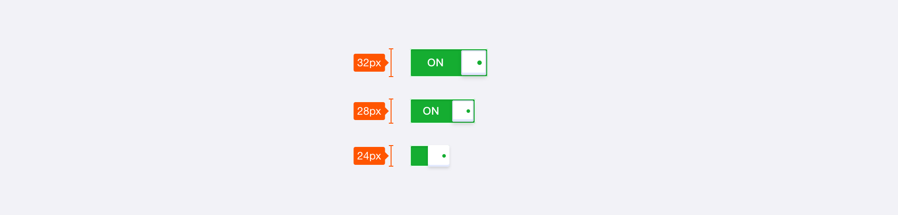
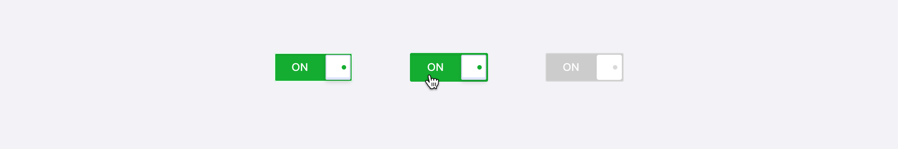
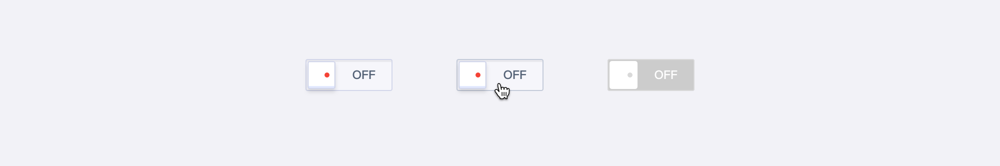
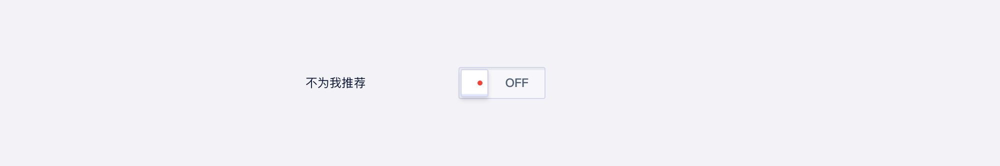

<!--副标题具体写法见源代码模式-->

## 简介

Switch 开关，常被翻译为开关、滑动开关、切换开关，作为界面中可直接操作的组件，提供两个互斥选项（如开/关、是/否、启动/禁用）供用户选择。

## 基本构成

| 容器（A） | 内容区域（B） |
| :-------: | :-------: |
|     √     |    可选   |

**A.容器**

- 操作项，允许用户将单个功能（例如个性化或显示设置）设置为活动或非活动状态

**B.内容区域（可选）**

- 文本内容，表明开关当前所处的状态

## 基本样式

### 尺寸
开关 `Switch` 预设了`lg`、`md`、 `sm`三种尺寸，高度分别为32px、 28px、24px。

### 状态
U-Design的 开关 `Switch` 有以下几种状态：
开启状态下的默认、hover、禁用。

关闭状态下的默认、hover、禁用。

## 设计说明

### 标签的表述尽量使用肯定句，不用使用否定词的语句

与表单 `Form` 结合使用时，标签的表述尽量使用肯定句。例如“不为我推荐”，这个句子本身就是否定句，开关控件本身也有打开和关闭两个属性。这时为了理解此开关的含义需要绕弯理解，避免误导用户、增加理解成本。

<!--

## 主题

| 内容 | 值           | 默认值  |
| :--- | :----------- | :------ |
| icon | icon/nothing | nothing |
| icon | icon/nothing | nothing |

-->

## 相关文档

1. [Checkbox 多选](/component/Checkbox/)
2. [Button 按钮](/component/Button/)
