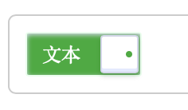
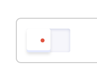
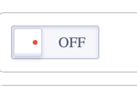
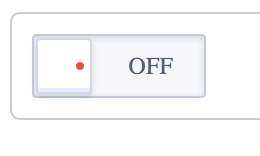
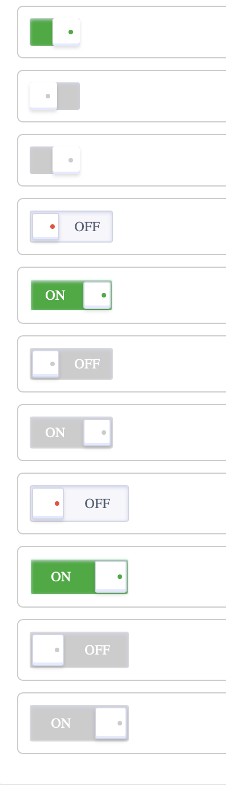
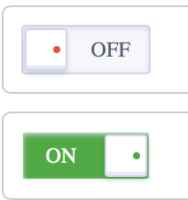
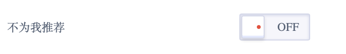

<!--副标题具体写法见源代码模式-->

## 简介

Switch 开关，常被翻译为开关、滑动开关、切换开关，作为界面中可直接操作的组件，提供两个互斥选项（如开/关、是/否、启动/禁用）供用户选择。

## 基本构成

| 开关（A） | 可选文本（B） | 
| :-------: | :-------: | 
|     √     |    可选   |

**A.开关**

- 操作项，允许用户将单个功能（例如个性化或显示设置）设置为活动或非活动状态

**B.可选文本**

- 表明开关当前所处的状态

## 基本样式

### 尺寸
开关 `Switch` 预设了 `sm`、 `md`、`lg`三种尺寸，高度分别为00px、 28px、32px。

小号开关

中号开关

大号开关

### 状态
U-Design的 开关 `Switch` 有以下几种状态：
关闭状态下：正常、hover、禁用
开启状态下：正常、hover、禁用

## 设计说明

### 对色盲友好
据调查色盲发生率在我国男性约为5%～8%、女性0.5～1%。从对色盲群体有好的角度来看，我们可以将可选文本的文案设置为“开”和“关”这样的表意。

### 标签的表述尽量使用肯定句，不用使用否定词的语句

与表单 `Form` 结合使用时，标签的表述尽量使用肯定句，例如“不为我推荐”，这个句子本身就是否定句，开关控件本身也有打开和关闭两个属性，这时为了理解此开关的含义需要绕弯理解，会误导用户，增加理解成本。

<!--

## 主题

| 内容 | 值           | 默认值  |
| :--- | :----------- | :------ |
| icon | icon/nothing | nothing |
| icon | icon/nothing | nothing |

-->

## 相关文档

1. [Checkbox 多选](/component/Checkbox/)
2. [Button 按钮](/component/Button/)
