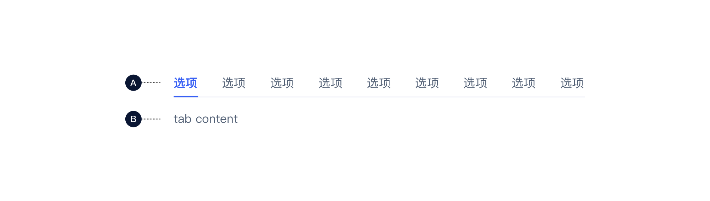
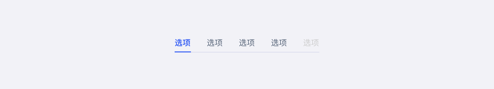
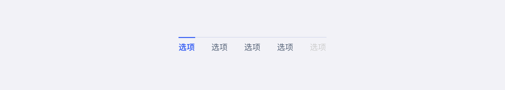
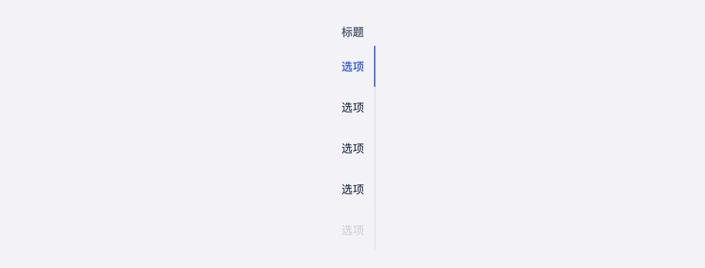
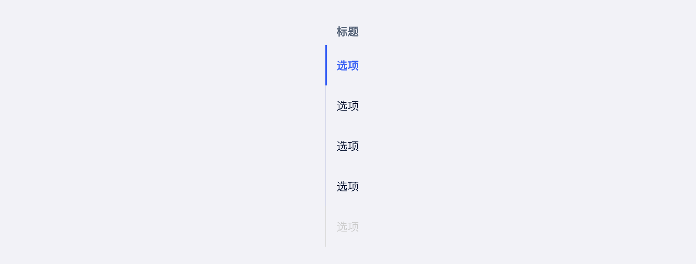
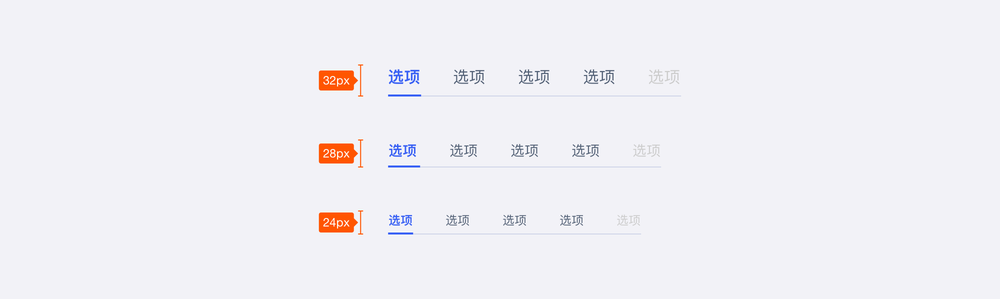
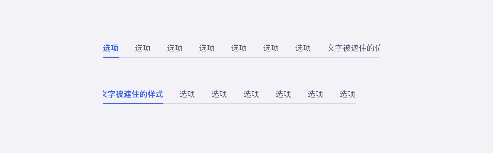
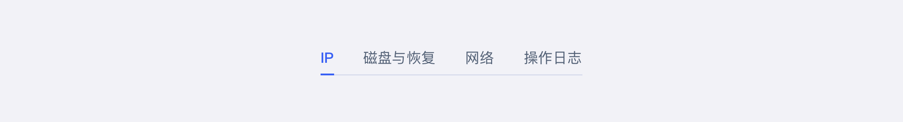
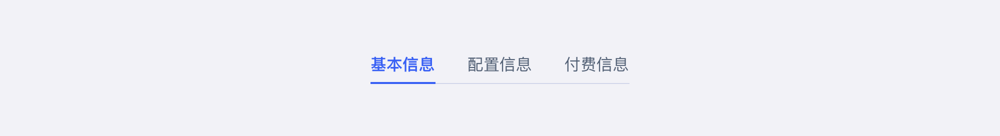

<!--副标题具体写法见源代码模式-->

## 简介

U-Deisgn将 **Tabs标签页** 定义为对象内的导航或过滤器。

**Tabs标签页** 主要使用在页面内部，其将大量关联的数据或者选项划分成更易理解的分组，提供简单的页面展示形式，即在不需要切换出上下文的情况下，扁平化地对内容进行有效的组织。

## 基本构成

| 标签（A） | 内容区（B） |
| :---------: | :-----------: |
|      √      |       √       |

**A.标签**

- 标签分为默认、选中、禁用三种状态
- 页面载入时，一般默认第一个标签为选中态
- 同时只有一个标签为选中状态
- 标签区的文字应该简洁扼要，具有代表性

**B.内容区**

- 用于展示标签对应的信息内容
- 当前展示的内容区与选中的标签相对应

## 基本样式

### 位置

#### 标签在内容区上方

#### 标签在内容区下方

#### 标签在内容区左侧

#### 标签在内容区右侧

### 尺寸
U-Design 目前对 Tabs 区分了大（lg）、中（md）、小（sm） 3 种尺寸，高度分别为32px、28px、24px。

## 设计说明

### 超出时滑动
当标签非常多时，组件会自动增加滑动支持(可以左右、上下滑动)，可以点击两侧箭头进行切换。

### 将产品需要推广或优先展示的内容放在默认Tab
标签的先后应当按照其重要程度进行排序，可以将产品需要推广或需要优先展示的内容放在默认标签上，将用户感兴趣的、无法忽略的，或者更要级更低的标签靠后。

### 标签上使用简短和有逻辑的文字
U-Design 参考Nielsen Norman Group（NN/g 尼尔森诺曼集团）的 [Tabs, Used Right](https://www.nngroup.com/articles/tabs-used-right/)，建议标签的内容控制在6个中文字符内，以便于用户操作理解。

## 常见问题

### 需要对多个标签的信息进行对比时，不建议使用

   

      
<i class="u-md-suggested"></i>Tabs中，标签之间具有某种关联特征，且是并列关系;内容不交叉，同时只展示一个。

      
   

   

      
<i class="u-md-not-suggested"></i>当用户需要同时查看多个标签时，不应该使用Tabs，否则会导致用户为了对比所需的信息，而不停在标签之间进行切换。

      
   

## 相关文档

1. [Breadcrumb 面包屑](https://udesign.ucloud.cn/component/Breadcrumb)
2. [Steps 步骤条](https://udesign.ucloud.cn/component/Steps)