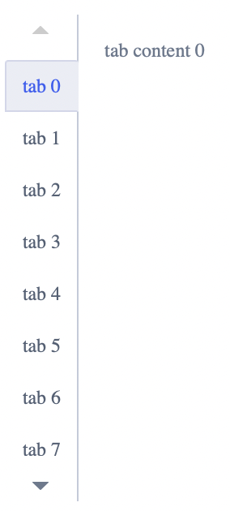
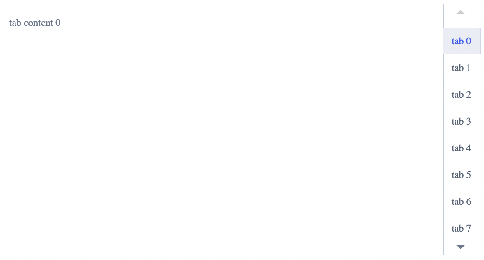
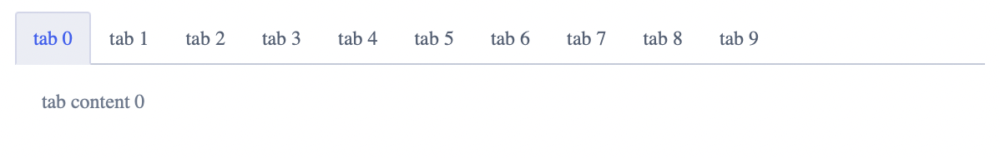
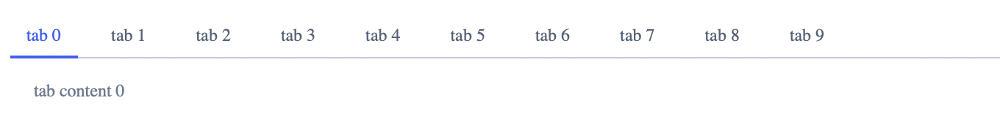
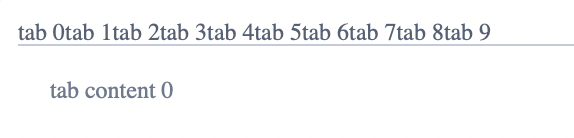
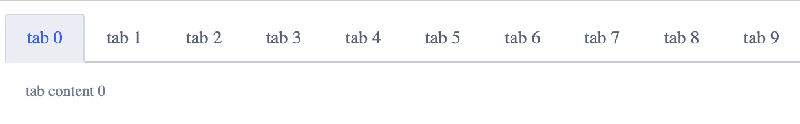
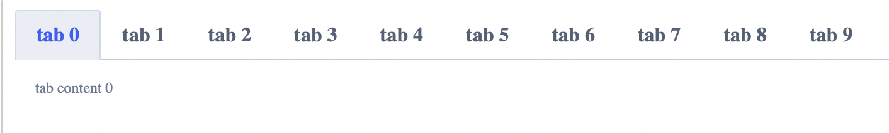
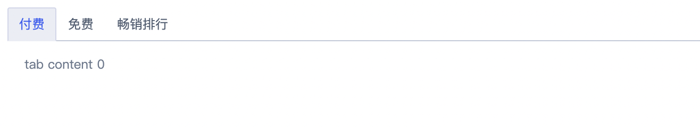

---
description: "对象内的导航或过滤器"
---

<!--副标题具体写法见源代码模式-->

## 简介

U-Deisgn将 **Tabs标签页** 定义为对象内的导航或过滤器，其将大量关联的数据或者选项划分成更易理解的分组，提供简单的页面展示形式，即在不需要切换出上下文的情况下，有效的进行内容组织的扁平化导航设计。

## 基本构成

| 标签（A） | 内容区（B） |
| :---------: | :-----------: |
|      √      |       √       |

**A.标签**

- 标签分为默认、选中、禁用三种状态
- 页面载入时，一般默认第一个标签为选中态
- 同时只有一个标签为选中状态
- 标签区的文字应该简洁扼要，具有代表性

**B.内容区**

- 用于展示标签对应的信息内容
- 当前展示的内容区与选中的标签相对应

## 基本样式

### 位置

#### 标签在内容区上方

#### 标签在内容区下方

#### 标签在内容区左侧

#### 标签在内容区右侧

### 风格
#### 默认样式

#### 线性样式

#### 至纯样式

### 尺寸
U-Design 目前对 Tabs 区分了 3 种尺寸：大（lg）、中（md）、小（sm）。

## 设计说明

### 需要对多个标签的信息进行对比时，不建议使用

**Tabs** 中，同一时刻，只能显示一个标签的内容。

当用户需要对位于不同标签上的信息进行对比，或者多个内容同时显示会更便于用户阅读时，就不应该使用 **Tabs** ，否则会导致用户为了对比所需的信息，而不停在标签之间进行切换。

### 将产品需要推广或优先展示的内容放在默认Tab
标签的先后应当按照其重要程度进行排序，可以将产品需要推广或优先展示的内容放在默认标签上，将用户感兴趣的、无法忽略的，或者更要级更低的标签靠后。

### 标签之间具有某种关联特征，且是并列关系，内容不交叉
构成 **Tabs** 的每个标签之间都应该具有逻辑上的关联性，但是，内容又不相重叠，这样用户才能将整个Tab区域视为一个整体。

## 相关文档

1. [Breadcrumb 面包屑](https://udesign.ucloud.cn/component/Breadcrumb)
2. [Steps 步骤条](https://udesign.ucloud.cn/component/Steps)