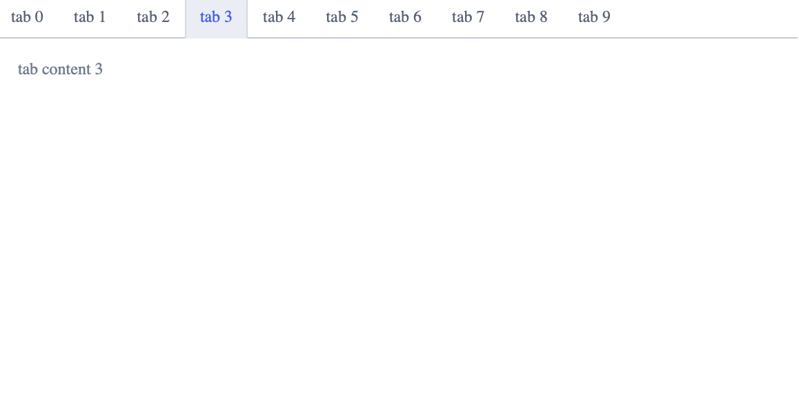
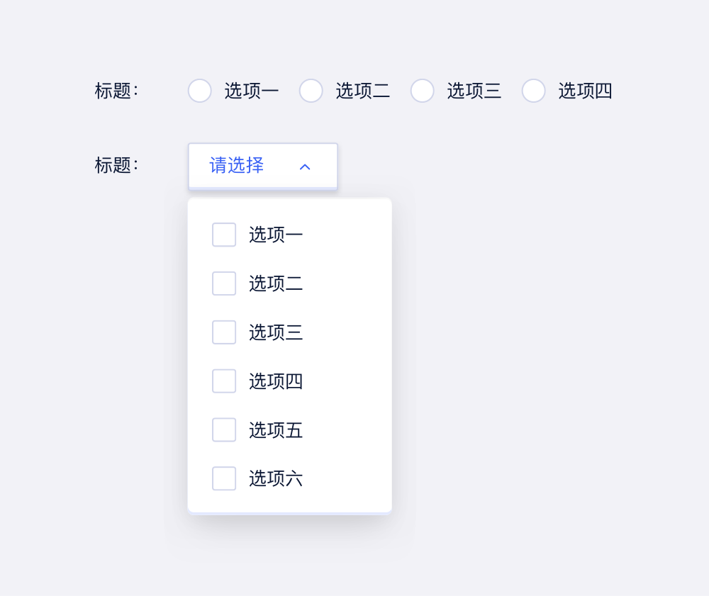
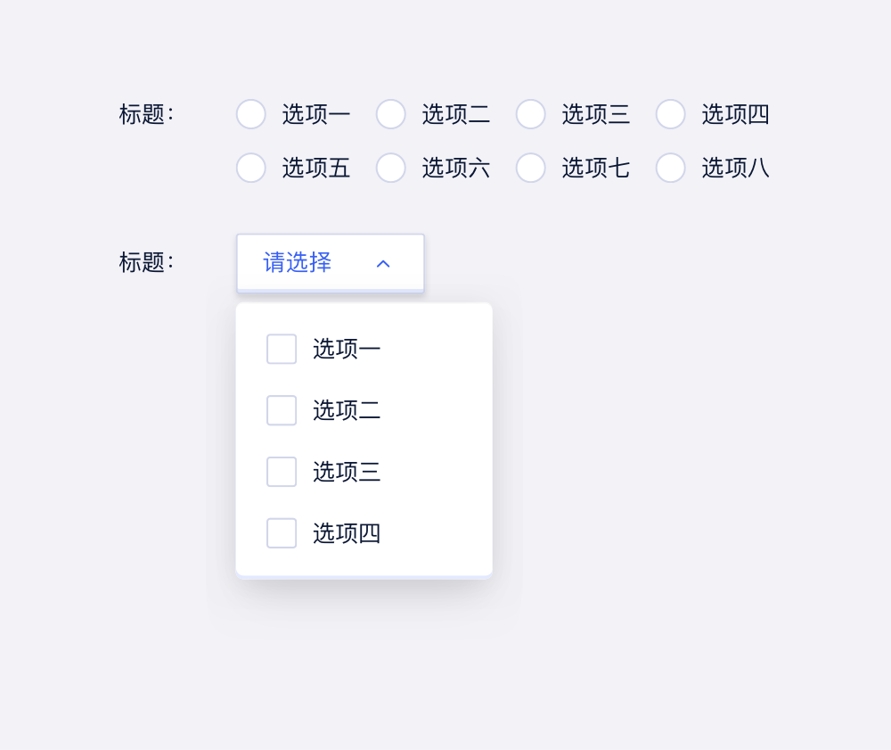

---
description: "从多个选项中选择一个或多个选项，并呈现选择结果的组件。"
---

<!--副标题具体写法见源代码模式-->

## 简介

TAB 让用户可以在不同子任务、视图、模式之间切换，它具有全局导航的作用，是全局功能的主要展示和切换区域，一个TAB标记一个核心功能，TAB之间可以快速点击切换。该窗口包含2个以上的选项卡，所有选项卡可以排列在一行中，即使该用户界面被本地化后也是如此。提供平级的区域将大块内容进行收纳和展现，保持界面整洁。

很多信息内容条目多，结构复杂，所以常常会需要把一大堆的内心信息进行分组归类，在一个页面中，通过「类别」把一堆信息梳理成有规律、有层次的逻辑架构。关于这个场景，我常常会用到「tab」这个功能来处理，

Tab元素中，同一时刻，只能显示一个选项卡的内容。当用户需要对多个选项卡的信息进行对比，或者这几个分类的信息，放在一起显示会让用户更加方便获取到目标信息的时候，就不应该使用Tab的形式来对信息进行分类和分组了，否则会导致用户为了对比所需的信息，而不停在选项卡之间进行切换。

图标标签栏由一系列标签组成，每个标签都链接到不同的内容区域或视图。您可以将其用于对象内的导航或过滤器。

有两个关键用例：

您希望让用户在对象详细信息区域的不同对象方面之间导航。
您希望让用户过滤列表，并让他们可以选择调用整个列表，或仅调用具有特定属性的项目。
在这两种情况下，用户都会通过单击相应的选项卡在选项卡页面之间切换。

Tabs 可用于将有关的内容分组，重叠放置在某一布局区块内，重叠的内容区里的每次只有其中一层是可见的。

用户通过鼠标点击或移到内容区所对应的标签上，来请求显示该层内容区。

Tab属于扁平信息结构，可以让用户在分类之间随意切换，而不用在意当前所处的位置。

## 优势
Tab将大量关联的数据或者选项划分成更易理解的分组，提供简单的页面展示形式，即在不需要切换出上下文，页面跳转的情况下，有效的进行内容组织的扁平化导航设计。

如PC端的标签页导航、模块选项卡等设计形式。

可以将产品包含的所有内容进行清晰分类，一目了然地呈现应用的内容范围，方便概览与跳转。
## 基本构成

| 选择器（A） | 下拉容器（B） | 搜索框（C） | 复选框（D） |
| :---------: | :-----------: | :---------: | :---------: |
|      √      |       √       |    可选     |      √      |

**A.标签**

- 标签分为选中和未选中两种状态，同时只有一个Tab为选中状态
- 页面载入时，一般默认第一个Tab为选中态

**B.内容区**

- 用于展示标签对应的信息内容
- 与当前选中的标签相对应

## 基本样式

### 位置

### 风格

### 尺寸

## 设计说明

## 常见问题

### Select与Radio使用时的区别

   

      
<i class="u-md-suggested"></i>选项小于5项时建议使用单选Radio，选项大于等于5项时建议使用select。

      
   

   

      
<i class="u-md-not-suggested"></i>选项过多时使用radio容易使表单整体看起来臃肿，当选项太少时若使用select不利于用户快速选择。

      
   

### 必填字段的默认项与空值使用

   

      
<i class="u-md-suggested"></i>若字段为必填项时，建议给出默认选项，且选项中不设空值。

      
   

   

      
<i class="u-md-not-suggested"></i>必填字段若默认为空，容易导致用户忘记选择而校验报错。

      
   

、

## 相关文档

1. [Input 输入框](/component/Input/)
2. [Menu 下拉菜单](/component/Menu/)

