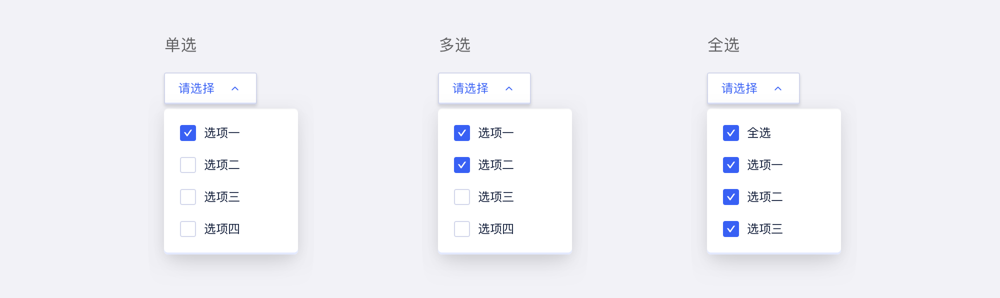
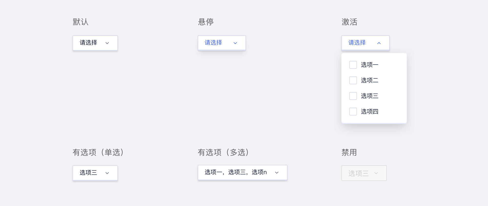
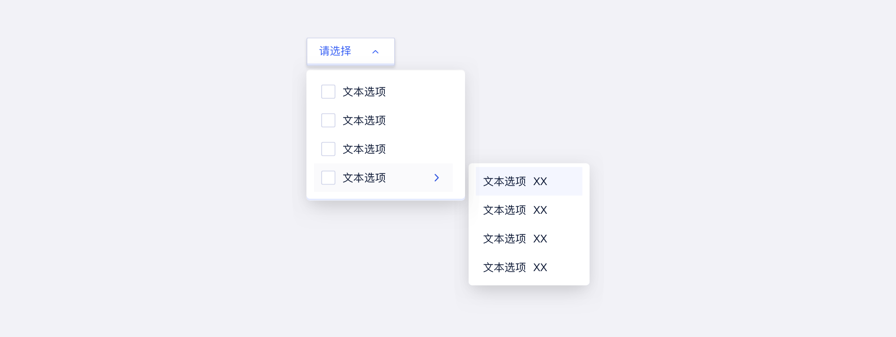

---
description: "从多个选项中选择一个或多个选项，并呈现选择结果的组件。"
---

<!--副标题具体写法见源代码模式-->

## 简介

TAB 让用户可以在不同子任务、视图、模式之间切换，它具有全局导航的作用，是全局功能的主要展示和切换区域，一个TAB标记一个核心功能，TAB之间可以快速点击切换。该窗口包含2个以上的选项卡，所有选项卡可以排列在一行中，即使该用户界面被本地化后也是如此。提供平级的区域将大块内容进行收纳和展现，保持界面整洁。

图标标签栏由一系列标签组成，每个标签都链接到不同的内容区域或视图。您可以将其用于对象内的导航或过滤器。

有两个关键用例：

您希望让用户在对象详细信息区域的不同对象方面之间导航。
您希望让用户过滤列表，并让他们可以选择调用整个列表，或仅调用具有特定属性的项目。
在这两种情况下，用户都会通过单击相应的选项卡在选项卡页面之间切换。

Tabs 可用于将有关的内容分组，重叠放置在某一布局区块内，重叠的内容区里的每次只有其中一层是可见的。

用户通过鼠标点击或移到内容区所对应的标签上，来请求显示该层内容区。

Tab属于扁平信息结构，可以让用户在分类之间随意切换，而不用在意当前所处的位置。

## 优势
Tab将大量关联的数据或者选项划分成更易理解的分组，提供简单的页面展示形式，即在不需要切换出上下文，页面跳转的情况下，有效的进行内容组织的扁平化导航设计。

如PC端的标签页导航、模块选项卡等设计形式。

可以将产品包含的所有内容进行清晰分类，一目了然地呈现应用的内容范围，方便概览与跳转。
## 基本构成

| 选择器（A） | 下拉容器（B） | 搜索框（C） | 复选框（D） |
| :---------: | :-----------: | :---------: | :---------: |
|      √      |       √       |    可选     |      √      |

**A.选择器**

- 展示操作后的选项

**B.下拉容器**

- 收纳操作元素、可选项

**C.搜索框（可选）**

**D.复选框**

- 复选框可配置全选项

## 基本样式

| 类型       | 说明                                                         |
| :--------- | :----------------------------------------------------------- |
| 基础用法   | 下拉选择器的基础用法，分为单选与多选，可配置全选项。         |
| 带搜索功能 | 搜索框可同时用于单选或多选选择器中，通常在选项数量较大，用户需要通过搜索才能方便找到选项时使用。 |
| 带分组标签 | 分组标签可同时用于单选或多选选择器中，当选项需要进行分类辅助用户查找选项时使用，标签不支持点选。 |

#### 基础用法

#### 带搜索功能

#### 带分组标签

## 基本状态

| 状态           | 说明                               | 作用                   |
| :------------- | :--------------------------------- | ---------------------- |
| 默认状态       | 组件初始状态                       | -                      |
| 悬停状态       | 鼠标经过选择器时，切换至该状态     | 暗示用户行动点可操作   |
| 激活状态       | 点击选择器切换该状态               | 提示用户进一步选择操作 |
| 有选项（单选） | 用户选择选项后显示该状态           | 选择器显示已选择内容   |
| 有选项（多选） | 用户选择选项后显示该状态           | 选择器显示已选择数量   |
| 禁用状态       | 当前行动点不可用，建议配合提示说明 | 表示当前选项不可选择   |

## 设计说明

在界面中如何使用该组件？

#### 1.使用场景    

- 当选项过多且选项没有层级关系时，使用 [级联选择器](http://10.179.234.214:8000/component/Cascader/) `Cascader`展示并选择内容。

  

#### 2.特殊用法    

- 当选择器支持空值时，选项中应给予空选项。

## 常见问题

### Select与Radio使用时的区别

   

      
<i class="u-md-suggested"></i>选项小于5项时建议使用单选Radio，选项大于等于5项时建议使用select。

      
   

   

      
<i class="u-md-not-suggested"></i>选项过多时使用radio容易使表单整体看起来臃肿，当选项太少时若使用select不利于用户快速选择。

      
   

### 必填字段的默认项与空值使用

   

      
<i class="u-md-suggested"></i>若字段为必填项时，建议给出默认选项，且选项中不设空值。

      
   

   

      
<i class="u-md-not-suggested"></i>必填字段若默认为空，容易导致用户忘记选择而校验报错。

      
   

<!--

## 主题

| 内容 | 值           | 默认值  |
| :--- | :----------- | :------ |
| icon | icon/nothing | nothing |
| icon | icon/nothing | nothing |

-->

## 相关文档

1. [Input 输入框](/component/Input/)
2. [Menu 下拉菜单](/component/Menu/)

