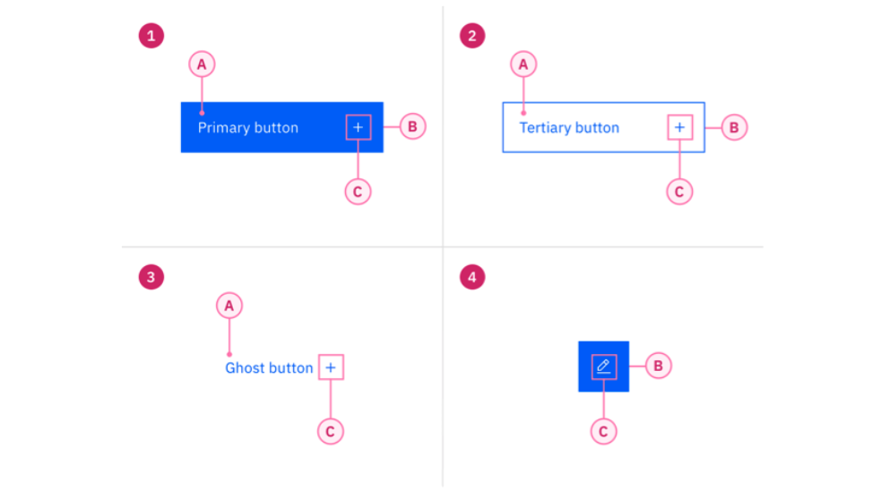

> # 组件设计文档模板
>
> 注意事项：
>
> 1. 图文排版的布局可以在 Example 页面中选择。
> 2. 图片 `  ` 中 `image alt` 代表图片不能显示情况下会展示的文字，`desc` 代表图片的描述展示在图片底部，**请务必认真对待这二个字段，必须为英文**
> 3. 图片 `` 中 `image alt` 代表图片不能显示情况下会展示的文字，`title` 代表图片的描述展示在图片底部，`width` 代表图片固定的宽度，不写则自适应展示，`align` 代表对齐方式，默认为左对齐 `left`, `center` 为居中显示。

<!--可以先空着，和最佳实践一起最后写-->

## 简介

该组件的**主要功能介绍**，能帮助用户完成使命操作，可能包括一些典型的使用场景。以及一些下文中可能会涉及到的**名词解释**，比如树种，包含其他项目的称节点，而不包含任何其他项目的称为叶子。**以及近似组件的差异性**等等。

<!--以下视觉写-->

## 组成元素

组成元素的描述。

## 基本样式

### 基本样式1

基本样式1的描述。

### 基本样式2

基本样式2的描述。

## 配置项

| 内容 | 值           | 默认值  |
| :--- | :----------- | :------ |
| icon | icon/nothing | nothing |
| icon | icon/nothing | nothing |

<!--以下交互写-->

## 交互说明

### 交互说明1

1. 交互说明描述1交互说明描述1交互说明描述1交互说明描述1交互说明描述1交互说明描述1交互说明描述1交互说明描述1交互说明描述1；
2. 交互说明描述2交互说明描述2交互说明描述2交互说明描述2交互说明描述2交互说明描述2交互说明描述2交互说明描述2交互说明描述2交互说明描述2交互说明描述2交互说明描述2；
3. 交互说明描述3交互说明描述3交互说明描述3交互说明描述3交互说明描述3交互说明描述3；

### 交互说明2

交互说明2的描述。

   交互说明2的描述交互说明2的描述交互说明2的描述交互说明2的描述交互说明2的描述交互说明2的描述交互说明2的描述交互说明2的描述。
   

      
   

<!--以下视觉写-->

## 视觉说明

### 视觉说明1

视觉说明1的描述。

### 视觉说明2

视觉说明2的描述。

   视觉说明2的描述视觉说明2的描述视觉说明2的描述视觉说明2的描述视觉说明2的描述视觉说明2的描述视觉说明2的描述视觉说明2的描述。
   

      
   

<!--可以先空着，和最佳实践一起最后写-->

## 最佳实践

   

      
<i class="u-md-suggested"></i>正确用法的说明文本。

      
   

   

      
<i class="u-md-not-suggested"></i>错误用法的说明文本。

      
   

<!--可以先空着，和最佳实践一起最后写-->

## 相关文档

1. [相关文档1](https://www.ucloud.cn)
2. [相关文档2](https://www.ucloud.cn)
