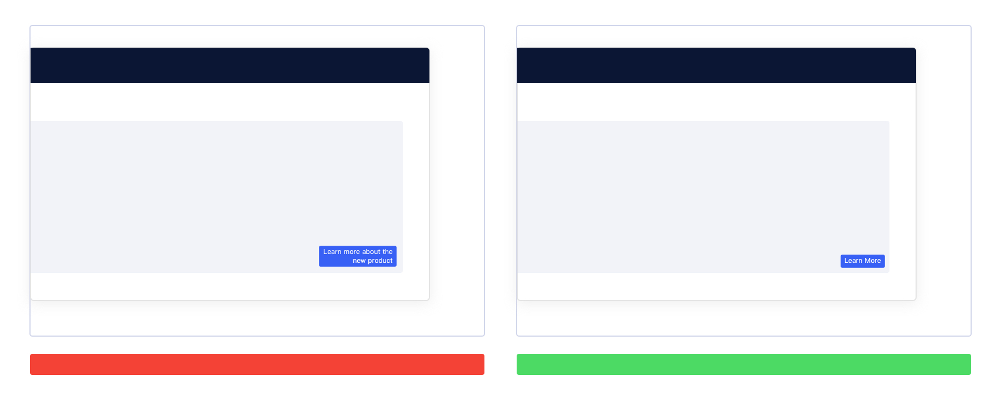

> # 组件设计文档模板
>
> 注意事项：
>
> 1. 图文排版的布局可以在 Example 页面中选择。
> 2. 图片 `  ` 中 `image alt` 代表图片不能显示情况下会展示的文字，`desc` 代表图片的描述展示在图片底部，**请务必认真对待这二个字段，必须为英文**
> 3. 图片 `` 中 `image alt` 代表图片不能显示情况下会展示的文字，`title` 代表图片的描述展示在图片底部，`width` 代表图片固定的宽度，不写则自适应展示，`align` 代表对齐方式，默认为左对齐 `left`, `center` 为居中显示。

# 名称 Name

此处副标题此处副标题此处副标题此处副标题

## 简介

按钮，用于触发操作的行动点。一般用于：

- 模态/非模态弹窗
- 表单
- 列表
- 卡片

## 构成

| 种类  | 构成部分1(A) | 构成部分2(B) | 构成部分3(C) |
| :---- | :----------- | ------------ | ------------ |
| 种类1 | ✓            | ✓            | 可选         |

## 基本样式

### 种类

| 内容  | 说明                 |
| :---- | :------------------- |
| 种类1 | 使用场景、使用限制等 |

### 尺寸

<!--此处UI提供配图-->

|        | 尺寸 |
| :----- | :--- |
| Large  |      |
| Middle |      |
| Small  |      |

### 

## 基本状态

| 状态  | 说明 | 作用 |
| :---- | :--- | ---- |
| 状态1 | 描述 | 描述 |

###  

## 设计说明

### 原则

在界面中如何使用该组件？

#### 1.原则

描述描述描述描述描述描述描述描述描述描述描述描述描述描述描述描述描述描述描述描述描述描述描述描述描述描述描述描述描述描述描述描述描述描述描述描述描述描述描述描述描述描述描述描述描述描述描述描述描述描述描述描述描述描述描述描述描述描述描述描述

#### 2.原则

描述描述描述描述描述描述描述描述描述描述描述描述描述描述描述描述描述描述描述描述描述描述描述描述描述描述描述描述描述描述描述描述描述描述描述描述描述描述描述描述描述描述描述描述描述描述描述描述描述描述描述描述描述描述

### 布局

在界面中如何摆放该组件？

#### 1. 布局说明

| 方式  | 说明                                     | 建议                     |
| :---- | :--------------------------------------- | ------------------------ |
| 方式1 | 描述描述描述描述描述描述描述描述描述描述 | 描述描述描述描述描述描述 |

## 行为

当用户使用不同设备端访问平台或页面时，如何与界面中的按钮交互？

#### 桌面端设备

- 鼠标：点击、悬停

#### 移动端设备

- 鼠标：平板可外接鼠标，行为与桌面端设备一致
- 手指：点击

## 常见问题

#### 问题概述

问题描述问题描述问题描述问题描述问题描述问题描述问题描述问题描述问题描述问题描述问题描述问题描述问题描述问题描述问题描述问题描述

#### 问题概述

问题描述问题描述问题描述问题描述问题描述问题描述问题描述问题描述问题描述问题描述问题描述问题描述问题描述问题描述问题描述问题描述

## 主题

| 内容 | 值           | 默认值  |
| :--- | :----------- | :------ |
| icon | icon/nothing | nothing |
| icon | icon/nothing | nothing |

## 相关文档

1. [相关文档1](https://www.ucloud.cn)
2. [相关文档2](https://www.ucloud.cn)

